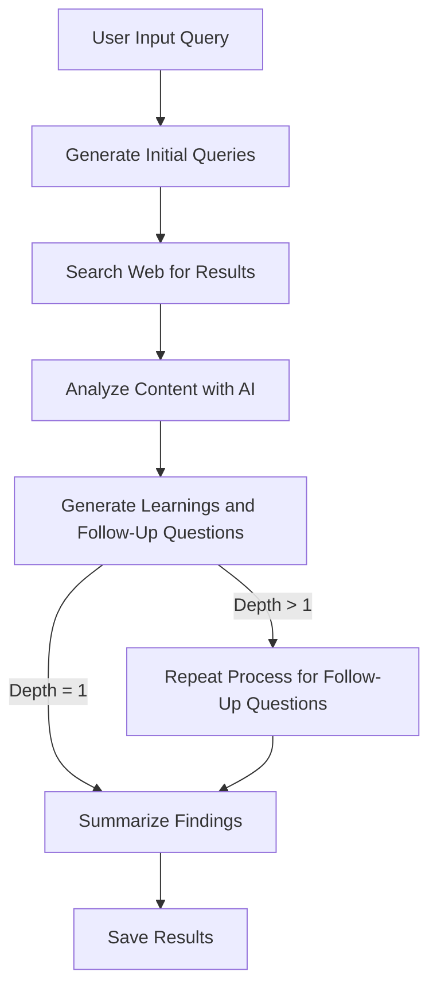

# Deep Research Privacy App

The **Deep Research Privacy App** is a privacy-focused research tool designed to automate the process of exploring topics in depth. It leverages AI to generate queries, analyze content, and summarize findings while maintaining user privacy by using the Brave Search API. The app supports both **CLI** and **Web-based Terminal** interfaces, making it versatile for different use cases.

---

## File Structure

The following is the most up-to-date file structure of the application:

```plaintext
app/
├── current_app_folder_file_tree.md  # Current file structure documentation
├── features/                # Core features of the app
│   ├── ai/                  # AI-related features
│   │   └── research.providers.mjs   # AI research providers
│   └── research/            # Research feature
│       ├── research.controller.mjs  # Research controller
│       ├── research.engine.mjs      # Research engine logic
│       ├── research.path.mjs        # Research path logic
│       └── routes.mjs               # Research API routes
├── filetree.mjs             # Generates the file tree structure
├── infrastructure/          # Infrastructure modules
│   ├── ai/                  # AI infrastructure
│   │   ├── venice.llm-client.mjs    # Venice LLM client
│   │   ├── venice.models.mjs        # Venice model configurations
│   │   └── venice.response-processor.mjs # AI response processing
│   ├── research/            # Research infrastructure
│   │   ├── research.engine.mjs      # Core research engine
│   │   └── research.path.mjs        # Research path logic
│   └── search/              # Search infrastructure
│       ├── search.mjs                # Search logic
│       └── search.providers.mjs      # Brave API client
├── public/                  # Static files for the web interface
│   ├── index.html           # Web-based terminal interface
│   ├── research.js          # Client-side research functionality
│   └── terminal.js          # Terminal emulation for web interface
├── start.mjs                # App entry point (server & CLI modes)
├── tests/                   # Test cases
│   ├── brave-provider.test.mjs      # Tests for Brave provider
│   ├── brave-search-provider.test.mjs # Tests for Brave search provider
│   ├── output-manager.test.mjs      # Tests for output manager
│   ├── provider.test.mjs            # Tests for AI providers
│   ├── rate-limiter.test.mjs        # Tests for rate limiter
│   ├── research-engine.test.mjs     # Tests for research engine
│   └── research.test.mjs            # Tests for research controller
└── utils/                   # Utility functions
    ├── cli-runner.mjs               # CLI runner utility
    ├── research.clean-query.mjs     # Light cleaning for user queries
    ├── research.ensure-dir.mjs      # Directory existence utility
    ├── research.object-utils.mjs    # General object utilities
    ├── research.output-manager.mjs  # Output management
    ├── research.prompt.mjs          # Prompt generation utilities
    └── research.rate-limiter.mjs    # Rate limiter utility
```

---

## Features

### 1. Dual-Mode Application
The application can run in two different modes:
- **Server Mode**: Web interface with API and WebSocket support.
- **CLI Mode**: Interactive command-line interface.

### 2. Server Mode
The app includes an Express server that provides:
- **REST API**: For programmatic access to research functionality.
  - **Endpoint**: `/api/research`
  - **Method**: `POST`
  - **Request Body**:
    ```json
    {
      "query": "Your research query",
      "depth": 2,
      "breadth": 3
    }
    ```
- **WebSocket Interface**: For real-time updates during research.
- **Web-Based Terminal**: Interactive browser-based research interface.

### 3. CLI Interface
The app provides an interactive command-line interface:
- **Activation**: Pass any argument when launching the app (e.g., `node app/start.mjs cli`).
- **Interactive Prompts**:
  - Research query input.
  - Research breadth selection (2-10).
  - Research depth selection (1-5).
- **Real-Time Progress**: Visual progress bar during research.
- **Results Display**: Formatted output with learnings and sources.
- **Automatic Saving**: Research results saved as markdown files.

### 4. Research Engine
The core functionality that powers both interfaces:
- **Multi-Depth Research**: Follows information paths to specified depth.
- **Breadth Control**: Explores multiple avenues based on breadth setting.
- **AI-Powered Analysis**: Uses LLM to generate queries and analyze content.
- **Privacy-Focused Search**: Uses Brave Search API for web queries.
- **Rate Limiting**: Respects API rate limits with automatic backoff.
- **Summarization**: Generates comprehensive summaries of findings.

### 5. Web-Based Terminal Interface
User-friendly browser interface with:
- **Terminal Emulation**: Similar experience to CLI.
- **WebSocket Communication**: Real-time updates.
- **Visual Connection Status**: Shows connection state.
- **Progress Visualization**: Displays research progress.

---

## Research Parameters

### Breadth (2-10)
Controls how many different search queries are generated and explored:
- **Lower values (2-3)**: More focused research on core aspects.
- **Higher values (8-10)**: Wider exploration of related topics.
- **Default**: 3.

### Depth (1-5)
Controls how deeply each search path is followed:
- **Lower values (1-2)**: High-level overview with fewer follow-up questions.
- **Higher values (4-5)**: Deep dive into topics with multiple layers of follow-up.
- **Default**: 2.

The total number of queries executed is influenced by both parameters, with a maximum of:
```plaintext
breadth * depth
```

---

## Automated Research Flow

The app operates as an **automated chain** where information is passed down, expanded, analyzed, and summarized. This flow is central to how the app functions and mimics the behavior of intelligent agents.

### Flow Diagram (Mermaid)


### Textual Flow
1. **User Input Query**: The user provides a query to research.
2. **Generate Initial Queries**: The app generates multiple specific queries based on the input query and breadth parameter.
3. **Search Web for Results**: Each query is sent to the Brave Search API to fetch relevant results.
4. **Analyze Content with AI**: The fetched content is analyzed using an LLM to extract key learnings and generate follow-up questions.
5. **Generate Learnings and Follow-Up Questions**: The AI outputs structured learnings and follow-up questions.
6. **Repeat Process for Follow-Up Questions**: If the depth parameter is greater than 1, the process repeats for the follow-up questions.
7. **Summarize Findings**: Once all queries are processed, the app generates a comprehensive summary of the findings.
8. **Save Results**: The results, including learnings, sources, and summary, are saved to a markdown file.

---

## Running the App

### Prerequisites
1. Install **Node.js** (v16 or later).
2. Install dependencies:
   ```bash
   npm install
   ```
3. Set the necessary environment variables:
   - `BRAVE_API_KEY` (required for Brave Search).
   - `VENICE_API_KEY` (required for LLM requests via Venice.ai).

   These can be placed in a `.env` file at the project root or exported in your shell.

### Usage Modes
- **Server Mode (Default)**:
  ```bash
  npm start
  ```
  - Access the web interface at [http://localhost:3000](http://localhost:3000).
  - The API is available at [http://localhost:3000/api/research](http://localhost:3000/api/research).

- **CLI Mode**:
  ```bash
  npm start -- cli
  ```
  Or directly:
  ```bash
  node app/start.mjs cli
  ```
  - Follow the interactive prompts to conduct research.

### Environment
- Default port: `3000` (can be changed with the `PORT` environment variable).
- Research results are saved in the `research/` directory.

---

## Validation and Accuracy Check

The README has been validated against the latest file structure and codebase. All features, parameters, and flows have been cross-referenced with the implementation to ensure accuracy and precision. If any discrepancies are found during future updates, this document should be revised accordingly.
