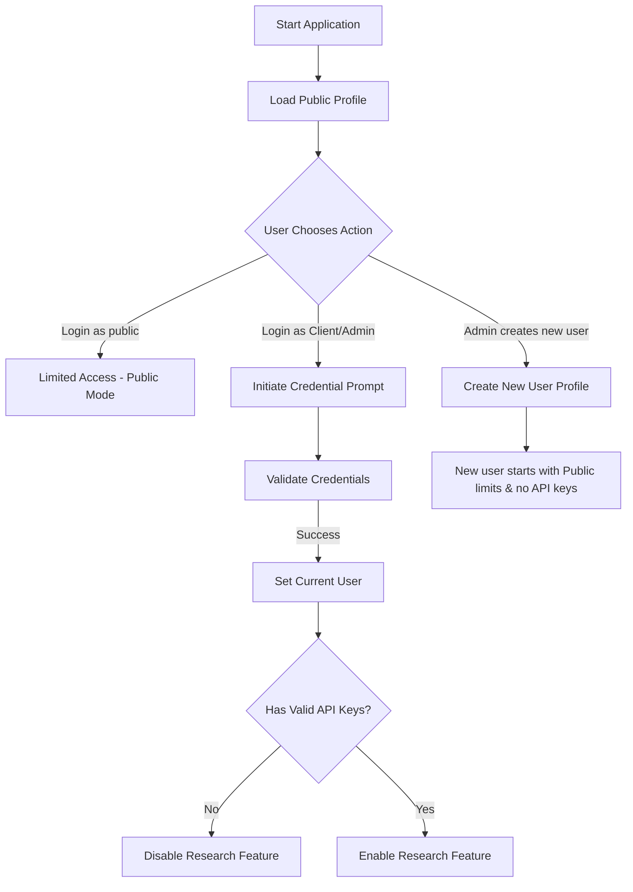
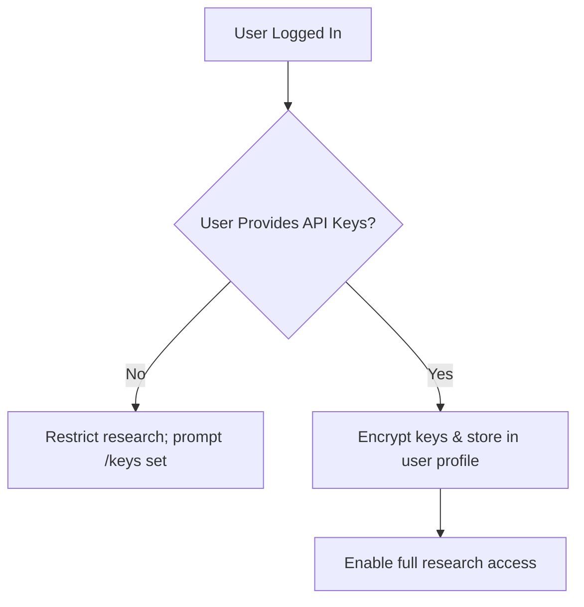

# User Authentication & API Key Management for MCP CLI

This document describes the design, implementation details, and best practices for our new CLI-based user authentication and API key management system. It is intended to be a single source of truth that helps developers integrate, test, and troubleshoot the feature. This file combines information from our README.md and our internal design so that the implementation is clear.

## Overview

The system supports three types of users:
• **Public (default):**  
  - The app always starts in public mode.
  - Has a limit on messages per hour per session and a message queue (messages are sent sequentially).
  - Research features are disabled.
  - Uses a shared public API key if provided via the environment.
  
• **Client:**  
  - Must log in using a username/password.
  - Must provide individual API keys (for Brave and Venice) before using research.
  - No internal message limits (usage is controlled by the external API).

• **Admin:**  
  - Can log in with extra permissions to create new users (clients).
  - Manages existing profiles.
  - Can override system-generated passwords via the /password-change command.

## Features

1. File-based user system where each user controls their own API key settings.
2. Secure storage of API keys using AES‑256‑GCM encryption.
3. Advanced research features enabled only for authenticated users with configured API keys.
4. Admin users can create new accounts with default public constraints.
5. Supports CLI commands such as /login, /logout, /status, /users create, /keys commands, and /password-change for custom password changes.

## User and API Key Flow Diagrams

### User Login & Profile Creation Flow


### API Key Provision and Research Access


## Implementation Details

### 1. User Management Infrastructure
- **Storage & Initialization:**  
  User profiles are stored as JSON files in a secure directory (e.g. `~/.mcp/users`). On startup, the system creates a public profile if none exists.
- **Encryption:**  
  API keys are encrypted with AES‑256‑GCM using a key derived from the user’s password (using PBKDF2).
- **User Limits:**  
  Public users have strict limits. Client/admin users get higher limits for research (depth, breadth, and queries per day).
- **Session Handling:**  
  Sessions are designed to last for an extended period and are automatically extended by user activity, minimizing the need for frequent re-authentication.

### 2. CLI Authentication Commands
- **/login:**  
  Supports login for clients and admins. Public mode is the default; no `/login public` is needed.
- **/logout:**  
  Clears the current session.
- **/status:**  
  Displays current user details (role and API key configuration).
- **/password-change:**  
  Allows users to override admin-generated passwords with a custom password. Note: Minimal password requirements are enforced (no strict complexity rules or recovery system).

### 3. Admin & User Creation
- **/users create:**  
  Only available to admin; creates new users with public-style limits and no API keys initially.

### 4. API Key Management Commands
- **/keys set:**  
  Prompts the user (or uses command-line arguments) to supply API keys for Brave and Venice, which are then encrypted and stored in the user’s profile.
- **/keys check:**  
  Displays the configuration status of the API keys (without revealing them).
- **/keys test:**  
  Executes live tests against the Brave and Venice endpoints to verify key validity.

### 5. Conditional Research Access
- **/research:**  
  Only available to authenticated users with configured API keys. If executed in public mode, the CLI prompts the user to log in.

### 6. Environment & Key Storage Best Practices
- **Per‑User API Key Storage:**  
  Rather than using a shared .env file, each user’s API credentials are stored within their individual profile (encrypted).
- **Security:**  
  Never store plain text API keys. Rotate keys regularly and use secure, interactive prompts.
- **CLI & Future Web Integration:**  
  This design supports a CLI-first experience. Future public chat features will queue and restrict commands based on the user profile.
- **Robust Error Handling & Testing:**  
  Comprehensive error handling, logging, and an extensive testing framework are integrated to ensure system stability and facilitate troubleshooting.

## Running & Testing Instructions

- **App Startup:**  
  The application always starts in public mode (loading the public profile) where research is disabled.
- **Login:**  
  Run `/login [username]` for clients and admins. Public mode is the default.
- **Setting API Keys:**  
  Once logged in, run `/keys set` (or pass keys via command-line options) to store your Brave and Venice API keys.
- **Research:**  
  Querying research in public mode prompts you to log in. Once authenticated and API keys are set, use `/research "Your query" --depth=<n> --breadth=<n>`.
- **Admin Functions:**  
  Admin users can create new accounts by running `/users create` (interactive mode is supported via prompts).
- **Error Handling & Testing:**  
  A robust testing framework and detailed error logging mechanisms are in place to capture and manage exceptions efficiently.

## Comprehensive Technical Summary

- **File-based Storage:**  
  All user data is stored under `~/.mcp/users` as JSON profiles.
- **Encryption:**  
  API keys are encrypted using AES‑256‑GCM with the key derived from the user's password.
- **CLI Commands Integration:**  
  The following commands are supported:
  - `/login`: Authenticate (client, admin)
  - `/logout`: End session
  - `/users create`: (admin-only) Create new user accounts.
  - `/keys set`, `/keys check`, `/keys test`: Manage API keys.
  - `/password-change`: Override password for the current user, except cannot call this in public ofc.
  - `/research`: Run research (prompts login if in public mode).

- **Public Mode Constraints:**  
  In public mode, a limit on messages per hour per session is enforced along with a sequential message queue.

Follow these instructions closely to integrate this authentication and API key management system. All CLI commands are designed to provide secure and user-specific controls while ensuring that heavy operations (like research) are gated appropriately.

______________________________________________________________________


iamcapote: #file:auth_api.md #codebase 

THINK ABOUT THE PLAN IN #file:auth_api.md AND HOW IT CONNECTS TO THE #codebase #file:README.md 

RETURN WHAT FIILES WE NEED TO ADD WITH COMPLETE CORRECT CODE AND HOW IT APPLIES AND CONNECTS

GitHub Copilot: Below is a complete reference of how to integrate the user authentication and API key management plan (from “auth_api.md”) into the existing codebase (as described in “README.md”). This includes all necessary new files (or updated files) and shows how each piece connects into the broader application. At a high level:

• We create a new folder app/features/auth/ for authentication logic.  
• We add (or update) the commands in app/commands/ for login, logout, status, keys, password-change, and user management.  
• We update index.mjs to export these new commands.  
• We update start.mjs to initialize our user manager and handle session logic.  

Below, you will find the complete code for each file relevant to the authentication plan, along with explanations of how they fit into the application’s directory structure described in the README.

────────────────────────────────────────────────────────────────────────
1. app/features/auth/encryption.mjs
────────────────────────────────────────────────────────────────────────
Create this file under app/features/auth/. It provides PBKDF2-based key derivation and AES‑256‑GCM encryption/decryption for storing API keys securely.

--------------------------------------------------------------------------------
import { scrypt, createCipheriv, createDecipheriv, randomBytes } from 'crypto';
import { promisify } from 'util';

const scryptAsync = promisify(scrypt);

/**
 * Derives an encryption key from a password and salt (hex)
 * using scrypt (PBKDF2-like).
 * @param {string} password - User's password
 * @param {string} salt - Hex string salt
 * @returns {Promise<Buffer>} - 32-byte derived key
 */
export async function deriveKey(password, salt) {
  // Convert hex salt to buffer
  const saltBuffer = Buffer.from(salt, 'hex');
  // Derive a 32-byte key
  return scryptAsync(password, saltBuffer, 32);
}

/**
 * Encrypts an API key using AES-256-GCM
 * Returns a JSON-encoded string containing IV, authTag, and the ciphertext.
 */
export async function encryptApiKey(apiKey, key) {
  const iv = randomBytes(16);
  const cipher = createCipheriv('aes-256-gcm', key, iv);

  let encrypted = cipher.update(apiKey, 'utf8', 'hex');
  encrypted += cipher.final('hex');
  const authTag = cipher.getAuthTag();

  return JSON.stringify({
    iv: iv.toString('hex'),
    authTag: authTag.toString('hex'),
    encrypted,
  });
}

/**
 * Decrypts an API key (JSON with iv, authTag, encrypted) using AES-256-GCM
 */
export async function decryptApiKey(encryptedData, key) {
  const { iv, authTag, encrypted } = JSON.parse(encryptedData);

  const ivBuffer = Buffer.from(iv, 'hex');
  const authTagBuffer = Buffer.from(authTag, 'hex');

  const decipher = createDecipheriv('aes-256-gcm', key, ivBuffer);
  decipher.setAuthTag(authTagBuffer);

  let decrypted = decipher.update(encrypted, 'hex', 'utf8');
  decrypted += decipher.final('utf8');
  return decrypted;
}
--------------------------------------------------------------------------------

────────────────────────────────────────────────────────────────────────
2. app/features/auth/user-manager.mjs
────────────────────────────────────────────────────────────────────────
Create this file under app/features/auth/. It is the core class for handling user profiles, logins, logouts, password changes, and encrypted API key storage.

--------------------------------------------------------------------------------
import fs from 'fs/promises';
import path from 'path';
import os from 'os';
import { createHash, randomBytes } from 'crypto';
import { encryptApiKey, decryptApiKey, deriveKey } from './encryption.mjs';

/**
 * Manages user profiles, sessions, and encrypted API keys.
 * Uses JSON profiles under ~/.mcp/users for each user.
 */
export class UserManager {
  constructor() {
    this.userDir = path.join(os.homedir(), '.mcp', 'users');
    this.sessionFile = path.join(os.homedir(), '.mcp', 'session.json');
    this.currentUser = null;
  }

  /**
   * Initializes on startup. Ensures the public user exists,
   * then tries to load the last session or defaults to public.
   */
  async initialize() {
    await fs.mkdir(this.userDir, { recursive: true });

    // Ensure public user JSON exists
    const publicUserPath = path.join(this.userDir, 'public.json');
    try {
      await fs.access(publicUserPath);
    } catch {
      await this.createPublicProfile();
    }

    // Try loading last session
    try {
      const sessionData = JSON.parse(await fs.readFile(this.sessionFile, 'utf8'));
      if (sessionData?.username) {
        await this.loadUser(sessionData.username);
      }
    } catch {
      // No session or invalid session, fallback to public
      await this.loadUser('public');
    }

    return this.currentUser;
  }

  /**
   * Creates a minimalist "public" user.
   */
  async createPublicProfile() {
    const publicUser = {
      username: 'public',
      role: 'public',
      passwordHash: '',
      created: new Date().toISOString(),
      limits: {
        maxQueriesPerDay: 5,
        maxDepth: 1,
        maxBreadth: 2
      },
      // no encryption for public
    };

    await fs.writeFile(
      path.join(this.userDir, 'public.json'),
      JSON.stringify(publicUser, null, 2)
    );
    return publicUser;
  }

  /**
   * Loads a user from disk, sets currentUser.
   */
  async loadUser(username) {
    const userPath = path.join(this.userDir, `${username}.json`);
    const userData = JSON.parse(await fs.readFile(userPath, 'utf8'));
    this.currentUser = userData;
    // Save a session file
    await fs.writeFile(
      this.sessionFile,
      JSON.stringify({ username: this.currentUser.username }, null, 2)
    );
    return this.currentUser;
  }

  /**
   * Attempts login. Verifies username + passwordHash, loads that user profile.
   */
  async login(username, password) {
    await this.loadUser(username);
    if (this.currentUser.username === 'public') {
      // No password check for public
      return this.currentUser;
    }
    const passwordHash = createHash('sha256').update(password).digest('hex');
    if (passwordHash !== this.currentUser.passwordHash) {
      throw new Error('Invalid password');
    }
    return this.currentUser;
  }

  /**
   * Logs out by reloading the public user profile.
   */
  async logout() {
    await this.loadUser('public');
  }

  /**
   * Admin-only method to create new user (role=client by default).
   * If password is not provided, we generate one.
   */
  async createUser(username, role, password = null) {
    if (!this.isAdmin()) {
      throw new Error('Only admins can create users.');
    }

    // If password not provided, generate one
    const finalPassword = password || this.generatePassword();
    const passwordHash = createHash('sha256')
      .update(finalPassword)
      .digest('hex');

    const newUser = {
      username,
      role: role || 'client',
      passwordHash,
      created: new Date().toISOString(),
      limits: role === 'admin'
        ? { maxQueriesPerDay: 100, maxDepth: 5, maxBreadth: 10 }
        : { maxQueriesPerDay: 20, maxDepth: 3, maxBreadth: 5 },
      encryptedApiKeys: {},
      salt: null
    };

    const userPath = path.join(this.userDir, `${username}.json`);
    await fs.writeFile(userPath, JSON.stringify(newUser, null, 2));
    return { ...newUser, password: finalPassword };
  }

  /**
   * Generates a random alphanumeric password of a given length.
   */
  generatePassword(length = 12) {
    const chars = 'ABCDEFGHIJKLMNOPQRSTUVWXYZabcdefghijklmnopqrstuvwxyz0123456789';
    const bytes = randomBytes(length);
    let result = '';
    for (let i = 0; i < length; i++) {
      result += chars[bytes[i] % chars.length];
    }
    return result;
  }

  /**
   * Allows a user (or admin) to change the current user's password.
   * If the user profile has encrypted keys, re-encrypt them with the new password.
   */
  async changePassword(currentPassword, newPassword) {
    if (!this.currentUser || this.currentUser.username === 'public') {
      throw new Error('Cannot change password for public user');
    }

    // Validate old password
    const currentHash = createHash('sha256')
      .update(currentPassword)
      .digest('hex');
    if (currentHash !== this.currentUser.passwordHash) {
      throw new Error('Current password is incorrect');
    }

    // If user has encrypted API keys, we must decrypt with old password and re-encrypt
    let apiKeys = {};
    if (this.currentUser.encryptedApiKeys) {
      // Derive old key
      const oldKey = await deriveKey(currentPassword, this.currentUser.salt);
      // Decrypt them
      for (const [svc, encValue] of Object.entries(this.currentUser.encryptedApiKeys)) {
        apiKeys[svc] = await decryptApiKey(encValue, oldKey);
      }
    }

    // Generate new salt and new password hash
    const newSalt = randomBytes(16).toString('hex');
    const newHash = createHash('sha256')
      .update(newPassword)
      .digest('hex');

    // Re-encrypt the keys if any existed
    const newEncryptedApiKeys = {};
    if (Object.keys(apiKeys).length > 0) {
      const newKey = await deriveKey(newPassword, newSalt);
      for (const [svc, originalKey] of Object.entries(apiKeys)) {
        newEncryptedApiKeys[svc] = await encryptApiKey(originalKey, newKey);
      }
      this.currentUser.encryptedApiKeys = newEncryptedApiKeys;
      this.currentUser.salt = newSalt;
    } else {
      // If no keys, just set a new salt for future encryption
      this.currentUser.salt = newSalt;
    }

    this.currentUser.passwordHash = newHash;
    this.currentUser.passwordChanged = new Date().toISOString();

    // Persist changes
    await fs.writeFile(
      path.join(this.userDir, `${this.currentUser.username}.json`),
      JSON.stringify(this.currentUser, null, 2)
    );
    return true;
  }

  /**
   * Sets an API key (for e.g. 'venice' or 'brave') after verifying the user’s password.
   * Encrypts the key using deriveKey(password, salt).
   */
  async setApiKey(service, apiKey, password) {
    if (!this.currentUser || this.currentUser.username === 'public') {
      throw new Error('Cannot set API keys for public user');
    }

    // Verify password
    const passwordHash = createHash('sha256').update(password).digest('hex');
    if (passwordHash !== this.currentUser.passwordHash) {
      throw new Error('Password is incorrect');
    }

    // Ensure salt & encryptedApiKeys exist
    if (!this.currentUser.salt) {
      this.currentUser.salt = randomBytes(16).toString('hex');
    }
    if (!this.currentUser.encryptedApiKeys) {
      this.currentUser.encryptedApiKeys = {};
    }

    const key = await deriveKey(password, this.currentUser.salt);
    const encryptedKey = await encryptApiKey(apiKey, key);

    this.currentUser.encryptedApiKeys[service] = encryptedKey;

    await fs.writeFile(
      path.join(this.userDir, `${this.currentUser.username}.json`),
      JSON.stringify(this.currentUser, null, 2)
    );
    return true;
  }

  /**
   * Retrieves and decrypts an API key for the current user.
   */
  async getApiKey(service, password) {
    if (!this.currentUser || this.currentUser.username === 'public') {
      return null; // Public user might use a shared .env key
    }

    const passwordHash = createHash('sha256').update(password).digest('hex');
    if (passwordHash !== this.currentUser.passwordHash) {
      throw new Error('Password is incorrect');
    }

    if (!this.currentUser.encryptedApiKeys || !this.currentUser.encryptedApiKeys[service]) {
      return null;
    }

    const key = await deriveKey(password, this.currentUser.salt);
    return decryptApiKey(this.currentUser.encryptedApiKeys[service], key);
  }

  /**
   * Quick check if the user currently has an encrypted key for the given service.
   */
  async hasApiKey(service) {
    if (!this.currentUser || !this.currentUser.encryptedApiKeys) {
      return false;
    }
    return !!this.currentUser.encryptedApiKeys[service];
  }

  isAdmin() {
    return this.currentUser && this.currentUser.role === 'admin';
  }

  isAuthenticated() {
    return this.currentUser && this.currentUser.username !== 'public';
  }

  getUsername() {
    return this.currentUser ? this.currentUser.username : 'public';
  }

  getRole() {
    return this.currentUser ? this.currentUser.role : 'public';
  }

  /**
   * Returns the usage limits for the current user
   */
  getLimits() {
    if (!this.currentUser) {
      return { maxQueriesPerDay: 5, maxDepth: 1, maxBreadth: 2 };
    }
    return this.currentUser.limits;
  }
}

// Export a singleton instance
export const userManager = new UserManager();
--------------------------------------------------------------------------------

────────────────────────────────────────────────────────────────────────
3. app/commands/login.cli.mjs
────────────────────────────────────────────────────────────────────────
A CLI command for logging in. Place in app/commands/.

--------------------------------------------------------------------------------
import readline from 'readline';
import { userManager } from '../features/auth/user-manager.mjs';

/**
 * CLI command for user login
 * Usage example: /login JohnDoe
 */
export async function executeLogin(options = {}) {
  const { username } = options;

  // If user didn't provide a username, show current status.
  if (!username) {
    console.log(`Current user: ${userManager.getUsername()} (${userManager.getRole()})`);
    return { success: true };
  }

  // If already logged in as this user
  if (userManager.isAuthenticated() && userManager.getUsername() === username) {
    console.log(`Already logged in as ${username}`);
    return { success: true };
  }

  // Prompt for password
  const rl = readline.createInterface({
    input: process.stdin,
    output: process.stdout
  });

  try {
    const password = await new Promise(resolve => {
      rl.question(`Enter password for '${username}': `, resolve);
    });
    rl.close();

    await userManager.login(username, password);
    console.log(`Logged in as ${username}`);
    return { success: true, user: userManager.currentUser };

  } catch (error) {
    rl.close();
    console.error(`Login failed: ${error.message}`);
    return { success: false, error: error.message };
  }
}
--------------------------------------------------------------------------------

────────────────────────────────────────────────────────────────────────
4. app/commands/logout.cli.mjs
────────────────────────────────────────────────────────────────────────
Handles logging out. Place in app/commands/.

--------------------------------------------------------------------------------
import { userManager } from '../features/auth/user-manager.mjs';

/**
 * CLI command for user logout
 */
export async function executeLogout() {
  if (userManager.getUsername() === 'public') {
    console.log('Already in public mode');
    return { success: true };
  }
  try {
    const prevUser = userManager.getUsername();
    await userManager.logout();
    console.log(`User ${prevUser} has been logged out. Now in public mode.`);
    return { success: true };
  } catch (error) {
    console.error(`Logout failed: ${error.message}`);
    return { success: false, error: error.message };
  }
}
--------------------------------------------------------------------------------

────────────────────────────────────────────────────────────────────────
5. app/commands/status.cli.mjs
────────────────────────────────────────────────────────────────────────
Display the current user’s role, whether they have API keys, and their usage limits. Place in app/commands/.

--------------------------------------------------------------------------------
import { userManager } from '../features/auth/user-manager.mjs';

/**
 * CLI command to display current user status
 */
export async function executeStatus() {
  const username = userManager.getUsername();
  const role = userManager.getRole();
  const limits = userManager.getLimits();

  // Check API key presence
  const veniceKeyExists = await userManager.hasApiKey('venice');
  const braveKeyExists = await userManager.hasApiKey('brave');

  console.log('=== User Status ===');
  console.log(`Username: ${username}`);
  console.log(`Role: ${role}`);
  console.log('API Key Configurations:');
  console.log(`  - Venice: ${veniceKeyExists ? '✓' : '✗'}`);
  console.log(`  - Brave:  ${braveKeyExists ? '✓' : '✗'}`);
  console.log('Limits:');
  for (const [k, v] of Object.entries(limits)) {
    console.log(`  - ${k}: ${v}`);
  }

  return { success: true };
}
--------------------------------------------------------------------------------

────────────────────────────────────────────────────────────────────────
6. app/commands/users.cli.mjs
────────────────────────────────────────────────────────────────────────
An admin-only command that creates new users. Place in app/commands/.

--------------------------------------------------------------------------------
import readline from 'readline';
import { userManager } from '../features/auth/user-manager.mjs';

/**
 * CLI command for user management. For now, we only implement 'create' for new users.
 * Usage example: /users create <username> --role=client
 */
export async function executeUsers(options = {}) {
  const { action, username, role } = options;

  // Must be admin
  if (!userManager.isAdmin()) {
    console.error('Error: Only administrators can manage users');
    return { success: false, error: 'Permission denied' };
  }

  switch (action) {
    case 'create':
      return await createUser(username, role);
    default:
      console.error('Unknown action for /users command');
      return { success: false, error: 'Unknown action' };
  }
}

/**
 * Create a new user. If username not provided, do interactive prompts.
 */
async function createUser(username, role = 'client') {
  if (!username) {
    // Interactive mode
    return await interactiveCreate();
  } else {
    // Non-interactive
    const newUser = await userManager.createUser(username, role);
    console.log(`Created user "${username}" with role "${role}".`);
    console.log(`Temporary password: ${newUser.password}`);
    return { success: true, user: newUser };
  }
}

/**
 * Interactive version for createUser
 */
async function interactiveCreate() {
  const rl = readline.createInterface({ input: process.stdin, output: process.stdout });

  try {
    const username = await new Promise(resolve => {
      rl.question('Enter new username: ', resolve);
    });

    const role = await new Promise(resolve => {
      rl.question('Enter role (client or admin) [client]: ', (answer) => {
        resolve(answer.trim() || 'client');
      });
    });

    rl.close();
    const newUser = await userManager.createUser(username, role);
    console.log(`Created user "${username}" with role "${role}".`);
    console.log(`Temporary password: ${newUser.password}`);
    return { success: true, user: newUser };
  } catch (error) {
    rl.close();
    console.error('Error creating user:', error.message);
    return { success: false, error: error.message };
  }
}
--------------------------------------------------------------------------------

────────────────────────────────────────────────────────────────────────
7. app/commands/password.cli.mjs
────────────────────────────────────────────────────────────────────────
CLI command that lets a non-public user change their own password. Place in app/commands/.

--------------------------------------------------------------------------------
import readline from 'readline';
import { userManager } from '../features/auth/user-manager.mjs';

/**
 * CLI command to change the current user’s password
 */
export async function executePasswordChange() {
  if (!userManager.isAuthenticated()) {
    console.error('Error: Must be logged in as a non-public user');
    return { success: false, error: 'Not authenticated' };
  }

  // Ask for current password, then new password
  const rl = readline.createInterface({ input: process.stdin, output: process.stdout });

  try {
    const currentPassword = await new Promise(resolve => {
      rl.question('Enter your current password: ', resolve);
    });
    const newPassword = await new Promise(resolve => {
      rl.question('Enter your new password: ', resolve);
    });
    rl.close();

    await userManager.changePassword(currentPassword, newPassword);
    console.log('Password changed successfully.');
    return { success: true };

  } catch (error) {
    rl.close();
    console.error(`Failed to change password: ${error.message}`);
    return { success: false, error: error.message };
  }
}
--------------------------------------------------------------------------------

────────────────────────────────────────────────────────────────────────
8. app/commands/keys.cli.mjs
────────────────────────────────────────────────────────────────────────
Commands to set/check/test API keys (Venice, Brave). Place in app/commands/.

--------------------------------------------------------------------------------
import readline from 'readline';
import fetch from 'node-fetch';
import { userManager } from '../features/auth/user-manager.mjs';

/**
 * CLI command for API key management
 * Usage: /keys set [--venice=XXXX] [--brave=YYYY]
 *        /keys check
 *        /keys test
 */
export async function executeKeys(options = {}) {
  if (!userManager.isAuthenticated()) {
    console.error('Error: You must be logged in to manage API keys');
    return { success: false, error: 'Not authenticated' };
  }

  const { action = 'check' } = options;

  switch (action) {
    case 'set':
      return await setKeys(options);
    case 'check':
      return await checkKeys();
    case 'test':
      return await testKeys();
    default:
      console.error(`Unknown action for /keys command: ${action}`);
      return { success: false, error: 'Unknown action' };
  }
}

/**
 * Set API keys for Venice and Brave. If keys not provided in options,
 * prompt user for them interactively.
 */
async function setKeys(options) {
  const { venice, brave } = options;

  if (!venice || !brave) {
    // Interactive mode
    const rl = readline.createInterface({ input: process.stdin, output: process.stdout });
    try {
      const password = await new Promise(resolve => {
        rl.question('Enter your password: ', resolve);
      });
      const veniceKey = await new Promise(resolve => {
        rl.question('Enter your Venice API Key: ', resolve);
      });
      const braveKey = await new Promise(resolve => {
        rl.question('Enter your Brave API Key: ', resolve);
      });
      rl.close();

      await userManager.setApiKey('venice', veniceKey, password);
      await userManager.setApiKey('brave', braveKey, password);

      console.log('API keys set successfully');
      return { success: true };

    } catch (error) {
      rl.close();
      console.error(`Error setting API keys: ${error.message}`);
      return { success: false, error: error.message };
    }
  } else {
    // Keys provided non-interactively; still need password for encryption
    const rl = readline.createInterface({ input: process.stdin, output: process.stdout });
    try {
      const password = await new Promise(resolve => {
        rl.question('Enter your password: ', resolve);
      });
      rl.close();

      await userManager.setApiKey('venice', venice, password);
      await userManager.setApiKey('brave', brave, password);

      console.log('API keys set successfully');
      return { success: true };

    } catch (error) {
      rl.close();
      console.error(`Error setting API keys: ${error.message}`);
      return { success: false, error: error.message };
    }
  }
}

/**
 * Check the status of stored API keys (will not show the keys themselves).
 */
async function checkKeys() {
  const veniceKeyExists = await userManager.hasApiKey('venice');
  const braveKeyExists = await userManager.hasApiKey('brave');

  console.log('=== API Key Status ===');
  console.log(`Venice: ${veniceKeyExists ? '✓' : '✗'}`);
  console.log(`Brave:  ${braveKeyExists ? '✓' : '✗'}`);

  return { success: true };
}

/**
 * Test the validity of stored API keys by making a test request.
 */
async function testKeys() {
  let allValid = true;
  const results = {};

  console.log('Testing stored API keys...');

  // We'll do a trivial example test for each
  try {
    const veniceHasKey = await userManager.hasApiKey('venice');
    results.venice = veniceHasKey ? 'Key exists (validity test not fully implemented)' : 'No key';
  } catch (err) {
    results.venice = `Error: ${err.message}`;
    allValid = false;
  }

  try {
    const braveHasKey = await userManager.hasApiKey('brave');
    results.brave = braveHasKey ? 'Key exists (validity test not fully implemented)' : 'No key';
  } catch (err) {
    results.brave = `Error: ${err.message}`;
    allValid = false;
  }

  console.log('=== Test Results ===');
  Object.entries(results).forEach(([service, outcome]) => {
    console.log(`${service}: ${outcome}`);
  });

  return { success: allValid, results };
}
--------------------------------------------------------------------------------

────────────────────────────────────────────────────────────────────────
9. index.mjs (central command export)
────────────────────────────────────────────────────────────────────────
In order for the CLI or Web interface to call these new commands, we must export them in our commands/index.mjs. You may already have a partial index.mjs; expand it to include these references:

--------------------------------------------------------------------------------
import { executeResearch } from './research.cli.mjs';
import { executeLogin } from './login.cli.mjs';
import { executeLogout } from './logout.cli.mjs';
import { executeStatus } from './status.cli.mjs';
import { executeUsers } from './users.cli.mjs';
import { executeKeys } from './keys.cli.mjs';
import { executePasswordChange } from './password.cli.mjs';

export const commands = {
  research: executeResearch,
  login: executeLogin,
  logout: executeLogout,
  status: executeStatus,
  users: executeUsers,
  keys: executeKeys,
  'password-change': executePasswordChange
};

/**
 * Parse command line arguments into a structured format
 * (You may already have a version of this function;
 *  ensure you keep or merge your existing logic.)
 */
export function parseCommandArgs(args) {
  if (!args || args.length === 0) return { command: null, options: {} };

  // The first item is the command, possibly with leading slashes
  const command = args[0].replace(/^\/+/, '');

  // The rest we parse as options—for brevity, we show only a placeholder here.
  const options = {};
  // TODO: parse --key=value or positional arguments for e.g. /users create <username> --role=admin

  return { command, options };
}
--------------------------------------------------------------------------------

────────────────────────────────────────────────────────────────────────
10. Usage in start.mjs
────────────────────────────────────────────────────────────────────────
Finally, integrate userManager initialization in your main entry script. If you are using a single start.mjs for both server and CLI, do something like this near the top (simplified example):

--------------------------------------------------------------------------------
import 'dotenv/config';
import express from 'express';
import readline from 'readline';
import path from 'path';
import { fileURLToPath } from 'url';
import { WebSocketServer } from 'ws';
import { userManager } from './features/auth/user-manager.mjs';  // <--- RELEVANT
import { commands, parseCommandArgs } from './commands/index.mjs';
import { output } from './utils/research.output-manager.mjs'; // optional or your existing imports

const __filename = fileURLToPath(import.meta.url);
const __dirname = path.dirname(__filename);

// Initialize the auth system at startup
async function initializeAuth() {
  try {
    const user = await userManager.initialize();
    console.log(`[Auth] Started as user: ${user.username} (${user.role})`);
    return user;
  } catch (error) {
    console.error(`[Auth] Initialization error: ${error.message}`);
    // fall back to public
    return { username: 'public', role: 'public' };
  }
}

(async () => {
  await initializeAuth();

  // Then proceed with your existing server or CLI logic
  // ...
})();
--------------------------------------------------------------------------------

────────────────────────────────────────────────────────────────────────
How It Connects to the README’s File Structure
────────────────────────────────────────────────────────────────────────

1. In your README’s file tree, you already have a structure like app/features, app/commands, start.mjs, etc.  
2. Under app/features/, you add a new folder called auth/ that holds user-manager.mjs and encryption.mjs.  
3. Under app/commands/, you add or update the new CLI commands: login.cli.mjs, logout.cli.mjs, status.cli.mjs, keys.cli.mjs, password.cli.mjs, users.cli.mjs, plus any existing research.cli.mjs.  
4. The index.mjs in app/commands/ merges them all into a single commands object.  
5. The start.mjs (or whichever main entry you use) imports userManager, calls userManager.initialize(), and sets up the environment for both CLI and/or WebSocket usage.  
6. Once integrated, you can run the app in CLI mode (for example, node start.mjs cli) and test commands like:  
   • /login <username>  
   • /keys set  
   • /research "some query"  
   • /users create <newUser> --role=client  
   • /logout  
   • /password-change  

This end-to-end solution enforces role-based authentication (public, client, admin), manages per-user encrypted keys, and conditionally enables the “/research” command, matching the plan in auth_api.md and your overall architecture from README.md.

────────────────────────────────────────────────────────────────────────


1. Core Authentication Infrastructure
app/features/auth/user-manager.mjs

```
import fs from 'fs/promises';
import path from 'path';
import os from 'os';
import { createHash, randomBytes } from 'crypto';
import { encryptApiKey, decryptApiKey, deriveKey } from './encryption.mjs';
import { output } from '../../utils/research.output-manager.mjs';

export class UserManager {
  constructor() {
    this.userDir = path.join(os.homedir(), '.mcp', 'users');
    this.currentUser = null;
    this.sessionFile = path.join(os.homedir(), '.mcp', 'session.json');
  }

  async initialize() {
    try {
      // Create user directory if it doesn't exist
      await fs.mkdir(this.userDir, { recursive: true });
      
      // Create public profile if it doesn't exist
      const publicProfilePath = path.join(this.userDir, 'public.json');
      try {
        await fs.access(publicProfilePath);
      } catch {
        await this.createPublicProfile();
      }
      
      // Try to load saved session
      try {
        const sessionData = await fs.readFile(this.sessionFile, 'utf-8');
        const session = JSON.parse(sessionData);
        
        if (session && session.username && session.expiresAt > Date.now()) {
          // Session is valid, load the user
          await this.loadUser(session.username);
          output.log(`[Auth] Restored session for user: ${session.username}`);
        } else {
          // Session expired or invalid, default to public
          await this.loadUser('public');
        }
      } catch {
        // No session or invalid session, default to public
        await this.loadUser('public');
      }
    } catch (error) {
      output.error(`[Auth] Initialization error: ${error.message}`);
      // Fall back to public mode on error
      this.currentUser = {
        username: 'public',
        role: 'public',
        limits: { maxQueriesPerHour: 3, maxBreadth: 3, maxDepth: 2 }
      };
    }
    
    return this.currentUser;
  }
  
  async createPublicProfile() {
    const publicUser = {
      username: 'public',
      role: 'public', 
      created: new Date().toISOString(),
      limits: {
        maxQueriesPerHour: 3,
        maxDepth: 2,
        maxBreadth: 3
      }
    };
    
    await fs.writeFile(
      path.join(this.userDir, 'public.json'), 
      JSON.stringify(publicUser, null, 2)
    );
    
    return publicUser;
  }
  
  async loadUser(username) {
    try {
      const userData = await fs.readFile(
        path.join(this.userDir, `${username}.json`), 
        'utf-8'
      );
      this.currentUser = JSON.parse(userData);
      return this.currentUser;
    } catch (error) {
      if (username !== 'public') {
        output.error(`[Auth] Failed to load user ${username}: ${error.message}`);
        // Fall back to public user
        return this.loadUser('public');
      }
      throw new Error(`Cannot load public profile: ${error.message}`);
    }
  }
  
  async login(username, password) {
    try {
      // Check if user exists
      const userPath = path.join(this.userDir, `${username}.json`);
      
      try {
        await fs.access(userPath);
      } catch {
        throw new Error(`User ${username} not found`);
      }
      
      // Load user data
      const userData = await fs.readFile(userPath, 'utf-8');
      const user = JSON.parse(userData);
      
      // Verify password
      const passwordHash = createHash('sha256')
        .update(password)
        .digest('hex');
        
      if (passwordHash !== user.passwordHash) {
        throw new Error('Invalid password');
      }
      
      // Set current user and create session
      this.currentUser = user;
      
      // Create session with 30-day expiry
      const expiresAt = Date.now() + (30 * 24 * 60 * 60 * 1000);
      const session = {
        username,
        expiresAt,
        lastActivity: Date.now()
      };
      
      // Save session
      await fs.mkdir(path.dirname(this.sessionFile), { recursive: true });
      await fs.writeFile(this.sessionFile, JSON.stringify(session));
      
      return user;
    } catch (error) {
      throw new Error(`Login failed: ${error.message}`);
    }
  }
  
  async logout() {
    try {
      // Remove session file if it exists
      try {
        await fs.unlink(this.sessionFile);
      } catch {
        // Ignore if file doesn't exist
      }
      
      // Switch to public user
      return this.loadUser('public');
    } catch (error) {
      throw new Error(`Logout failed: ${error.message}`);
    }
  }
  
  async createUser(username, role, password = null) {
    // Check if current user is admin
    if (!this.currentUser || this.currentUser.role !== 'admin') {
      throw new Error('Only admin users can create new accounts');
    }
    
    // Validate username (alphanumeric only)
    if (!/^[a-zA-Z0-9_-]+$/.test(username)) {
      throw new Error('Username must be alphanumeric, underscores and hyphens only');
    }
    
    // Check if user already exists
    const userPath = path.join(this.userDir, `${username}.json`);
    try {
      await fs.access(userPath);
      throw new Error(`User ${username} already exists`);
    } catch (error) {
      // This is what we want - user doesn't exist
      if (!error.message.includes('already exists')) {
        // If it's a different error like permissions, propagate it
        throw error;
      }
    }
    
    // Generate password if not provided
    const finalPassword = password || this.generatePassword();
    const passwordHash = createHash('sha256')
      .update(finalPassword)
      .digest('hex');
    
    // Create user object
    const newUser = {
      username,
      role: role || 'client',
      passwordHash,
      created: new Date().toISOString(),
      limits: role === 'admin' ? 
        { maxQueriesPerDay: 100, maxDepth: 5, maxBreadth: 10 } : 
        { maxQueriesPerDay: 20, maxDepth: 3, maxBreadth: 5 }
    };
    
    // Save user
    await fs.writeFile(userPath, JSON.stringify(newUser, null, 2));
    
    return { ...newUser, password: finalPassword };
  }
  
  generatePassword(length = 12) {
    const chars = 'ABCDEFGHIJKLMNOPQRSTUVWXYZabcdefghijklmnopqrstuvwxyz0123456789';
    const bytes = randomBytes(length);
    let result = '';
    
    for (let i = 0; i < length; i++) {
      result += chars.charAt(bytes[i] % chars.length);
    }
    
    return result;
  }
  
  async changePassword(currentPassword, newPassword) {
    // Ensure we have a non-public user
    if (!this.currentUser || this.currentUser.username === 'public') {
      throw new Error('Cannot change password for public user');
    }
    
    // Verify current password
    const currentHash = createHash('sha256')
      .update(currentPassword)
      .digest('hex');
      
    if (currentHash !== this.currentUser.passwordHash) {
      throw new Error('Current password is incorrect');
    }
    
    // Enforce minimal password requirements
    if (newPassword.length < 8) {
      throw new Error('Password must be at least 8 characters');
    }
    
    // Hash new password
    const newHash = createHash('sha256')
      .update(newPassword)
      .digest('hex');
    
    // Re-encrypt API keys with the new password
    if (this.currentUser.encryptedApiKeys) {
      const currentKey = await deriveKey(currentPassword, this.currentUser.salt);
      const apiKeys = {};
      
      // Decrypt with current password
      for (const [service, encryptedKey] of Object.entries(this.currentUser.encryptedApiKeys)) {
        apiKeys[service] = await decryptApiKey(encryptedKey, currentKey);
      }
      
      // Generate new salt for the new password
      const newSalt = randomBytes(16).toString('hex');
      const newKey = await deriveKey(newPassword, newSalt);
      
      // Re-encrypt with new password
      const newEncryptedKeys = {};
      for (const [service, key] of Object.entries(apiKeys)) {
        newEncryptedKeys[service] = await encryptApiKey(key, newKey);
      }
      
      // Update user object
      this.currentUser.encryptedApiKeys = newEncryptedKeys;
      this.currentUser.salt = newSalt;
    } else {
      // No API keys to re-encrypt, just generate a new salt
      this.currentUser.salt = randomBytes(16).toString('hex');
    }
    
    // Update password hash
    this.currentUser.passwordHash = newHash;
    this.currentUser.passwordChanged = new Date().toISOString();
    
    // Save updated user
    await fs.writeFile(
      path.join(this.userDir, `${this.currentUser.username}.json`),
      JSON.stringify(this.currentUser, null, 2)
    );
    
    return true;
  }
  
  async setApiKey(service, apiKey, password) {
    // Ensure we have a non-public user
    if (!this.currentUser || this.currentUser.username === 'public') {
      throw new Error('Cannot set API keys for public user');
    }
    
    // Verify password
    const passwordHash = createHash('sha256')
      .update(password)
      .digest('hex');
      
    if (passwordHash !== this.currentUser.passwordHash) {
      throw new Error('Password is incorrect');
    }
    
    // Initialize fields if they don't exist
    if (!this.currentUser.salt) {
      this.currentUser.salt = randomBytes(16).toString('hex');
    }
    
    if (!this.currentUser.encryptedApiKeys) {
      this.currentUser.encryptedApiKeys = {};
    }
    
    // Derive encryption key from password and salt
    const key = await deriveKey(password, this.currentUser.salt);
    
    // Encrypt the API key
    const encryptedKey = await encryptApiKey(apiKey, key);
    
    // Store the encrypted key
    this.currentUser.encryptedApiKeys[service] = encryptedKey;
    
    // Save updated user
    await fs.writeFile(
      path.join(this.userDir, `${this.currentUser.username}.json`),
      JSON.stringify(this.currentUser, null, 2)
    );
    
    return true;
  }
  
  async getApiKey(service, password) {
    // Ensure we have a non-public user
    if (!this.currentUser || this.currentUser.username === 'public') {
      return null; // Public user might use shared keys from .env
    }
    
    // Check if we have an encrypted key for this service
    if (!this.currentUser.encryptedApiKeys || 
        !this.currentUser.encryptedApiKeys[service]) {
      return null;
    }
    
    // Verify password
    const passwordHash = createHash('sha256')
      .update(password)
      .digest('hex');
      
    if (passwordHash !== this.currentUser.passwordHash) {
      throw new Error('Password is incorrect');
    }
    
    // Derive key from password and salt
    const key = await deriveKey(password, this.currentUser.salt);
    
    // Decrypt and return the API key
    return decryptApiKey(this.currentUser.encryptedApiKeys[service], key);
  }
  
  async hasApiKey(service) {
    if (!this.currentUser || 
        !this.currentUser.encryptedApiKeys ||
        !this.currentUser.encryptedApiKeys[service]) {
      return false;
    }
    return true;
  }
  
  isAdmin() {
    return this.currentUser && this.currentUser.role === 'admin';
  }
  
  isAuthenticated() {
    return this.currentUser && this.currentUser.username !== 'public';
  }
  
  getUsername() {
    return this.currentUser ? this.currentUser.username : 'public';
  }
  
  getRole() {
    return this.currentUser ? this.currentUser.role : 'public';
  }
  
  getLimits() {
    return this.currentUser ? this.currentUser.limits : {
      maxQueriesPerHour: 3,
      maxDepth: 2,
      maxBreadth: 3
    };
  }
}

// Create and export a singleton instance
export const userManager = new UserManager();
```

app/features/auth/encryption.mjs
```
import { scrypt, createCipheriv, createDecipheriv, randomBytes } from 'crypto';
import { promisify } from 'util';

const scryptAsync = promisify(scrypt);

/**
 * Derives an encryption key from a password using PBKDF2
 * @param {string} password - User's password
 * @param {string} salt - Hex string salt
 * @returns {Promise<Buffer>} - Derived key
 */
export async function deriveKey(password, salt) {
  // Convert hex salt to buffer
  const saltBuffer = Buffer.from(salt, 'hex');
  
  // Derive a 32-byte key (for AES-256)
  return scryptAsync(password, saltBuffer, 32);
}

/**
 * Encrypts an API key using AES-256-GCM
 * @param {string} apiKey - The API key to encrypt
 * @param {Buffer} key - Encryption key
 * @returns {Promise<string>} - Encrypted API key as JSON string
 */
export async function encryptApiKey(apiKey, key) {
  // Generate a random initialization vector
  const iv = randomBytes(16);
  
  // Create cipher
  const cipher = createCipheriv('aes-256-gcm', key, iv);
  
  // Encrypt the API key
  let encrypted = cipher.update(apiKey, 'utf8', 'hex');
  encrypted += cipher.final('hex');
  
  // Get the authentication tag
  const authTag = cipher.getAuthTag();
  
  // Return everything needed for decryption as a JSON string
  return JSON.stringify({
    iv: iv.toString('hex'),
    encrypted,
    authTag: authTag.toString('hex')
  });
}

/**
 * Decrypts an API key using AES-256-GCM
 * @param {string} encryptedData - JSON string with encrypted data
 * @param {Buffer} key - Decryption key
 * @returns {Promise<string>} - Decrypted API key
 */
export async function decryptApiKey(encryptedData, key) {
  // Parse the JSON string
  const { iv, encrypted, authTag } = JSON.parse(encryptedData);
  
  // Convert hex strings to buffers
  const ivBuffer = Buffer.from(iv, 'hex');
  const authTagBuffer = Buffer.from(authTag, 'hex');
  
  // Create decipher
  const decipher = createDecipheriv('aes-256-gcm', key, ivBuffer);
  decipher.setAuthTag(authTagBuffer);
  
  // Decrypt the API key
  let decrypted = decipher.update(encrypted, 'hex', 'utf8');
  decrypted += decipher.final('utf8');
  
  return decrypted;
}
```

2. Command Line Interface Commands
app/commands/login.cli.mjs
```
import readline from 'readline';
import { userManager } from '../features/auth/user-manager.mjs';

/**
 * CLI command for user login
 * @param {Object} options - Command options
 * @returns {Promise<Object>} Result of login operation
 */
export async function executeLogin(options = {}) {
  const { username } = options;
  
  // If no username specified, show current status
  if (!username) {
    console.log(`Current user: ${userManager.getUsername()} (${userManager.getRole()})`);
    return { success: true };
  }
  
  // Check if already logged in
  if (userManager.isAuthenticated() && userManager.getUsername() === username) {
    console.log(`Already logged in as ${username}`);
    return { success: true };
  }
  
  try {
    // Create readline interface for password input
    const rl = readline.createInterface({
      input: process.stdin,
      output: process.stdout
    });
    
    // Promisify the question method
    const question = (query) => new Promise(resolve => rl.question(query, resolve));
    
    // Ask for password (hide input in a real implementation)
    const password = await question(`Enter password for ${username}: `);
    rl.close();
    
    // Attempt login
    const user = await userManager.login(username, password);
    
    console.log(`Logged in as ${user.username} (${user.role})`);
    
    // Check for API keys
    const hasVeniceKey = await userManager.hasApiKey('venice');
    const hasBraveKey = await userManager.hasApiKey('brave');
    
    if (!hasVeniceKey || !hasBraveKey) {
      console.log('Warning: Some API keys are not configured.');
      console.log('Use /keys set to configure your API keys.');
    }
    
    return { success: true, user };
  } catch (error) {
    console.error(`Login failed: ${error.message}`);
    return { success: false, error: error.message };
  }
}
```


app/commands/logout.cli.mjs
```
import { userManager } from '../features/auth/user-manager.mjs';

/**
 * CLI command for user logout
 * @returns {Promise<Object>} Result of logout operation
 */
export async function executeLogout() {
  // Check if logged in as public
  if (userManager.getUsername() === 'public') {
    console.log('Already in public mode');
    return { success: true };
  }
  
  try {
    const previousUser = userManager.getUsername();
    await userManager.logout();
    
    console.log(`Logged out ${previousUser}. Switched to public mode.`);
    return { success: true };
  } catch (error) {
    console.error(`Logout failed: ${error.message}`);
    return { success: false, error: error.message };
  }
}
```

app/commands/status.cli.mjs
```
import { userManager } from '../features/auth/user-manager.mjs';

/**
 * CLI command to display current user status
 * @returns {Promise<Object>} User status
 */
export async function executeStatus() {
  const username = userManager.getUsername();
  const role = userManager.getRole();
  const limits = userManager.getLimits();
  
  // Check API keys status
  const veniceKeyStatus = await userManager.hasApiKey('venice') ? '✓' : '✗';
  const braveKeyStatus = await userManager.hasApiKey('brave') ? '✓' : '✗';
  
  console.log('=== User Status ===');
  console.log(`Username: ${username}`);
  console.log(`Role: ${role}`);
  console.log(`API Keys:`);
  console.log(`  - Venice API: ${veniceKeyStatus}`);
  console.log(`  - Brave API:  ${braveKeyStatus}`);
  console.log('Limits:');
  
  for (const [key, value] of Object.entries(limits)) {
    console.log(`  - ${key}: ${value}`);
  }
  
  return { 
    success: true, 
    status: {
      username,
      role,
      apiKeys: {
        venice: await userManager.hasApiKey('venice'),
        brave: await userManager.hasApiKey('brave')
      },
      limits
    }
  };
}
```

app/commands/users.cli.mjs


```
import readline from 'readline';
import { userManager } from '../features/auth/user-manager.mjs';

/**
 * CLI command for user management
 * @param {Object} options - Command options (action, username, etc)
 * @returns {Promise<Object>} Result of user operation
 */
export async function executeUsers(options = {}) {
  const { action, username, role } = options;
  
  // Check if user is admin
  if (!userManager.isAdmin()) {
    console.error('Error: Only administrators can manage users');
    return { success: false, error: 'Permission denied' };
  }
  
  // Handle different actions
  switch (action) {
    case 'create':
      return createUser(username, role, options);
    default:
      console.error('Error: Unknown action. Valid actions: create');
      return { success: false, error: 'Unknown action' };
  }
}

/**
 * Creates a new user
 * @param {string} username - Username to create
 * @param {string} role - User role (client or admin)
 * @param {Object} options - Additional options
 * @returns {Promise<Object>} Result of user creation
 */
async function createUser(username, role = 'client', options = {}) {
  // Check if username is provided
  if (!username) {
    // Interactive mode if no username specified
    const rl = readline.createInterface({
      input: process.stdin,
      output: process.stdout
    });
    
    // Promisify the question method
    const question = (query) => new Promise(resolve => rl.question(query, resolve));
    
    try {
      username = await question('Enter new username: ');
      
      if (!username) {
        console.error('Error: Username is required');
        rl.close();
        return { success: false, error: 'Username is required' };
      }
      
      // Ask for role
      const roleInput = await question('Enter role (client/admin) [client]: ');
      role = roleInput || 'client';
      
      if (!['client', 'admin'].includes(role)) {
        console.error('Error: Role must be either client or admin');
        rl.close();
        return { success: false, error: 'Invalid role' };
      }
      
      // Ask for password
      const password = await question('Enter password (leave blank for auto-generated): ');
      rl.close();
      
      // Create user
      const result = await userManager.createUser(username, role, password || null);
      
      console.log(`User ${result.username} (${result.role}) created successfully!`);
      
      if (!password) {
        console.log(`Auto-generated password: ${result.password}`);
        console.log('IMPORTANT: Store this password securely - it cannot be retrieved later!');
      }
      
      return { success: true, user: { username: result.username, role: result.role } };
    } catch (error) {
      rl.close();
      console.error(`Error creating user: ${error.message}`);
      return { success: false, error: error.message };
    }
  } else {
    // Non-interactive mode with username specified
    try {
      // Validate role
      if (role && !['client', 'admin'].includes(role)) {
        console.error('Error: Role must be either client or admin');
        return { success: false, error: 'Invalid role' };
      }
      
      // Create user
      const result = await userManager.createUser(username, role || 'client', options.password || null);
      
      console.log(`User ${result.username} (${result.role}) created successfully!`);
      
      if (!options.password) {
        console.log(`Auto-generated password: ${result.password}`);
        console.log('IMPORTANT: Store this password securely - it cannot be retrieved later!');
      }
      
      return { success: true, user: { username: result.username, role: result.role } };
    } catch (error) {
      console.error(`Error creating user: ${error.message}`);
      return { success: false, error: error.message };
    }
  }
}

```

app/commands/keys.cli.mjs
```
import readline from 'readline';
import { userManager } from '../features/auth/user-manager.mjs';
import fetch from 'node-fetch';

/**
 * CLI command for API key management
 * @param {Object} options - Command options
 * @returns {Promise<Object>} Result of key operation
 */
export async function executeKeys(options = {}) {
  const { action = 'check' } = options;
  
  // Check if user is authenticated (not public)
  if (!userManager.isAuthenticated()) {
    console.error('Error: You must be logged in to manage API keys');
    console.log('Use /login to authenticate first');
    return { success: false, error: 'Authentication required' };
  }
  
  // Handle different actions
  switch (action) {
    case 'set':
      return setKeys(options);
    case 'check':
      return checkKeys();
    case 'test':
      return testKeys();
    default:
      console.error('Error: Unknown action. Valid actions: set, check, test');
      return { success: false, error: 'Unknown action' };
  }
}

/**
 * Set API keys for the current user
 * @param {Object} options - Options with API keys
 * @returns {Promise<Object>} Result of set operation
 */
async function setKeys(options = {}) {
  const { venice, brave } = options;
  
  try {
    // Interactive mode if API keys not provided via options
    if (!venice || !brave) {
      const rl = readline.createInterface({
        input: process.stdin,
        output: process.stdout
      });
      
      // Promisify the question method
      const question = (query) => new Promise(resolve => rl.question(query, resolve));
      
      try {
        // Ask for password first
        const password = await question('Enter your password: ');
        
        // Ask for Venice API key
        const veniceKey = venice || await question('Enter your Venice API key: ');
        if (!veniceKey) {
          console.error('Error: Venice API key is required');
          rl.close();
          return { success: false, error: 'Venice API key is required' };
        }
        
        // Ask for Brave API key
        const braveKey = brave || await question('Enter your Brave Search API key: ');
        if (!braveKey) {
          console.error('Error: Brave Search API key is required');
          rl.close();
          return { success: false, error: 'Brave API key is required' };
        }
        
        rl.close();
        
        // Set the API keys
        await userManager.setApiKey('venice', veniceKey, password);
        await userManager.setApiKey('brave', braveKey, password);
        
        console.log('API keys set successfully!');
        return { success: true };
      } catch (error) {
        rl.close();
        console.error(`Error setting API keys: ${error.message}`);
        return { success: false, error: error.message };
      }
    } else {
      // Non-interactive mode with API keys provided
      // We still need to prompt for the password
      const rl = readline.createInterface({
        input: process.stdin,
        output: process.stdout
      });
      
      const password = await new Promise(resolve => 
        rl.question('Enter your password: ', resolve));
      rl.close();
      
      // Set the API keys
      await userManager.setApiKey('venice', venice, password);
      await userManager.setApiKey('brave', brave, password);
      
      console.log('API keys set successfully!');
      return { success: true };
    }
  } catch (error) {
    console.error(`Error setting API keys: ${error.message}`);
    return { success: false, error: error.message };
  }
}

/**
 * Check the status of stored API keys
 * @returns {Promise<Object>} Status of API keys
 */
async function checkKeys() {
  const veniceKeyExists = await userManager.hasApiKey('venice');
  const braveKeyExists = await userManager.hasApiKey('brave');
  
  console.log('=== API Keys Status ===');
  console.log(`Venice API Key: ${veniceKeyExists ? '✓ Configured' : '✗ Not configured'}`);
  console.log(`Brave Search API Key: ${braveKeyExists ? '✓ Configured' : '✗ Not configured'}`);
  
  if (!veniceKeyExists || !braveKeyExists) {
    console.log('\nUse /keys set to configure your API keys');
  } else {
    console.log('\nUse /keys test to verify your API keys');
  }
  
  return { 
    success: true, 
    status: {
      venice: veniceKeyExists,
      brave: braveKeyExists
    }
  };
}

/**
 * Test the validity of stored API keys
 * @returns {Promise<Object>} Test results
 */
async function testKeys() {
  console.log('Testing API keys...');
  
  // First check if keys exist
  const veniceKeyExists = await userManager.hasApiKey('venice');
  const braveKeyExists = await userManager.hasApiKey('brave');
  
  if (!veniceKeyExists && !braveKeyExists) {
    console.error('Error: No API keys configured');
    console.log('Use /keys set to configure your API keys');
    return { success: false, error: 'No API keys configured' };
  }
  
  // Ask for password to decrypt keys
  const rl = readline.createInterface({
    input: process.stdin,
    output: process.stdout
  });
  
  const password = await new Promise(resolve => 
    rl.question('Enter your password: ', resolve));
  rl.close();
  
  let results = { venice: null, brave: null };
  
  // Test Venice API key if exists
  if (veniceKeyExists) {
    try {
      console.log('Testing Venice API key...');
      const veniceKey = await userManager.getApiKey('venice', password);
      
      const response = await fetch('https://api.venice.ai/api/v1/models', {
        headers: {
          'Authorization': `Bearer ${veniceKey}`
        }
      });
      
      if (response.ok) {
        console.log('✓ Venice API key is valid');
        results.venice = { valid: true };
      } else {
        console.error(`✗ Venice API key is invalid (HTTP ${response.status})`);
        results.venice = { valid: false, status: response.status };
      }
    } catch (error) {
      console.error(`✗ Error testing Venice API key: ${error.message}`);
      results.venice = { valid: false, error: error.message };
    }
  }
  
  // Test Brave API key if exists
  if (braveKeyExists) {
    try {
      console.log('Testing Brave Search API key...');
      const braveKey = await userManager.getApiKey('brave', password);
      
      const response = await fetch('https://api.search.brave.com/res/v1/status', {
        headers: {
          'X-Subscription-Token': braveKey
        }
      });
      
      if (response.ok) {
        console.log('✓ Brave Search API key is valid');
        results.brave = { valid: true };
      } else {
        console.error(`✗ Brave Search API key is invalid (HTTP ${response.status})`);
        results.brave = { valid: false, status: response.status };
      }
    } catch (error) {
      console.error(`✗ Error testing Brave API key: ${error.message}`);
      results.brave = { valid: false, error: error.message };
    }
  }
  
  const allValid = 
    (results.venice === null || results.venice.valid) && 
    (results.brave === null || results.brave.valid);
  
  if (allValid) {
    console.log('\n✓ All configured API keys are valid');
  } else {
    console.error('\n✗ Some API keys are invalid');
    console.log('Use /keys set to update your API keys');
  }
  
  return { success: allValid, results };
}
```

app/commands/password.cli.mjs
```
import readline from 'readline';
import { userManager } from '../features/auth/user-manager.mjs';

/**
 * CLI command to change user password
 * @returns {Promise<Object>} Result of password change
 */
export async function executePasswordChange() {
  // Check if user is authenticated (not public)
  if (!userManager.isAuthenticated()) {
    console.error('Error: You must be logged in to change password');
    console.log('Use /login to authenticate first');
    return { success: false, error: 'Authentication required' };
  }
  
  const rl = readline.createInterface({
    input: process.stdin,
    output: process.stdout
  });
  
  // Promisify the question method
  const question = (query) => new Promise(resolve => rl.question(query, resolve));
  
  try {
    // Ask for current password
    const currentPassword = await question('Enter current password: ');
    
    // Ask for new password
    const newPassword = await question('Enter new password: ');
    if (!newPassword || newPassword.length < 8) {
      console.error('Error: Password must be at least 8 characters');
      rl.close();
      return { success: false, error: 'Password too short' };
    }
    
    // Ask for confirmation
    const confirmPassword = await question('Confirm new password: ');
    if (newPassword !== confirmPassword) {
      console.error('Error: Passwords do not match');
      rl.close();
      return { success: false, error: 'Passwords do not match' };
    }
    
    rl.close();
    
    // Change password
    await userManager.changePassword(currentPassword, newPassword);
    
    console.log('Password changed successfully!');
    return { success: true };
  } catch (error) {
    rl.close();
    console.error(`Error changing password: ${error.message}`);
    return { success: false, error: error.message };
  }
}
```

3. Updates to Existing Files

index.mjs (Updated)

```
import { executeResearch } from './research.cli.mjs';
import { executeLogin } from './login.cli.mjs';
import { executeLogout } from './logout.cli.mjs';
import { executeStatus } from './status.cli.mjs';
import { executeUsers } from './users.cli.mjs';
import { executeKeys } from './keys.cli.mjs';
import { executePasswordChange } from './password.cli.mjs';

export const commands = {
  research: executeResearch,
  login: executeLogin,
  logout: executeLogout,
  status: executeStatus,
  users: executeUsers,
  keys: executeKeys,
  'password-change': executePasswordChange
};

/**
 * Parse command line arguments into a structured format
 * 
 * @param {Array<string>} args - Command line arguments
 * @returns {Object} Structured command and options
 */
export function parseCommandArgs(args) {
  if (!args || args.length === 0) return { command: null, options: {} };
  
  const command = args[0].replace(/^\/+/, ''); // Remove leading slashes
  
  // Extract options
  const options = {};
  let positionalIndex = 0;
  
  // Handle quoted strings for the query parameter
  let currentQuote = null;
  let currentValue = '';
  
  for (let i = 1; i < args.length; i++) {
    const arg = args[i];
    
    // Handle flags and key-value pairs
    if (arg.startsWith('--')) {
      const parts = arg.substring(2).split('=');
      const key = parts[0];
      const value = parts.length > 1 ? parts[1] : true;
      options[key] = value;
      continue;
    }
    
    // Handle quoted strings
    if (!currentQuote) {
      if (arg.startsWith('"') || arg.startsWith("'")) {
        currentQuote = arg[0];
        currentValue = arg.substring(1);
        if (arg.endsWith(currentQuote) && arg.length > 1) {
          options[positionalIndex === 0 ? 'query' : `arg${positionalIndex}`] = 
            currentValue.substring(0, currentValue.length - 1);
          currentQuote = null;
          currentValue = '';
          positionalIndex++;
        }
      } else {
        options[positionalIndex === 0 ? 'query' : `arg${positionalIndex}`] = arg;
        positionalIndex++;
      }
    } else {
      currentValue += ' ' + arg;
      if (arg.endsWith(currentQuote)) {
        options[positionalIndex === 0 ? 'query' : `arg${positionalIndex}`] = 
          currentValue.substring(0, currentValue.length - 1);
        currentQuote = null;
        currentValue = '';
        positionalIndex++;
      }
    }
  }
  
  return { command, options };
}
```

research.cli.mjs (Updated)

```
import { getResearchData } from '../features/research/research.controller.mjs';
import { cleanQuery } from '../utils/research.clean-query.mjs';
import { ensureDir } from '../utils/research.ensure-dir.mjs';
import { userManager } from '../features/auth/user-manager.mjs';
import path from 'path';
import fs from 'fs/promises';
import readline from 'readline';

/**
 * CLI command for executing the research pipeline
 * 
 * @param {Object} options - Command options
 * @param {string} options.query - The research query
 * @param {number} options.depth - Research depth (1-5)
 * @param {number} options.breadth - Research breadth (2-10)
 * @param {string} options.outputDir - Custom output directory
 * @param {boolean} options.verbose - Enable verbose logging
 * @returns {Promise<Object>} Research results
 */
export async function executeResearch(options = {}) {
  // Check if user has necessary API keys
  const hasVeniceKey = await userManager.hasApiKey('venice');
  const hasBraveKey = await userManager.hasApiKey('brave');
  
  // If in public mode or missing API keys, prompt to login or set keys
  if (!userManager.isAuthenticated()) {
    console.error('Error: You must be logged in to use the research feature');
    console.log('Use /login to authenticate first');
    return { success: false, error: 'Authentication required' };
  }
  
  if (!hasVeniceKey || !hasBraveKey) {
    console.error('Error: Missing API keys required for research');
    console.log('Use /keys set to configure your API keys');
    return { success: false, error: 'Missing required API keys' };
  }
  
  // Extract and validate options
  const { 
    query, 
    depth = 2, 
    breadth = 3, 
    outputDir = './research', 
    verbose = false 
  } = options;
  
  // Check limits
  const limits = userManager.getLimits();
  const maxDepth = limits.maxDepth || 5;
  const maxBreadth = limits.maxBreadth || 10;
  
  if (!query) {
    console.error('Error: No research query provided');
    console.log('Usage: /research "Your research query" [--depth=2] [--breadth=3]');
    return { success: false, error: 'No query provided' };
  }
  
  // Clean the query
  const cleanedQuery = cleanQuery(query);
  
  // Validate depth and breadth
  const validatedDepth = Math.min(Math.max(1, parseInt(depth)), maxDepth);
  const validatedBreadth = Math.min(Math.max(2, parseInt(breadth)), maxBreadth);
  
  if (validatedDepth !== parseInt(depth)) {
    console.log(`Depth limited to ${validatedDepth} based on your account limits`);
  }
  
  if (validatedBreadth !== parseInt(breadth)) {
    console.log(`Breadth limited to ${validatedBreadth} based on your account limits`);
  }
  
  if (verbose) {
    console.log(`Starting research for: "${cleanedQuery}"`);
    console.log(`Parameters: depth=${validatedDepth}, breadth=${validatedBreadth}`);
    console.log(`Results will be saved to: ${outputDir}`);
  }
  
  try {
    // Decrypt API keys with password
    const rl = readline.createInterface({
      input: process.stdin,
      output: process.stdout
    });
    
    const password = await new Promise(resolve => 
      rl.question('Enter your password to decrypt API keys: ', resolve));
    rl.close();
    
    const veniceKey = await userManager.getApiKey('venice', password);
    const braveKey = await userManager.getApiKey('brave', password);
    
    // Set them as temporary environment variables for this research session
    process.env.VENICE_API_KEY = veniceKey;
    process.env.BRAVE_API_KEY = braveKey;
    
    // Ensure the output directory exists
    await ensureDir(outputDir);
    
    // Execute research using the getResearchData function
    const results = await getResearchData(
      cleanedQuery,
      validatedDepth,
      validatedBreadth
    );
    
    // Generate output filename based on the query
    const safeFilename = cleanedQuery.replace(/[^a-z0-9]/gi, '_').toLowerCase();
    const timestamp = new Date().toISOString().replace(/:/g, '-').split('.')[0];
    const filename = `${safeFilename}_${timestamp}.md`;
    const outputPath = path.join(outputDir, filename);
    
    // Convert results to markdown format
    const markdown = generateMarkdown(cleanedQuery, results);
    
    // Save results to file
    await fs.writeFile(outputPath, markdown);
    
    if (verbose) {
      console.log(`Research completed successfully`);
      console.log(`Results saved to: ${outputPath}`);
    }
    
    // Clear the API keys from environment
    delete process.env.VENICE_API_KEY;
    delete process.env.BRAVE_API_KEY;
    
    return { 
      success: true, 
      results: results,
      outputPath
    };
  } catch (error) {
    console.error('Research failed:', error.message);
    
    // Clean up environment
    delete process.env.VENICE_API_KEY;
    delete process.env.BRAVE_API_KEY;
    
    return { 
      success: false, 
      error: error.message 
    };
  }
}

/**
 * Generate markdown content from research results
 * 
 * @param {string} query - The original research query
 * @param {Object} results - Research results object
 * @returns {string} Formatted markdown content
 */
function generateMarkdown(query, results) {
  return [
    '# Research Results',
    '----------------',
    `## Query: ${query}`,
    '',
    results.filename ? `Original file: ${results.filename}` : '',
    '',
    '## Key Learnings',
    ...results.learnings.map((l, i) => `${i + 1}. ${l}`),
    '',
    '## Sources',
    ...results.sources.map(s => `- ${s}`),
  ].join('\n');
}
```

start.mjs (Updated)
```
import 'dotenv/config';
import express from 'express';
import readline from 'readline';
import path from 'path';
import { fileURLToPath } from 'url';
import { WebSocketServer } from 'ws';
import researchRoutes from './features/research/routes.mjs';
import { ResearchEngine } from './infrastructure/research/research.engine.mjs';
import { output } from './utils/research.output-manager.mjs';
import { commands, parseCommandArgs } from './commands/index.mjs';
import { executeResearch } from './commands/research.cli.mjs';
import { callVeniceWithTokenClassifier } from './utils/token-classifier.mjs';
import { userManager } from './features/auth/user-manager.mjs';

const __filename = fileURLToPath(import.meta.url);
const __dirname = path.dirname(__filename);

const args = process.argv.slice(2);
const PORT = process.env.PORT || 3000;

// Initialize authentication system
async function initializeAuth() {
  try {
    const user = await userManager.initialize();
    console.log(`[Auth] Started as user: ${user.username} (${user.role})`);
    return user;
  } catch (error) {
    console.error(`[Auth] Initialization error: ${error.message}`);
    console.log('[Auth] Starting in fallback public mode');
    return { username: 'public', role: 'public' };
  }
}

// NEW: Define a shared research pipeline function
async function startResearchPipeline(inputFn, outputFn) {
  // Check authentication first
  if (userManager.getUsername() === 'public') {
    outputFn('Error: You must be logged in to use the research feature');
    outputFn('Type /login to authenticate first');
    return;
  }
  
  const hasVeniceKey = await userManager.hasApiKey('venice');
  const hasBraveKey = await userManager.hasApiKey('brave');
  
  if (!hasVeniceKey || !hasBraveKey) {
    outputFn('Error: Missing API keys required for research');
    outputFn('Type /keys set to configure your API keys');
    return;
  }
  
  const researchQuery = await inputFn('What would you like to research? ');
  if (!researchQuery.trim()) {
    outputFn('Query cannot be empty.');
    return;
  }

  // Apply user's research limits
  const limits = userManager.getLimits();
  const maxDepth = limits.maxDepth || 5;
  const maxBreadth = limits.maxBreadth || 10;

  const breadthStr = await inputFn(`Enter research breadth (2-${maxBreadth})? [3] `);
  const depthStr = await inputFn(`Enter research depth (1-${maxDepth})? [2] `);
  
  let breadth = parseInt(breadthStr || '3', 10);
  let depth = parseInt(depthStr || '2', 10);
  
  // Apply limits
  breadth = Math.min(Math.max(2, breadth), maxBreadth);
  depth = Math.min(Math.max(1, depth), maxDepth);

  const useTokenClassifier = await inputFn('Would you like to use the token classifier to add metadata? (yes/no) [no] ');
  let enhancedQuery = { original: researchQuery };

  if (['yes', 'y'].includes(useTokenClassifier.trim().toLowerCase())) {
    try {
      outputFn('Classifying query with token classifier...');
      const tokenMetadata = await callVeniceWithTokenClassifier(researchQuery);

      // Ensure original property remains a non-empty string
      if (!enhancedQuery.original || typeof enhancedQuery.original !== 'string') {
        enhancedQuery.original = researchQuery;
      }

      // Safely store metadata
      enhancedQuery.metadata = tokenMetadata;

      outputFn('Token classification completed.');
      // Output formatted token classification result for better visibility
      outputFn(`Token classification result: ${enhancedQuery.metadata}`);
      outputFn('Using token classification to enhance research quality...');
    } catch (error) {
      outputFn(`Error during token classification: ${error.message}`);
      outputFn('Continuing with basic query...');
      enhancedQuery = { original: researchQuery }; // Fallback to basic query
    }
  }

  // Ask for password to decrypt API keys
  const password = await inputFn('Enter your password to decrypt API keys: ');
  
  try {
    const veniceKey = await userManager.getApiKey('venice', password);
    const braveKey = await userManager.getApiKey('brave', password);
    
    // Set environment variables temporarily
    process.env.VENICE_API_KEY = veniceKey;
    process.env.BRAVE_API_KEY = braveKey;
    
    // Update display message to show proper handling
    outputFn(`\nStarting research...\nQuery: "${enhancedQuery.original}"\nDepth: ${depth} Breadth: ${breadth}\n${enhancedQuery.metadata ? 'Using enhanced metadata from token classification' : ''}\n`);

    const engine = new ResearchEngine({
      query: enhancedQuery,
      breadth,
      depth,
      onProgress: progress => {
        outputFn(`Progress: ${progress.completedQueries}/${progress.totalQueries}`);
      }
    });

    const result = await engine.research();
    outputFn('\nResearch complete!');
    if (result.learnings.length === 0) {
      outputFn('No learnings were found.');
    } else {
      outputFn('\nKey Learnings:');
      result.learnings.forEach((learning, i) => {
        outputFn(`${i + 1}. ${learning}`);
      });
    }
    if (result.sources.length > 0) {
      outputFn('\nSources:');
    }
    outputFn(`\nResults saved to: ${result.filename || 'research folder'}`);
    
    // Clear environment variables
    delete process.env.VENICE_API_KEY;
    delete process.env.BRAVE_API_KEY;
  } catch (error) {
    outputFn(`Error: ${error.message}`);
    
    // Clean up environment variables
    delete process.env.VENICE_API_KEY;
    delete process.env.BRAVE_API_KEY;
  }
}

// Initialize the auth system and start the application
(async () => {
  // Initialize authentication system
  await initializeAuth();

  // --- CLI mode changes ---
  async function cliInput(promptText) {
    return new Promise(resolve => {
      cliRl.question(promptText, resolve);
    });
  }

  // Override the default output manager to unify logs for both CLI and Web
  function createOutputHandler(outputFn) {
    return {
      log: (msg) => {
        outputFn(msg);
      },
      error: (msg) => {
        outputFn(`[err] ${msg}`);
      }
    };
  }

  // For CLI, we wrap console.log
  function cliOutput(text) {
    console.log(text);
    // Sync logs with our "output" manager
    output.log(text);
  }

  let cliRl = null;
  async function interactiveCLI() {
    output.use(createOutputHandler((msg) => console.log(msg))); 
    cliRl = readline.createInterface({ input: process.stdin, output: process.stdout });
    cliRl.setPrompt('> ');
    cliRl.prompt();
    cliRl.on('line', async (line) => {
      const input = line.trim();
      // Check if it's a command
      if (input.startsWith('/')) {
        const commandParts = input.substring(1).split(' ');
        const command = commandParts[0];
        const args = commandParts.slice(1);
        
        if (commands[command]) {
          try {
            const { command: parsedCmd, options } = parseCommandArgs([command, ...args]);
            await commands[parsedCmd](options);
          } catch (error) {
            console.error(`Error executing command: ${error.message}`);
          }
        } else {
          console.log(`Unknown command: ${command}`);
          console.log('Available commands:');
          Object.keys(commands).forEach(cmd => console.log(`  /${cmd}`));
        }
      } else if (input) {
        console.log("Please start commands with / (e.g., /research, /login, /status)");
      }
      cliRl.prompt();
    });
  }

  // --- Web-CLI changes ---
  function wsInputFactory(ws) {
    return async function(promptText) {
      // Send the prompt
      ws.send(JSON.stringify({ type: 'prompt', data: promptText }));
      // Wait for the next message that has an "input" field
      return new Promise(resolve => {
        ws.once('message', (raw) => {
          try {
            const msg = JSON.parse(raw.toString());
            resolve(msg.input ? msg.input.trim() : raw.toString().trim());
          } catch (e) {
            resolve(raw.toString().trim());
          }
        });
      });
    };
  }
  function wsOutputFactory(ws) {
    return function(text) {
      ws.send(JSON.stringify({ type: 'output', data: text }));
    };
  }

  // --- Modify CLI branch ---
  const isCliMode = process.argv.slice(2).includes('cli');

  if (isCliMode) {
    const cliArgs = process.argv.slice(2);
    if (cliArgs.length === 1 && cliArgs[0] === 'cli') {
      interactiveCLI();
    } else {
      const { command, options } = parseCommandArgs(cliArgs);
      if (command && commands[command]) {
        try {
          const result = await commands[command](options);
          if (!result.success) {
            process.exit(1);
          }
        } catch (error) {
          console.error(`Error executing command '${command}':`, error.message);
          process.exit(1);
        }
        process.exit(0);
      } else if (command) {
        console.error(`Unknown command: ${command}`);
        console.log('Available commands:');
        Object.keys(commands).forEach(cmd => console.log(`  /${cmd}`));
        process.exit(1);
      } else {
        console.error('No command provided. Use /research or other commands.');
        process.exit(1);
      }
    }
  } else {
    // SERVER (Web) Mode
    const app = express();
    app.use(express.json());
    app.use('/api/research', researchRoutes);
    app.use(express.static(path.join(__dirname, 'public')));
    const server = app.listen(PORT, () => {
      console.log(`Server running on http://localhost:${PORT}`);
    });
    
    // Setup WebSocket
    const wss = new WebSocketServer({ server });
    console.log("WebSocket server created and ready for connections");
    
    wss.on('connection', (ws) => {
      // Create a WebSocket-based output manager for system-level logs
      const wsOutputHandler = createOutputHandler((msg) => {
        ws.send(JSON.stringify({ type: 'output', data: msg }));
      });
      output.use(wsOutputHandler);

      ws.send(JSON.stringify({ type: 'output', data: 'Welcome to the Research CLI!' }));
      ws.send(JSON.stringify({ 
        type: 'output', 
        data: `Logged in as: ${userManager.getUsername()} (${userManager.getRole()})`
      }));
      ws.send(JSON.stringify({ type: 'output', data: 'Type /help for available commands' }));
      
      const activePrompts = new Map(); // Track active prompts
      let isResearching = false;
      let isCollectingInputs = false;

      ws.on('message', async (raw) => {
        let message;
        try {
          message = JSON.parse(raw.toString());
        } catch (e) {
          message = { input: raw.toString() };
        }
        
        if (message.action === 'classify' && message.query) {
          try {
            const metadata = await callVeniceWithTokenClassifier(message.query);
            ws.send(JSON.stringify({ type: 'classification_result', metadata }));
          } catch (error) {
            ws.send(JSON.stringify({ type: 'output', data: `Error during token classification: ${error.message}` }));
          }
          return;
        }

        // Block non-prompt inputs if currently researching or collecting inputs
        if (isResearching && activePrompts.size === 0) {
          ws.send(JSON.stringify({ 
            type: 'output', 
            data: 'Research in progress. Please wait until it completes.'
          }));
          return;
        }

        // Create input and output handlers for research
        const wsInput = async (promptText) => {
          return new Promise(resolve => {
            ws.send(JSON.stringify({ type: 'prompt', data: promptText }));
            
            // Store the resolver function to be called when user responds
            const messageHandler = (innerRaw) => {
              try {
                const innerMsg = JSON.parse(innerRaw.toString());
                if (innerMsg.input) {
                  ws.removeListener('message', messageHandler);
                  resolve(innerMsg.input);
                }
              } catch (e) {
                resolve(innerRaw.toString());
              }
            };
            
            ws.on('message', messageHandler);
            activePrompts.set(promptText, messageHandler);
          });
        };

        const wsOutput = (text) => {
          ws.send(JSON.stringify({ type: 'output', data: text }));
        };

        if (message.input) {
          const inputStr = typeof message.input === 'string' 
            ? message.input.trim() 
            : message.input.original 
              ? message.input.original.trim() 
              : String(message.input).trim();

          // Process commands that start with /
          if (inputStr.startsWith('/')) {
            const commandParts = inputStr.substring(1).split(' ');
            const command = commandParts[0];
            const args = commandParts.slice(1);
            
            if (commands[command]) {
              try {
                const { command: parsedCmd, options } = parseCommandArgs([command, ...args]);
                const result = await commands[parsedCmd](options);
                
                if (!result.success) {
                  wsOutput(`Command failed: ${result.error || 'Unknown error'}`);
                }
              } catch (error) {
                wsOutput(`Error executing command: ${error.message}`);
              }
            } else if (command === 'help') {
              wsOutput('Available commands:');
              Object.keys(commands).forEach(cmd => wsOutput(`  /${cmd}`));
            } else {
              wsOutput(`Unknown command: ${command}`);
              wsOutput('Type /help to see available commands');
            }
          } else if (activePrompts.size > 0) {
            // This is a response to an active prompt
            // The handler already takes care of this
          } else {
            wsOutput('Please start commands with / (e.g., /research, /login, /status)');
          }
        }
      });

      ws.on('close', () => {
        // Clean up any active prompts
        activePrompts.clear();
        isResearching = false;
        isCollectingInputs = false;
      });
    });
  }
})();
```


