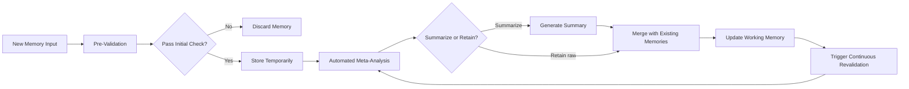
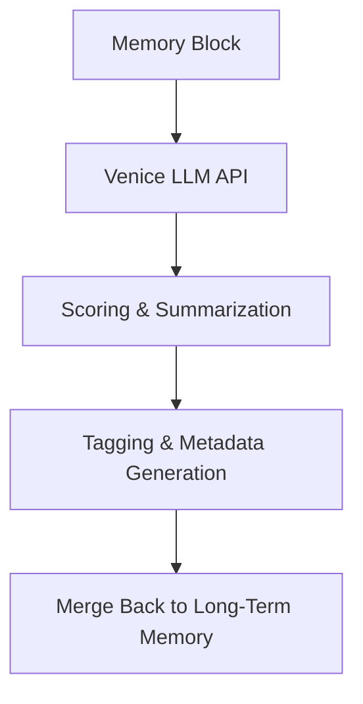
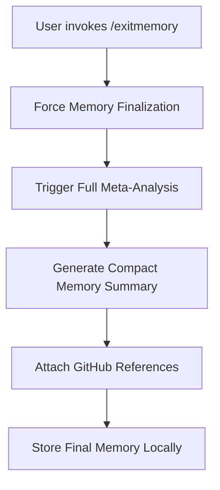

# Chat and Memory System – Comprehensive Technical Documentation

This document serves as a detailed reference for implementing the next-generation single-user chat system with advanced memory integration. The system is inspired by human cognition, computing networks, materials memory, and biogenetic processes. It is designed to operate seamlessly, with minimal manual intervention, while providing robust memory management and GitHub integration for traceability and context enrichment.

---

## Overview

The chat system is divided into three main components:

1. **Primary Chat Interface**  
   - Captures user input and generates AI responses on the client side.
   - Does not persist full conversation data on the server.
   - Commands (e.g., `/exitmemory`) manually trigger memory finalization.

2. **Memory Subsystem**  
   - Stores and continuously refines ephemeral memories.
   - Uses automated meta-validation and analysis to determine whether to summarize, retain, merge, or discard memories.
   - Inspired by multiple memory paradigms (e.g., CPU cache, GPU memory, brain synapses, biogenetic memories).
   - Integrates with GitHub for attaching code references and experimental logs.

3. **Inference Points**  
   - Integrates with external AI systems (e.g., Venice LLM) for advanced query generation, memory validation, and summarization.
   - AI-driven scoring and tagging ensure memory relevance and quality.

---

## System Architecture

### A. Chat Input and Response Flow

```mermaid
flowchart TD
    A[User Input] --> B[Chat Parser]
    B --> C{Memory Mode Enabled?}
    C -- No --> D[Discard Ephemeral Data]
    C -- Yes --> E[Store in Ephemeral Memory]
    E <--> F[Memory Analyzer & Merger]
    B --> G[AI Response Generator]
    G --> H[Display Response to User]
    F --> H
    H --> I[/exitmemory Command Trigger]
    I --> J[Manual Memory Finalization]
```

**Explanation:**
- **A → B:** User input is captured and parsed.
- **B → C:** The system checks if memory mode is enabled.
- **C → D/E:** Based on the toggle, ephemeral memory is either discarded or stored.
- **E ⇄ F:** The memory subsystem continuously reanalyzes and merges recent inputs.
- **B → G → H:** Simultaneously, the AI generates a response.
- **F → H:** Memory references may be appended to the output.
- **H → I → J:** The `/exitmemory` command finalizes the memory state (e.g., summarization, permanent storage in browser) and resets ephemeral memory.

---

### B. Memory Subsystem – Detailed Design

The memory subsystem is the core of the system, inspired by human cognition and computational memory hierarchies. It ensures that ephemeral memories are continuously analyzed, validated, and refined.

#### 1. Memory Layers

| **Layer**         | **Purpose**                             | **Lifetime**                      | **Location**                         | **Access**                          |
|--------------------|-----------------------------------------|-----------------------------------|--------------------------------------|--------------------------------------|
| **Short-Term**     | Session-only context                    | Minutes (ephemeral)               | In-memory (RAM)                      | Instant during session only          |
| **Working Memory** | Real-time ephemeral data                | Seconds–minutes (ephemeral)       | In-memory (RAM)                      | Only relevant to immediate tasks     |
| **Long-Term**      | Validated knowledge                     | Persistent (until edited)         | `long_term_registry.md` in GitHub    | Queried post-session                 |
| **Meta Memory**    | Summarized and validated memories       | Persistent                        | `meta_memory_registry.md` in GitHub | Summarized for future retrieval      |
| **Cache**          | Recently referenced items               | Temporary                         | Local map/Redis-like store           | Fast retrieval of “hot” data         |

---

#### 2. Memory Flow and Meta-Validation



**Explanation:**
- **A → B:** New memory input is pre-validated for relevance and quality.
- **B → C:** If the memory fails validation, it is discarded.
- **C → E:** Valid memories are stored temporarily.
- **E → F:** Automated meta-analysis determines whether to summarize or retain the memory.
- **F → G → H/I:** Based on analysis, the memory is either summarized or retained in its raw form.
- **I → J:** Updated working memory is continuously revalidated for consistency.
- **J → K → F:** The system iterates over memory content to refine and optimize storage.

---

### C. Inference Points and AI Integration

#### 1. Venice LLM Integration

- **Purpose:**  
  - Advanced query generation for research pipelines.
  - Memory validation and summarization.
  - Contextual tagging and metadata generation.

- **Process:**  
  - Memory blocks are sent to Venice LLM for scoring and summarization.
  - AI-generated tags and confidence scores are appended to memory metadata.
  - Summarized memories are merged back into the long-term memory layer.



#### 2. Automated Query Generation

- **Purpose:**  
  - Generate advanced queries for research pipelines based on chat context and memory.
  - Use AI to refine query breadth, depth, and specificity.

- **Process:**  
  - Chat context and memory are analyzed to extract key topics.
  - Venice LLM generates queries with advanced operators (e.g., site-specific searches, exclusions, wildcards).
  - Queries are passed to the research pipeline for execution.

---

## D. Information Flow and Orchestration

This section explains how different subsystems pass, transform, and inject memories into the chat flow.

- **Data Capture & Injection:**  
  User inputs are captured, parsed, and transformed into memory blocks. These blocks are instantly passed to the Memory Subsystem for temporary storage.

- **Ephemeral to Persistent Transition:**  
  Ephemeral (Short-Term/Working) memories are validated through automated processes. Once validated via meta-analysis, these memories are summarized and migrated to Long-Term and Meta Memory layers in GitHub repositories.

- **Inter-System Communication:**  
  Information flows between the chat interface, memory layers, and external tools (e.g., GitHub, Venice LLM). GitHub stores the permanent memory registries whereas Venice LLM processes memory blocks for scoring, summarization, and tagging before reintegration.

- **Inference Points:**  
  Key transformation points are when:
  1. A new memory is pre-validated and then sent for meta-analysis.
  2. Venice LLM is invoked for scoring, tagging, and generating enhanced queries.
  3. Memory summaries are merged back into the persistent layers.
  These stages ensure that only high-quality, context-enriched information is injected into the chat responses.

---

## E. Minimum Viable Product (MVP) Roadmap

The MVP focuses on a basic yet functional integration of the chat and memory systems using available tools:

1. **Basic Chat Interface:**  
   - Capture user inputs and generate AI responses.
   - Support for manual `/exitmemory` command to trigger memory finalization.

2. **Ephemeral Memory Capture:**  
   - Store incoming messages in short-term and working memory.
   - Perform basic pre-validation and discard irrelevant data.

3. **Memory Processing:**  
   - Implement an initial meta-analysis component that uses core rules to merge or summarize memory blocks.
   - Integrate Venice LLM for basic scoring and tagging of memory inputs.

4. **Data Persistence & GitHub Integration:**  
   - Create initial registries (`long_term_registry.md` and `meta_memory_registry.md`) to store validated memories.
   - Tag memory entries with GitHub commit references for traceability.

5. **Robust Flow Orchestration:**  
   - Monitor data flow between chat inputs, memory analysis, and output generation.
   - Establish explicit inference points for memory transformation and injection into subsequent chat responses.

The goal is to maintain elegance by leveraging existing frameworks and APIs while ensuring scalability for future memory layer enhancement.

---

### F. Granular Memory Control and Retrieval

To enhance chat quality, our system can toggle storing and retrieving memories as separate processes. This enables:

- Granular Retention Levels:  
  Settings to control memory depth (short, medium, long-term) determine how much context to inject into active chats.
  
- Toggle Flags:  
  The system allows separate flags for storing (capturing inputs) and retrieving (injecting relevant memories) to refine context. For instance, memories are searched for key terms; when triggered, the chat message is injected with a reference such as:
  
  [memory] 1233  
  [user input] "Your latest query..."
  
- Automated Memory Validation:  
  Instead of manual pruning, raw messages are sent at key inference points to Venice LLM. This LLM scores, tags, and decides which memories—raw or summarized—are injected back into the conversation for enhanced context and quality.

---

### G. Integration of Inference Points in the Research Pipeline

Key Inference Points occur when:
- New chat inputs or memory blocks are sent for Venice LLM processing.
- In the research pipeline, aggregated chat history and memory blocks are scored and tagged to determine relevance.
- The validated and enriched memories are reconstituted into the conversation flow.

The process works as follows:
1. Capture user input and store memory blocks.
2. Pre-validate messages and send to Venice LLM for meta-analysis.
3. Use Venice LLM responses to score, tag, and refine memories.
4. Inject chosen memory blocks back into chats (e.g., using markers such as `[memory] ID`) to improve context.

This pragmatic approach leverages existing tools and APIs to balance simplicity with advanced memory enhancement, ensuring our next-gen AI app remains both elegant and effective.

---

### D. Manual Overrides and GitHub Integration

#### 1. Manual `/exitmemory` Command

- **Purpose:** Finalizes all ephemeral memories and triggers a full meta-summary routine.
- **Process:**
  - Summarizes ephemeral memories into compact blocks.
  - Clears raw chat memory if needed, based on user preference.

#### 2. GitHub Integration

- **Purpose:** Enhances traceability and reproducibility by linking memory blocks to GitHub commits or issues.
- **Process:**
  - Memory blocks are tagged with GitHub references.
  - Developers can trace which code contexts influenced AI responses.



---

## Integration Challenges and Considerations

### 1. Balancing Chat and Memory Functions

- **Seamless Automation vs. Manual Control:**  
  The system should operate automatically, with memory analysis occurring in the background. Manual commands (e.g., `/exitmemory`) allow users to fine-tune memory retention.

- **Dynamic Memory Profiles:**  
  Memory profiles mimic computational hierarchies:
  - **"CPU" Memory:** Instantaneous inputs processed by AI.
  - **"RAM" Memory:** Active working memory combining recent interactions.
  - **"Cache" and "Long-Term" Memory:** Summaries periodically refreshed by meta-analysis.

- **Real-Time Meta-Validation:**  
  Continuous analysis ensures self-correction. Conflicting information is flagged, and the system suggests summarization or deletion.

- **Automated Summarization and Reiteration:**  
  The AI periodically reviews stored memories to decide if updates are needed.

---

### 2. Gaps and Pragmatic Improvements

- **Granular Memory Control:**  
  Introduce settings to control the “depth” of memory retention (e.g., short, medium, long-term).

- **Context-Aware Expiry:**  
  Memories expire automatically based on relevance, ensuring outdated information is pruned.

- **Adaptive Triggering for Meta-Analysis:**  
  Monitor conversation complexity and adjust thresholds for summarization dynamically.

- **Integration with External Knowledge Bases:**  
  Allow optional references (via GitHub or dedicated databases) for advanced research contexts.

- **User Feedback Loop:**  
  Prompt users to confirm memory summaries, training the system further.

---

## Summary

This document provides a comprehensive blueprint for implementing the chat and memory system. Key features include:

- **Memory Layers:** Inspired by human cognition and computational hierarchies.
- **Meta-Validation:** Ensures memory quality through continuous analysis.
- **Inference Points:** Venice LLM integration for advanced query generation and memory validation.
- **GitHub Integration:** Enhances traceability and reproducibility.
- **Manual Overrides:** Allow users to fine-tune memory retention.

The mermaid diagrams illustrate the flow of user input, memory processing, and meta-validation. This documentation should serve as the foundation for development, ensuring all edge cases are addressed before implementation.

---

*End of Document*


