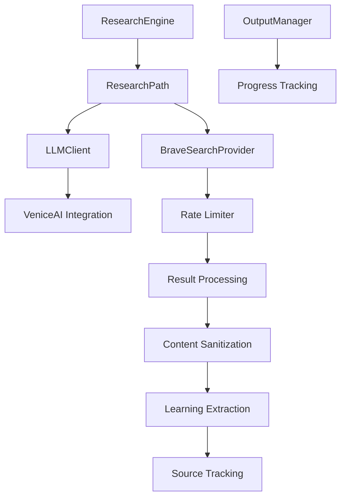
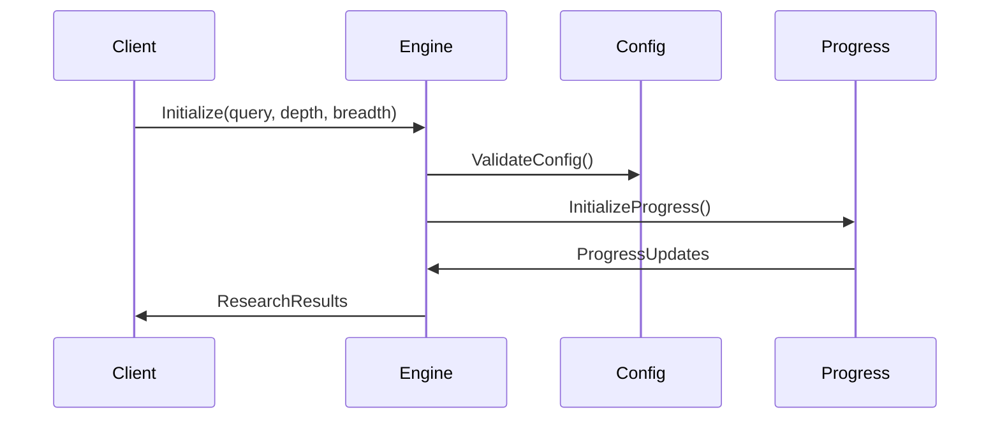
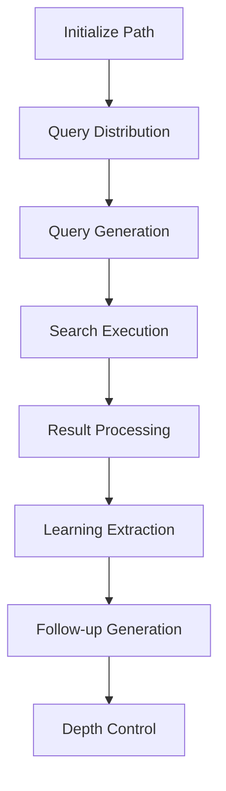
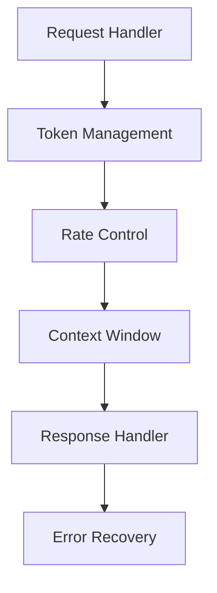
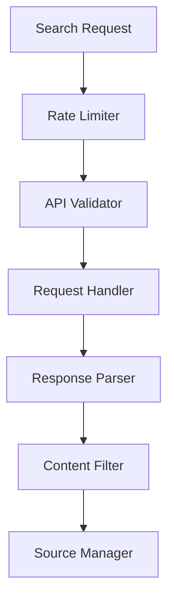
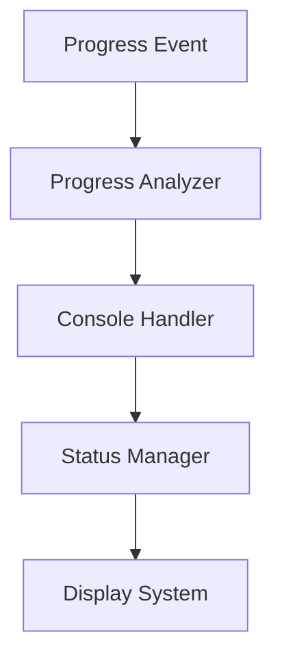
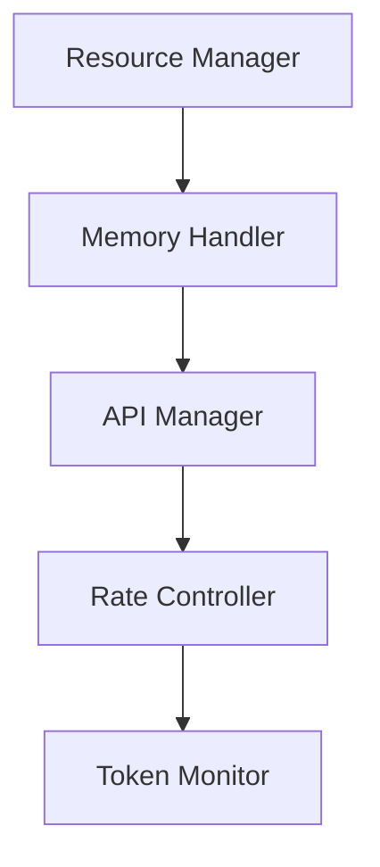
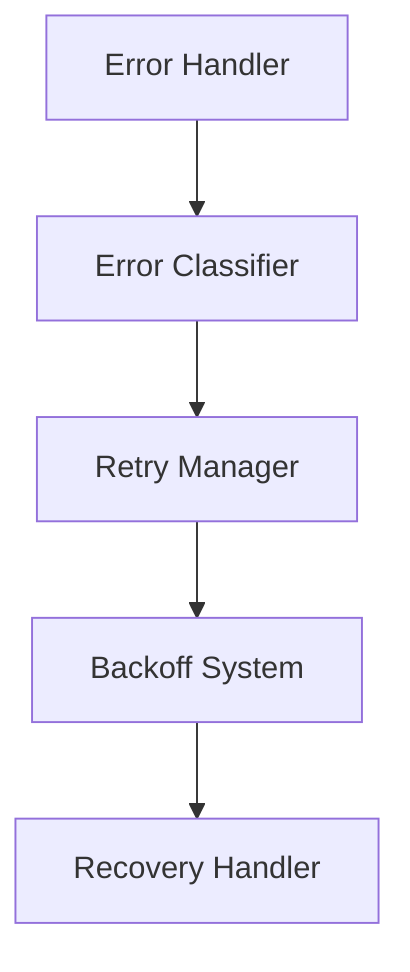
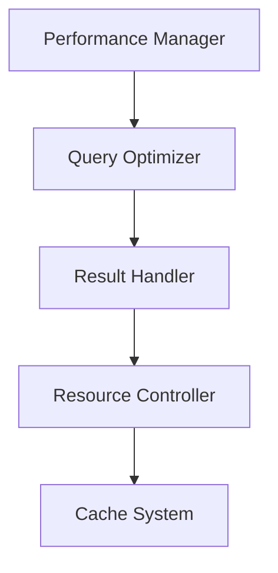
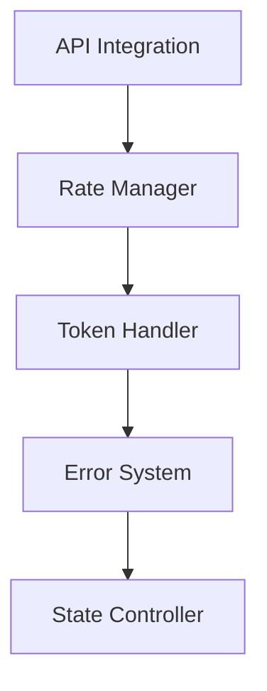

# Deep Research Pipeline – Technical Guide

This document is the source of truth for how the current Deep Research pipeline works across CLI and WebSocket entry points. It reflects the implementation in `/app` as of September 2025.

---

## 1. High-Level Architecture

| Layer | Modules | Responsibility |
| --- | --- | --- |
| **Entry Points** | `app/commands/research.cli.mjs`, `app/features/research/routes.mjs`, `app/commands/chat.cli.mjs` (chat-to-research) | Parse user intent, collect options/flags, prompt for optional settings (token classifier, depth/breadth), and trigger research execution. |
| **Controller** | `app/features/research/research.controller.mjs` | Normalises inputs from CLI/WebSocket, binds output/error/progress handlers, and delegates to the engine. |
| **Engine** | `app/infrastructure/research/research.engine.mjs` | Builds and runs one or more `ResearchPath` instances, aggregates their output, and produces the final Markdown payload. |
| **Path Execution** | `app/infrastructure/research/research.path.mjs` | Executes a single breadth/depth branch: query scheduling, Brave API calls, follow-up generation, and progress reporting. |
| **Providers** | `app/features/ai/research.providers.mjs`, `app/infrastructure/search/search.providers.mjs`, `app/utils/token-classifier.mjs` | LLM prompts (Venice) for query generation, summarisation, follow-ups, and Brave search integration. |
| **Output Plumbing** | `app/utils/research.output-manager.mjs`, `app/utils/websocket.utils.mjs` | Broadcasts progress/outputs to CLI stdout and active WebSocket sessions. |

---

## 2. Execution Flow

1. **Command Dispatch**
    - CLI: `/research`, `/research --classify`, or chat `/research` calls `executeResearch` in `research.cli.mjs`.
    - WebSocket: `handleCommandMessage` (`routes.mjs`) recognises the `/research` verb and routes through the controller.

2. **Options Gathering**
    - Depth, breadth, model, and classifier prompts are requested via `promptUser` (CLI) or `wsPrompt` (Web).
    - Token classifier opt-in triggers Venice metadata enrichment through `token-classifier.mjs` prior to query generation.

3. **Engine Invocation**
    - `ResearchController.execute()` constructs an engine config object (user context, API keys, output streams, cache state) and passes it to `ResearchEngine.run()`.

4. **Query Generation**
    - `generateQueries` in `research.providers.mjs` uses Venice to create initial breadth queries from the user prompt plus optional classification metadata.
    - A rate-limited Brave provider (`search.providers.mjs`) is instantiated alongside optional follow-up models (`generateFollowUps`).

5. **Path Orchestration**
    - `ResearchEngine` iterates breadth queries, building a `ResearchPath` per query. Each path:
      - Executes Brave searches with retry/backoff.
      - Calls Venice for synthesis (`generateSummary`, `generateLearnings`).
      - Emits granular progress through `progressHandler`.

6. **Aggregation & Markdown Build**
    - Each path yields structured results (sources, learnings, summary). The engine collates them, applies deduplication, and renders Markdown via `generateMarkdownResult`.

7. **Post-Research Action**
    - CLI displays a text menu.
    - WebSocket sessions send a `post_research_action` prompt (Display / Download / Upload / Discard). GitHub uploads rely on `app/utils/github.utils.mjs` with decrypted user credentials.

---

## 3. Key Components in Detail

### 3.1 `ResearchEngine`
- Entry method: `run({ query, options, output, progressHandler, user, session })`.
- Normalises options (depth, breadth, follow-up limits) and seeds a shared `progressData` object.
- Calls `createResearchPath()` for each starting query, wiring output/debug/progress callbacks.
- Maintains `visitedUrls` to avoid duplicate Brave fetches across paths.
- Aggregates results in `combineResults()` and returns `{ markdown, summary, sources, learnings }`.

### 3.2 `ResearchPath`
- Accepts engine config plus path-specific data (`initialQuery`, `pathIndex`).
- Key phases:
  1. `prepareQueryObjects()` – ensures consistent shape (`{ query, metadata, tokenClassification }`).
  2. `executeBreadth()` – runs initial Brave searches, tracks completion.
  3. `generateDepthFollowUps()` – optionally uses Venice to create follow-up questions.
  4. `executeDepthQueries()` – runs follow-ups and merges results.
  5. `synthesise()` – summarises via Venice, compiles learnings, and maps sources.
- Emits progress via `updateProgress({ completedQueries, totalQueries, phase, message })`.

### 3.3 Providers & Utilities
- **Venice Client**: `app/infrastructure/ai/venice.llm-client.mjs` wraps REST calls with retry/backoff. Character presets live in `venice.characters.mjs` and models in `venice.models.mjs`.
- **Brave Provider**: `app/infrastructure/search/search.providers.mjs` handles REST fetch, error normalisation, and paging. Rate limiting is enforced by `app/utils/research.rate-limiter.mjs`.
- **Token Classifier**: `app/utils/token-classifier.mjs` optionally augments the initial query with Venice-driven metadata (entities, intent, guardrails) before `generateQueries` runs.
- **Output Manager**: `app/utils/research.output-manager.mjs` multiplexes console output and WebSocket output to keep CLI/Web parity.

---

## 4. CLI vs WebSocket Behaviour

| Capability | CLI (`research.cli.mjs`) | WebSocket (`routes.mjs`) |
| --- | --- | --- |
| Prompting | Uses `promptUser` (readline) for depth/breadth/classifier questions. | Sends `prompt` messages via WebSocket, client `terminal.js` handles modal input. |
| Progress | Console streaming via `output()` and `progress` text lines. | `progress` JSON messages consumed by `app/public/terminal.js`. |
| Post-action | Inline menu in terminal. | `post_research_action` prompt with buttons/commands. |
| Error handling | Throws to CLI runner → `cli-error-handler.mjs`. | Sends `error` messages plus optional `enable_input`. |

Both flows share the same engine/controller; the only difference is how prompts and outputs are surfaced.

---

## 5. Configuration & Secrets

- **API Keys**: Retrieved from `userManager` (`app/features/auth/user-manager.mjs`). If a logged-in user has encrypted Brave/Venice keys, they are decrypted on-demand; otherwise the engine falls back to environment variables (`BRAVE_API_KEY`, `VENICE_API_KEY`).
- **GitHub Uploads**: Require GitHub owner/repo/token fields on the authenticated user profile (or environment fallbacks). Uploads are routed through `github.utils.mjs`.
- **Timeouts & Limits**: Depth, breadth, and concurrency defaults live in `research.engine.mjs` and are overridden via CLI flags or Web prompts.

---

## 6. Testing the Pipeline

Relevant automated suites (Vitest):

- `tests/research-engine.test.mjs` – ResearchEngine orchestration.
- `tests/research-pipeline.test.mjs` – Integration-level pipeline behaviour.
- `tests/provider.test.mjs`, `tests/brave-provider.test.mjs`, `tests/brave-search-provider.test.mjs` – Provider and API client contracts.
- `tests/token-classifier.test.mjs` – Venice metadata enrichment.

When making pipeline changes, run:

```bash
npm test -- research
```

For manual smoke tests:

```bash
# CLI mode
npm start -- cli
/login <user>
/research "Example query" --depth=2 --breadth=2
```

```bash
# Web mode
npm start
# Visit http://localhost:3000, connect, and run /research from the terminal UI
```

---

## 7. Extension Points & Future Work

- **Alternate Search Providers**: Add new providers to `app/infrastructure/search/` and plug them into `research.providers.mjs` via dependency injection.
- **Custom Post-Actions**: Extend `ResearchController.handlePostResearchAction` to add new export targets (e.g., S3, email).
- **Observability**: Hook additional telemetry into `research.output-manager.mjs` or integrate with a logging service for production deployments.

---

This guide is updated whenever the research pipeline contract changes. Treat it as canonical documentation when modifying the engine, providers, or user prompts.

### Core System Components and Data Flow



## Detailed Component Architecture

### 1. Research Engine Core (ResearchEngine)

The ResearchEngine orchestrates the research process with:



Core Components:
- ResearchConfig interface:
  - query: Research topic initialization
  - breadth: Parallel path configuration
  - depth: Path depth control
  - onProgress: Progress monitoring
- ResearchProgress tracking:
  - Real-time depth/breadth monitoring
  - Query completion status
  - Progress event handling

### 2. Research Path Implementation (ResearchPath)

Research execution flow:



Core Processing Steps:
1. Query Generation and Management
   - Intelligent query generation with LLM
   - Dynamic query reduction
   - Token optimization system
   - Context window management
   - Automatic query refinement

2. Search Execution System
   - Exponential backoff retry mechanism
   - Intelligent request throttling
   - API state management
   - Dynamic rate limiting
   - Error recovery protocols

3. Result Processing Pipeline
   - Content sanitization
   - Source validation
   - Learning synthesis
   - Token optimization
   - Cross-reference verification

### 3. LLM Integration Architecture (LLMClient)

Venice.ai integration system:



Key Features:
- Adaptive token management
- Model selection optimization
- Smart retry mechanisms
- State preservation
- Response validation

### 4. Search Provider Architecture (BraveSearchProvider)

Privacy-focused search implementation:



Implementation:
- Request rate optimization
- Error classification system
- Intelligent retry logic
- Content validation pipeline
- Source verification

### 5. Progress Tracking System (OutputManager)

Real-time monitoring system:



Features:
- Real-time progress computation
- Dynamic visualization system
- State management
- Query tracking optimization

### 6. Resource Management

System resource optimization:



Core Features:
- Memory optimization system
- Batch processing controller
- Buffer management system
- Resource allocation optimization

### 7. Error Handling Architecture

Robust error recovery system:



Implementation:
- Smart backoff system
- State preservation mechanism
- Error classification engine
- Recovery strategy optimization

## Performance Optimization

Performance architecture:



Key Areas:
1. Query Optimization
   - Dynamic query refinement
   - Context-aware generation
   - Redundancy elimination
   - Pattern recognition

2. Result Processing
   - Parallel processing system
   - Incremental aggregation
   - Memory-efficient handling
   - Result validation

3. Resource Utilization
   - Dynamic rate management
   - Adaptive batch processing
   - Smart resource allocation
   - Cache optimization

## Technical Integration Points

Integration architecture:



Implementation:
- Secure API management
- Rate control optimization
- Token usage monitoring
- State management system
- Recovery mechanisms
