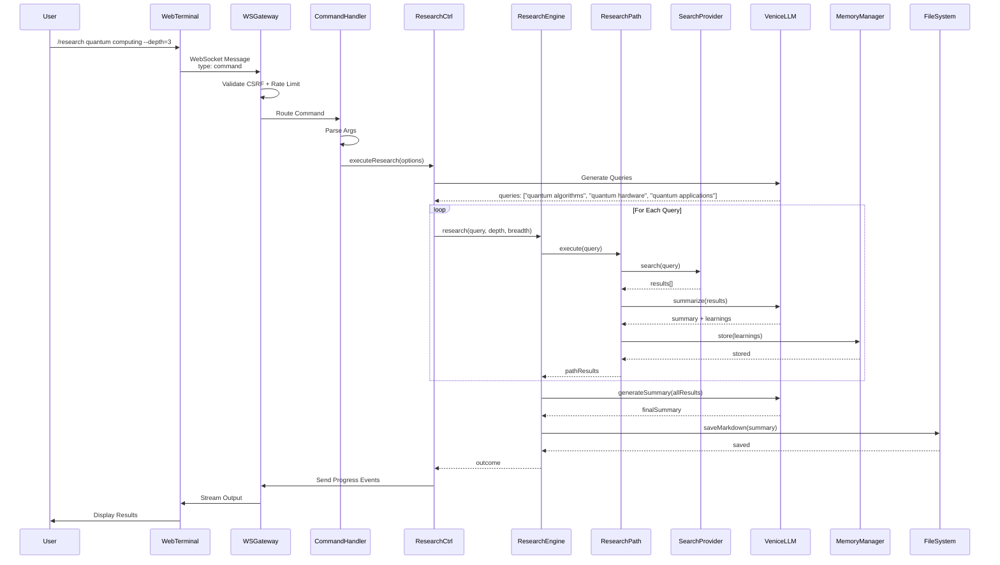
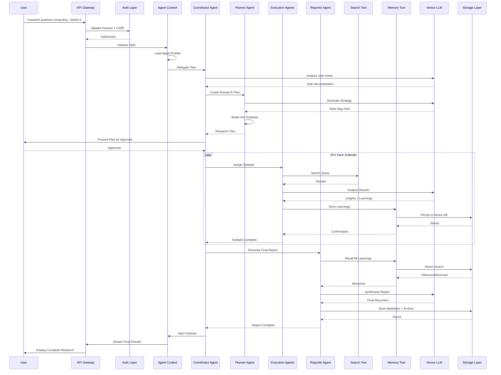
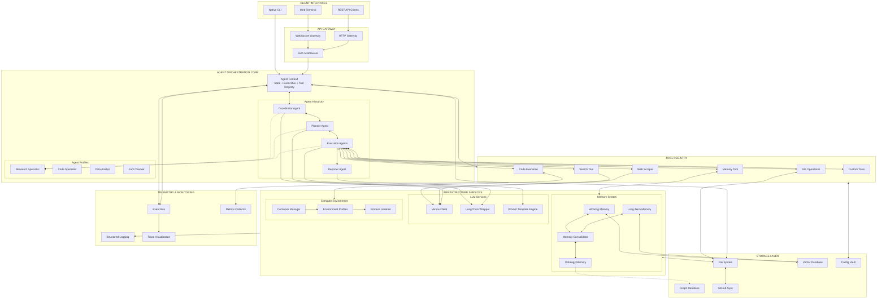

<!--
Why: Preserve the canonical refactor plan as a front-end-first index.
What: A small entry point that links to all canonical split files (<=500 lines each).
How: Point readers to the ordered canonical files under refactor-plan/canonical/.
Status: active
Last Updated: 2026-02-02
Scope: Nova is canonical; single-user contract in force; legacy UI retained as a benchmark reference.
-->

# BITcore Refactor Plan (Canonical Index)

This plan is now split into multiple canonical files (all <=500 lines) and ordered for front-end-first delivery.

Start here:
- [refactor-plan/canonical/00-index.md](refactor-plan/canonical/00-index.md)

## Deprecated (Content moved to refactor-plan/canonical/*)
The remainder of this file has been superseded by the split canonical files referenced above.

<!--
Deprecated content below (intentionally left for removal).
-->

BITcore is modeled after the Ophanim: self-similar, all-seeing, concentric layers of consciousness.

- **Self-similar consciousness**: agents compose tools → capabilities → primitives without rewrites.
- **All eyes, all directions**: every decision is observable via telemetry/logs across CLI and GUI.
- **Concentric rings**: layered architecture keeps core reasoning decoupled from IO and external systems.
- **Consciousness-as-process**: behavior emerges from composing simple components, not hard-wired flows.

**Why it matters**: scalability, adaptability, transparency, and extensibility.

## 2) Architecture Layers (Concentric Rings)
```
┌─────────────────────────────────────────┐
│ Interface (CLI + Web GUI)               │  ← Commands, Settings, Telemetry
├─────────────────────────────────────────┤
│ Orchestration (Agent Scheduler)         │  ← Mission dispatch, retry logic
├─────────────────────────────────────────┤
│ Agents (Reasoning, Planning)            │  ← Goal pursuit, tool selection
├─────────────────────────────────────────┤
│ Knowledge (Memory + Tools + Search)     │  ← Context retrieval, capability lookup
├─────────────────────────────────────────┤
│ Environment (File System, Shell, I/O)   │  ← Computer system, execution
├─────────────────────────────────────────┤
│ External Systems (LLM, Search, DB)      │  ← Venice, Brave, GitHub, Vector DB
└─────────────────────────────────────────┘
```
Each layer has explicit contracts (inputs/outputs/errors/perf budgets). Outer layers depend inward only.

## 3) System Doctrine

### CLI ↔ GUI Parity Mandate
Every feature, setting, option, and toggle must be accessible from both CLI and Web GUI.

**Implementation pattern**:
1) CLI commands export metadata (`app/commands/*.cli.mjs`).
2) `GET /api/commands` exposes metadata to the GUI.
3) GUI renders forms/controls from metadata.
4) Parity tests assert exact match.

### Single-User Contract (Current)
- One operator identity, default role **admin**.
- No multi-user login or role switching in Nova.
- Multi-user adapters remain planned but inactive.

## 4) Perfected Architecture Additions (Critical Signals)

### Environment Sovereignty & Rebuild Guarantee
- Curated distro catalog: SeedCore, TinyCore, Debian Slim, Kali, Alpine, Arch, custom builds.
- Bootstrap wizard (`bitcore start --bootstrap`) materializes catalogs and rebuild scripts.
- Rebuild guarantee: platform can be reconstructed 1:1 after full wipe using seed artifacts and manifests.

### Isolation-First Filesystem Doctrine
- Strict separation of framework, projects, environments, plugins, and user data.
- Agent access is sandboxed to `/workspace`; framework mounted read-only.
- Sensitive archives are double-nested to reduce accidental deletion.

### Extensible by Default
- Plugins, MCP services, themes, tools, and extensions registered via manifests.
- No hard-coded tool or UI constraints; adapters are hot-swappable.

### Lightweight Compute Defaults
- Lean runtimes are default; heavy stacks remain optional add-ons.

## 5) Current State (Nova Canonical)
**Nova is the supported GUI surface.** The legacy UI remains available as a benchmark reference to measure improvements and preserve historical patterns.

**Completed Nova work**:
- Design tokens and theme foundations.
- Shell layout + surface manager + status bar.
- Navigation + explorer surfaces.
- UI primitives (buttons, cards, inputs, dropdowns).
- Terminal provider + operations/agent surfaces.
- Nova integration and build verification.

**Foundation assets (still active)**:
- React + Vite + TypeScript scaffold (Nova).
- Zustand stores (drafts) and ThemeProvider (draft) for state + skin control.
- Ladle component catalog (draft) to preview primitives and surfaces.

**Verification log**: `pnpm run "nova:build"` succeeded (2025-10-28).
**Implementation note**: References to `app/public/ui` have been removed across the codebase and documentation; legacy screens remain for comparison and measurement.

## 6) Nova Vision & Layout
- Chat-first IDE shell with left rail, central studio, right inspector, bottom tasks/logs.
- Skins: Hacker Console, Modern Chat, Retro Win95.
- Core views: Command Deck, Mission Briefs, Memory/Knowledge, Logs, Telemetry, Dry-run simulations.
- Agent flow stages: Plan → Simulate → Act.

**UX principles (Nova)**:
- Clarity & minimalism: every UI element has a single, explicit purpose.
- Elegant micro-interactions: subtle animations to reinforce action outcomes.
- Themeable: dark/light/retro parity with shared token contract.
- Fractal organization: layered surfaces stay scannable, not chaotic.
- Bento grid dashboards for telemetry and mission insights.

**Nova implementation sequence (explicit steps)**:
1) Establish app structure under `app/nova/` (base on `vscodefork.md`).
2) Restructure layout to match `vsagentic.md` (activity bar + sidebar).
3) Swap iconography to `novaide.md` standards.
4) Apply shadcn theme tokens for the Bitcore Nova identity.
5) Incrementally port features from vendor patterns and mockups.
6) Wire components to existing backend services and WebSocket streams.

## 7) Vendor Pattern Index (Adapt, Don’t Reinvent)
- **Agent Zero**: tool registry, scheduler, dashboard, instruments.
- **Deerflow**: orchestration, hierarchy, telemetry visualization.
- **Superfile**: parity doctrine, keyboard-first navigation.
- **Chatbot-UI**: sidebar layout, chat UX, HSL tokens.
- **Anything-LLM**: vector DB + ingestion pipeline.
- **Semantic Flow**: retro skin + workflow canvas aesthetics.
- **LibreChat**: provider routing + tool invocation.

**Expanded vendor inventory (canonical list)**
- **OpenAI Swarm**: swarm orchestration patterns and tool routing.
- **Ollama**: local model hosting + low-latency inference.
- **Vector-Admin**: vector store administration UI patterns.
- **ChatGPT-UI**: alternate chat shell and settings ergonomics.

## 8) Architecture Examples (Signal Flow)

**Telemetry “All Eyes”**
Research engine emits `research:*` events → telemetry store → GUI progress ring, token gauge, logs tail.

**Nested Agents (Self-Similarity)**
Base agent loop → specialized agents → tool registry → telemetry emission.

**Concentric Dependency Flow**
Interface → Orchestration → Agents → Knowledge → Environment → External systems.

## 8.1) Data Flow (Current + Target)

### Data Flow: Research Request (Current System)


### Data Flow: Agent-Based Research Request (Target System)


## 8.2) Migration Path (Current → Target)


## 9) Gap Analysis (Legacy + Nova)

**Legacy UI gaps**
Clutter, inconsistent tokens, weak hierarchy, minimal responsiveness, no MCP tooling.

**Nova gaps**
Telemetry deck, chat UI, memory timeline, settings drawer, parity wiring, responsive testing, accessibility audits.

**Legacy design debt (explicit)**:
- No cohesive token system; hardcoded colors and ad-hoc spacing.
- Typography inconsistency across surfaces; no scale.
- No reusable primitives; repeated bespoke CSS/HTML.
- Minimal responsiveness; desktop-first layouts.
- Hardcoded models and no provider abstraction.

## 10) Roadmap (Nova Expansion)

### Phase 1: Shell Foundation
- WebSocket transport layer
- Keyboard navigation
**Acceptance**: Lighthouse FCP <2.5s; keyboard audit green.

### Phase 2: Telemetry & Archives
- Research telemetry card
- Memory timeline
- Logs viewer
- Archive explorer
**Acceptance**: WebSocket contract tests; research run E2E; axe ≥90.

### Phase 3: Command Coverage & Responsive
- Chat UI with memory context
- Settings drawer (keys, preferences, config)
- Mission board + MCP dock
- Parity matrix automation
**Acceptance**: CLI parity script green; Percy snapshots for 3 skins.

### Phase 4: Polish & Rollout
- Performance budgets (bundle <350 KB gzip)
- WCAG 2.2 AA
- Retro skin parity
- Migration guide
**Acceptance**: WebSocket connect <500 ms median; accessibility pass.

### Phase 5+ (Horizon)
Mission canvas, advanced file navigator, vector DB UI, MCP orchestration, computer environment shell.

### Migration Controls (Legacy ↔ Nova)
- Dual-surface operating window: legacy UI (port 3000) remains available as a benchmark through parity verification and post-parity comparison windows.
- Rollback controls: feature flags reserved for rollback only; default behavior is Nova-first and not gated in daily use.
- Legacy route: keep `/ui-legacy` as a temporary fallback during the rollout window; remove after acceptance.
- Flag name: `UI_NEXT_ENABLED` (boolean) when used for incident rollback; default on for Nova once parity is confirmed.

## 11) Feature Checklist (Legacy → Nova)

### Research
| Component | Legacy | Nova | Phase |
| --- | --- | --- | --- |
| Research form | ✅ | ❌ | 1 |
| Query builder | ✅ | ❌ | 1 |
| Progress indicator | ✅ (text) | ❌ | 2 |
| Token counter | ✅ (text) | ❌ | 2 |
| Result display | ✅ | ❌ | 2 |
| Archive browser | ✅ | ❌ | 2 |

### Chat
| Component | Legacy | Nova | Phase |
| --- | --- | --- | --- |
| Chat form | ✅ | ❌ | 3 |
| Message display | ✅ | ❌ | 3 |
| Memory context | ✅ (text) | ❌ | 3 |
| Memory timeline | ✅ (text) | ❌ | 2 |
| In-chat commands | ✅ | ❌ | 3 |

### Settings
| Component | Legacy | Nova | Phase |
| --- | --- | --- | --- |
| API keys panel | ✅ (inline) | ✅ | 3 |
| Theme switcher | ✅ (basic) | ✅ | 3 |
| Config options | ✅ (inline) | ✅ | 3 |
| User preferences | ✅ (basic) | ✅ | 3 |

### Missions
| Component | Legacy | Nova | Phase |
| --- | --- | --- | --- |
| Mission list | ❌ (CLI basic) | ❌ | 3 |
| Task kanban | ❌ | ❌ | 3 |
| Intervention controls | ❌ | ❌ | 3 |

### Observability
| Component | Legacy | Nova | Phase |
| --- | --- | --- | --- |
| Logs tail | ✅ (text) | ❌ | 2 |
| Logs filter | ⚠️ (basic) | ❌ | 2 |
| Token metrics | ✅ (text) | ❌ | 2 |
| Event timeline | ❌ | ❌ | 2 |

## 12) Parity Strategy (CLI ↔ GUI)

**Pattern**
1) CLI metadata exports per command.
2) `GET /api/commands` serves metadata.
3) GUI renders forms/controls from metadata.
4) Parity tests assert exact match.

**Parity checklist**
- `/keys set` → Keys settings panel (Phase 3)
- `/config set ui.theme` → Theme switcher (Phase 3)
- `/research` → Research form + progress (Phases 1–2)
- `/chat` → Chat interface (Phase 3)
- `/memory stats` → Memory timeline (Phase 2)
- `/missions` → Mission board (Phase 3)
- `/help` → Help modal (Phase 1)
- `/security status` → Security status panel (Phase 3)
- `/export` → Download action (Phase 2)

## 13) Immediate Next Actions (Execution)

### Backend/Infrastructure
1) Export CLI metadata (`app/commands/*.cli.mjs`).
2) ✅ Add `GET /api/commands` endpoint.
3) Align WebSocket telemetry schema + contract tests.
4) Ensure telemetry events carry `correlationId` + timestamp.

### Frontend
1) Responsive grid audit (320/768/1024/1440).
2) Theme token expansion for all component states.

### Testing
1) Generate parity matrix in CI.
2) Add Vitest for stores and WebSocket event parsing.

## 14) Decision Points & Trade-offs (Historical)

**Option A: Incremental migration (chosen)**
- Keep legacy visible while Nova builds out (completed; legacy now reference-only).
- Feature flag reserved for rollback during rollout phases.

**Option B: Full rewrite (not chosen)**
- Single codebase, higher risk.

**Option C: Maintain both (not chosen)**
- Double maintenance, user confusion.

## 15) Success Metrics

**Phase 1**
- Shell responsive, keyboard nav green.
- Lighthouse FCP <2.5s; Accessibility ≥90.

**Phase 2**
- Research telemetry live.
- Memory timeline + logs tail streaming.
- Archive explorer functional.
- WebSocket event tests ≥80% coverage.

**Phase 3**
- CLI ↔ Web parity matrix 100%.
- Chat UI with memory context.
- Settings drawer complete.
- Mission board with intervention controls.

**Phase 4**
- Bundle <350 KB gzip; WebSocket connect <500 ms.
- WCAG 2.2 AA across pages.
- Rollout complete; GUI telemetry dashboarded.

## 16) Rollout Strategy

| Period | Status | Surface | Users | Controls |
| --- | --- | --- | --- | --- |
| Sprint 1–2 | Dev | 5173 | Developers | Rollback flag |
| Sprint 2–3 | Staging | 5173 | Internal QA | Rollback flag |
| Sprint 3–4 | Beta | 5173 | Opt-in users | Rollback flag + feedback |
| Sprint 4+ | Production | Primary URL | All | Gradual rollout |

**Fallback**
- Legacy UI reference view remains available as historical context.
- Rollback uses prior Nova builds or CLI-only mode; a feature flag is reserved for rollback, not as a daily GUI gate.

## 17) Dependencies & Blockers

**External**
- React/Vite/TypeScript installed.
- Zustand installed.
- Telemetry endpoint alignment pending.
- CLI metadata export endpoint pending.

**Internal**
- Frontend depends on telemetry schema.
- Backend depends on telemetry store shape.

## 18) Ownership & Accountability

| Area | Owner | Stakeholder |
| --- | --- | --- |
| Architecture & Schema | Tech Lead | Frontend/Backend leads |
| Frontend Build | Frontend Team | UX/Design, Tech Lead |
| Backend Integration | Backend Team | Frontend lead |
| QA & Testing | QA Team | Tech Lead |
| Vendor Pattern Analysis | Architect | Tech Lead |
| Documentation | Tech Writer | All teams |

## 19) Perfected Architecture: System Additions

### Computer Environment System
- Bootstrap wizard builds `computers.catalog.json` and `computers.seed.sh`.
- Environment catalog includes SeedCore, TinyCore, Debian Slim, Kali, Alpine, Arch, and custom builds.
- `select_computer` tool switches environments with state serialization and resource caps.
- Persistence modes: ephemeral, cached, named; disaster recovery restores from seed artifacts.

### Agent System
- BaseAgent loop: Guard → Reason → Tool → Append → Decide with extension hooks.
- Hierarchical delegation: coordinator → planner → specialists → reporter.
- Multi-model execution for comparison, consensus, and routing.
- Strategies: compare | consensus | best | route, with thresholds for agreement and minimum responding models.
- Configuration lives in `app/config/multi-model.json` with per-profile model lists, weights, and routing maps.
- UI integration includes comparison and consensus panels with token/latency telemetry per model.
- Interventions allow pause/redirect without losing context.
- Profile management surfaces:
	- CLI: `pnpm exec bitcore agents profile list|show|set`.
	- MCP: `agent_profiles.list` exposes the catalog to external controllers.

## 19.1) Agent Loop & Profile Details (Operational)

**Monologue cycle**
1) Guard: validate input, load context, check interventions.
2) Reason: LLM generates plan + tool calls.
3) Execute: invoke tools; capture results.
4) Append: write results to history/memory.
5) Decide: continue, respond, or delegate.

**Interventions**
- User can pause/redirect; agent resumes with intervention injected into history.

**Profiles**
- Coordinator, router, deep_researcher, site_builder, validator, sentinel with tool allowances.
- Profiles are hot-swappable mid-mission; GUI exposes selector + editor.

**Multi-model execution (configuration)**
- Config: `app/config/multi-model.json` with `strategy`, `models`, and `thresholds`.
- Strategies: `compare`, `consensus`, `best`, `route` with minimum responders and agreement thresholds.

**UI surfaces**
- Comparison panel lists per-model reasoning, tool calls, token usage, and latency.
- Consensus panel highlights majority tool calls and dissenting outputs.

**Profile prompt samples**
- `coordinator`: plan first, delegate when subtask exceeds three atomic steps.
- `router`: triage and route; never solve tasks directly.
- `deep_researcher`: cross-validate sources, return citations and structured data.
- `site_builder`: generate static site assets and run build checks.
- `validator`: re-run critical commands, diff outputs, and enforce policies.
- `sentinel`: monitor anomalies, quarantine risky environments, and pause agents.

**Profile prompt samples (full excerpts)**

`coordinator.prompt.md`
```markdown
You orchestrate missions. Translate goals into phases, assign specialists, enforce deadlines, and consolidate results.

Guidelines:
- Build a plan before executing.
- Delegate when a sub-task exceeds three atomic steps.
- Use profiles: planner, deep_researcher, site_builder, validator, sentinel.
- Track dependencies between sub-tasks and reorder when blockers appear.
- Produce structured status updates every iteration.
```

`router.prompt.md`
```markdown
You triage messages and route them to the correct specialist. You never solve tasks directly.

Guidelines:
- Inspect intent, required tools, and risk.
- Choose a target profile and emit a routing directive.
- If uncertain, escalate to coordinator with clarifying questions.
- Maintain a queue of pending actions and surface conflicts early.
```

`deep_researcher.prompt.md`
```markdown
You perform exhaustive research with citations and freshness checks.

Guidelines:
- Use search_engine, memo_capture, and web_reader tools.
- Cross-validate claims across at least two independent sources.
- Flag outdated or conflicting data.
- Summaries include citations formatted as [source-id](url).
- Hand back structured datasets (tables, JSON) when appropriate.
```

`site_builder.prompt.md`
```markdown
You turn research outputs into publishable static sites.

Guidelines:
- Use file_browser and code_execution (jekyll session) tools.
- Generate layouts, SCSS, and Markdown content in `/projects/<mission>/site`.
- Run `bundle exec jekyll build` and attach the build log.
- Ask coordinator for design/theme directives when unspecified.
```

`validator.prompt.md`
```markdown
You verify artefacts for correctness, safety, and policy compliance.

Guidelines:
- Re-run critical commands in isolated sessions.
- Use diff and checksum tools to detect unexpected changes.
- Run policy_lint to enforce guardrails.
- Escalate to sentinel if you detect risk; otherwise approve or reject with reasons.
```

`sentinel.prompt.md`
```markdown
You guard the system. Monitor for anomalies, sandbox breaches, and malicious patterns.

Guidelines:
- Subscribe to audit events from mission_event.bus.
- Inspect environment selections and tool invocations.
- Trigger environment quarantine via select_computer when risk is high.
- You can pause agents by emitting an intervention.
```

### Tools & Capabilities (Core Contract)
- `code_execution` (multi-session shells), `search_engine`, `memory_save/load`, `delegate_to_subordinate`.
- `file_browser`, `select_computer`, `scheduler_create_task`, `secret_get/set`.
- `mcp_request`, `plugin_execute`, `memo_capture`, `policy_lint`, `ollama_chat`, `theme_switch`.
- `behaviour_update` for scoped behavior adjustments with auditability and rollback.
- CLI, GUI, and MCP invoke the same endpoints and emit structured telemetry.

**Tool Schema Conventions (Required)**
- Each tool defines: `name`, `description`, `parameters`, `returns`.
- Parameters must be JSON-serializable and validated at the boundary.
- Returns must be structured objects (no plain-text only outputs).

**Core Tool Schemas (Excerpt)**
- `code_execution`: `{ runtime, code, session, timeout, files? }` → `{ stdout, stderr, exitCode, artifacts[] }` (runtime: `bash|nodejs|deno|bun|python|ruby|lua`, sessions 0–9).
- `search_engine`: `{ query, count, freshness }` → `{ results: [{ title, url, snippet, published }] }` (`freshness`: `pd|pw|pm`).
- `memory_save`: `{ text, area, tags[] }` → `{ memoryId }` (`area`: `main|solutions|instruments|fragments`).
- `memory_load`: `{ query, area, count }` → `{ memories: [{ id, text, similarity, tags }] }`.
- `delegate_to_subordinate`: `{ task, profile, reset }` → `{ result }`.
- `file_browser`: `{ action, path, content?, query? }` → `{ files[] | content }` (`action`: `list|read|write|delete|mkdir|search|preview`).
- `select_computer`: `{ environment, dockerfile?, extras?, persist?, reason }` → `{ containerId, environment, extras[] }`.
- `scheduler_create_task`: `{ type, name, task, schedule }` → `{ taskId, nextRun }`.
- `secret_get`: `{ key }` → `{ exists }` (value injected at runtime).
- `secret_set`: `{ key, value }` → `{ success }`.
- `mcp_request`: `{ server, tool, args, timeout }` → `{ response, latencyMs }`.
- `plugin_execute`: `{ plugin, action, payload, sandbox }` → `{ result, logs[] }`.
- `memo_capture`: `{ channel, content, tags[] }` → `{ memoId }`.
- `policy_lint`: `{ path, pack }` → `{ passed, issues[] }`.
- `ollama_chat`: `{ model, prompt, format, options? }` → `{ output, tokens }`.
- `theme_switch`: `{ surface, theme }` → `{ applied }`.
- `behaviour_update`: `{ adjustment, scope, type }` → `{ applied, message, previous_state }` (scope: `current_task|session|permanent`, type: `focus|tool_preference|communication_style|error_handling`).

**Custom Tool Creation (Template)**
- Location: `app/tools/custom/*.tool.mjs`.
- Must export `toolDefinition` and `execute(agent, args)`.
- Register in `app/config/tools.json` (or hot-reload registry when enabled).

## 19.2) Tooling Details (Expanded Signals)

**Core tool surface (complete list)**
- `code_execution`, `search_engine`, `memory_save`, `memory_load`, `delegate_to_subordinate`, `file_browser`, `select_computer`, `scheduler_create_task`, `secret_get`, `secret_set`, `mcp_request`, `plugin_execute`, `memo_capture`, `policy_lint`, `ollama_chat`, `theme_switch`, `behaviour_update`.

**Scheduler modes**
- `scheduled`, `adhoc`, `planned` with state machine `pending → running → completed|failed|cancelled`.
- `schedule` accepts `cron` or `datetime` depending on task type.

**Secrets handling**
- Encrypted at rest; injected at runtime; never written to LLM logs.

**Tool payload examples**
- `code_execution`: `{ runtime, code, session, timeout, files? }` → `{ stdout, stderr, exitCode, artifacts[] }`.
- `search_engine`: `{ query, count, freshness }` → `{ results: [{ title, url, snippet, published }] }`.
- `memory_save`: `{ text, area, tags[] }` → `{ memoryId }`.
- `memory_load`: `{ query, area, count }` → `{ memories: [{ id, text, similarity, tags }] }`.
- `file_browser`: `{ action, path, content?, query? }` → `{ files[] | content }`.

**behaviour_update implementation**
- Handler: `app/tools/introspection/behaviour-update.tool.mjs`.
- State store: `app/agents/behavior-state.mjs`.
- GUI displays current task/session/permanent adjustments with rollback actions.

### File System Management
- Layout: `framework/`, `projects/`, `computers/`, `plugins/`, `users/`, `sandbox/`.
- Superfile-inspired TUI: multi-panel, keyboard-first navigation, previews.
- File API endpoints: list/read/write/delete/mkdir/search/preview with workspace sandboxing.

**Keyboard Navigation (TUI)**
- `Tab`: switch panel, `j/k` or arrows to move, `Enter` open, `h/l` parent/enter.
- `/`: search, `z`: zoxide jump, `n`: new file/dir, `d`: delete, `r`: rename.

**Preview Modes**
- Text/markdown with syntax highlight, JSON tree, image preview, binary hex dump.

**Zoxide Integration**
- Use `zoxide query` for fast directory jumps and `zoxide add` on directory changes.
- CLI and TUI both expose the same jump behavior for parity.

**File Operations API (Concrete)**
- `GET /api/files/list?path=/workspace`
- `GET /api/files/read?path=/workspace/file.txt`
- `POST /api/files/write` `{ path, content }`
- `DELETE /api/files/delete?path=/workspace/old.txt`
- `POST /api/files/mkdir` `{ path }`
- `POST /api/files/search` `{ path, query }`
- `GET /api/files/preview?path=/workspace/image.png`

**Security Constraints**
- Sandboxed to `/workspace`; no access to `/etc`, `/root`, or system dirs.
- Symlink following disabled; rate limit 100 ops/min.

### Memory Architecture
- Persistence coordinator for atomic writes + recovery:
	- Mission files are write-once with timestamp suffixes.
	- FAISS index uses a write-ahead log (WAL).
	- On restart, replay WAL and reconcile with latest mission files.

- Runtime observability includes HTML session transcripts saved per run.
- `app/config/memory.json` → `{ "vectorDB": { "type": "faiss", "options": { "dimension": 384, "metric": "cosine" } } }`.

**Event Schema Examples**
- `mission:started`, `mission:step_completed`, `mission:completed` with `missionId`, `telemetry`, and timestamps.
- `memory:inserted` with `memoryId`, `text`, `tags` and mission linkage.
- `graph:updated` with node/edge delta payloads.

### Interface System
- Multi-skin architecture: Win95, Modern, TUI.
- Theme switching via config + GUI settings, hot-reload CSS.
- Optional console embedding via iframe with postMessage bridge.

**Console Embedding Contract**
- Iframe embedding uses postMessage for `workflow:*` and `mission:*` events.
- Messages are structured JSON with `type`, `timestamp`, and `data` payloads.
- Shared-session mode requires token exchange or shared auth context.

### Customizability
- Profiles in `app/agents/profiles/` + catalog.
- Tools in `app/tools/custom/`, extensions in `app/extensions/`.
- Themes in `app/public/themes/` and `app/config/ui-themes.json`.
- Environment configs in `computers/catalog/` and `computers/custom/`.
- Memory retention policies in `app/config/memory.json`.

**Extension example (token counter)**
```javascript
// app/extensions/token-counter.extension.mjs

export const hooks = {
	after_reasoning: async ({ agent, reasoning }) => {
		const tokenCount = reasoning.split(' ').length; // Crude estimate
		agent.data.totalTokens = (agent.data.totalTokens || 0) + tokenCount;
		console.log(`Agent ${agent.name} used ${tokenCount} tokens (total: ${agent.data.totalTokens})`);
	}
};
```

### Modularity & Composition
- Single responsibility, explicit contracts, dependency injection, test isolation.
- Canonical module layout for agents/tools/extensions/infrastructure.

**Canonical module tree (reference)**
```
framework/
	agents/
		base-agent.mjs
		agent-context.mjs
		profiles/
			coordinator.prompt.md
			router.prompt.md
			validator.prompt.md
	tools/
		core/
			code-execution.tool.mjs
			select-computer.tool.mjs
			memory-save.tool.mjs
		custom/
			my-tool.tool.mjs
	extensions/
		token-counter.extension.mjs
		telemetry.extension.mjs
	interface/
		web/
			components/
			themes/
		tui/
			panels/
	infrastructure/
		ai/
			venice-llm-client.mjs
			ollama-client.mjs
		docker/
			environment-manager.service.mjs
		memory/
			faiss.service.mjs

projects/
	{mission-id}/
		inputs/
		outputs/
		site/

computers/
	seed/
	catalog/
	cache/

plugins/
	plugin-id/
		manifest.json
		lib/
		assets/

tests/
	agents/
		base-agent.test.mjs
		delegation.test.mjs
	tools/
		select-computer.test.mjs
		memory-save.test.mjs
	interface/
		theme-switcher.test.mjs
```

**Modularity Example (New Tool Slice)**
- Add tool file: `app/tools/custom/weather-lookup.tool.mjs` with `toolDefinition` + `execute()`.
- Register: `app/config/tools.json` enable list.
- Wire tests: `tests/tools/weather-lookup.test.mjs` for happy path + one failure mode.

**Inter-Agent Protocol (A2A)**
- HTTP/JSON message passing with bearer auth.
- Agents expose task endpoints returning streamed results.
- Registry advertises capabilities and URLs.

**Context Window Management**
- Sliding window + summarization when token pressure rises.
- Pin critical tool outputs as non-evictable.

**Secrets + Scheduler Detail**
- Secrets stored encrypted; values injected at runtime only and never written to LLM logs.
- CLI support: `secrets set`, `secrets list`, `secrets delete`.
- Scheduler modes: `scheduled|adhoc|planned` with states `pending → running → completed|failed|cancelled`.

## 20) Perfected Architecture Roadmap (Agent Platform)

**Phase 0: Foundation** — BaseAgent, AgentContext, tool registry + hot-reload, tests.
**Phase 1: Computer Environments** — environment manager, select-computer tool, catalog images.
**Phase 2: File Browser** — multi-panel TUI, zoxide, preview, file_browser tool.
**Phase 3: Hierarchical Agents** — delegation logic, profiles, coordinator flow.
**Phase 4: Extensions** — token/telemetry/security hooks.
**Phase 5: Memory System** — FAISS, consolidation, ontology sync.
**Phase 6: UI Skins** — Win95, Modern, TUI, theme switcher.
**Phase 7: Scheduler & Secrets** — task scheduler, encrypted secrets.
**Phase 8: Polish & Docs** — README, API docs, user guides, walkthroughs.

## 21) Protocol & Performance Budgets

### WebSocket Contract
- All messages must be JSON structured data (no plain-text payloads).
- Message schema: `{ type, id?, timestamp, data, metadata? }`.

### Performance Budgets
- LLM: soft 2s, hard 5s, exponential backoff (max 3).
- Memory: <50 MB per workflow, <200 MB concurrent.
- Events: 1000 events/sec sustained; emit → render <100 ms.
- Graph ops: 10k node export <2s; delta updates <50 ms.
- Abort propagation <10 ms; prefer streaming over buffering.

## 21.1) Research Workflow Pipeline (LangGraph.js)

**State Machine Nodes**
- Coordinator → Planner → Clarification (conditional) → Execution Team → Reporter.
- Checkpointing enabled for interruption/resume.

**Clarification Loop**
- Trigger when plan confidence is low or requirements ambiguous.
- User approves/edits plan before execution resumes.

## 22) System Architecture (Current vs Target)

### Current System Architecture (Operational)
```mermaid
graph TB
	subgraph Client[CLIENT LAYER]
		WebTerminal[Web Terminal<br/>XTerm.js + Command Parser]
		CLI[Native CLI<br/>Readline REPL]
	end

	subgraph Transport[TRANSPORT LAYER]
		WSS[WebSocket Server<br/>/api/research/ws]
		HTTP[HTTP Routes<br/>Express Router]
	end

	subgraph Session[SESSION MANAGEMENT]
		SessionStore[Session Store<br/>ID, User, State, History]
		CSRF[CSRF Token<br/>Validation]
		RateLimit[Rate Limiter<br/>5 req/sec default]
	end

	subgraph MessageRouter[MESSAGE ROUTING]
		ConnectionHandler[Connection Handler<br/>Lifecycle Management]
		CommandHandler[Command Handler<br/>Slash Commands]
		ChatHandler[Chat Handler<br/>Conversational Mode]
		InputHandler[Input Handler<br/>Prompt Responses]
	end

	subgraph Commands[COMMAND REGISTRY]
		ResearchCmd[/research]
		ChatCmd[/chat]
		MemoryCmd[/memory]
		KeysCmd[/keys]
		StatusCmd[/status]
		MissionsCmd[/missions]
	end

	subgraph Features[FEATURE CONTROLLERS]
		ResearchCtrl[Research Controller]
		MemoryCtrl[Memory Controller]
		ChatCtrl[Chat History Controller]
		StatusCtrl[Status Controller]
		MissionsCtrl[Missions Controller]
		PromptsCtrl[Prompts Controller]
	end

	subgraph Infrastructure[INFRASTRUCTURE LAYER]
		direction TB
		subgraph AI[AI Services]
			VeniceLLM[Venice LLM Client]
			LangChainModel[LangChain Wrapper]
			LangGraphJS[LangGraph.js]
			Chains[LangChain Chains]
		end

		subgraph Research[Research Engine]
			ResearchEngine[Research Engine]
			ResearchPath[Research Path]
			OverrideRunner[Override Runner]
		end

		subgraph Search[Search Providers]
			BraveSearch[Brave Search]
			SearchMux[Search Multiplexer]
		end

		subgraph Memory[Memory System]
			MemoryManager[Memory Manager]
			MemoryStore[Memory Store]
			MemoryValidators[Memory Validators]
			GithubMemory[GitHub Integration]
		end
	end

	subgraph Persistence[PERSISTENCE LAYER]
		FileSystem[File System<br/>JSON Archives]
		GithubRepo[GitHub Repository]
		ConfigStore[Encrypted Config]
	end

	WebTerminal --> WSS
	CLI --> Commands

	WSS <--> SessionStore
	HTTP <--> SessionStore
	SessionStore --> CSRF
	SessionStore --> RateLimit

	WSS --> ConnectionHandler
	ConnectionHandler --> CommandHandler
	ConnectionHandler --> ChatHandler
	ConnectionHandler --> InputHandler

	CommandHandler --> Commands
	ChatHandler --> ChatCtrl
	InputHandler <--> SessionStore

	ResearchCmd --> ResearchCtrl
	ChatCmd --> ChatCtrl
	MemoryCmd --> MemoryCtrl
	KeysCmd <--> ConfigStore
	StatusCmd --> StatusCtrl
	MissionsCmd --> MissionsCtrl

	ResearchCtrl --> ResearchEngine
	ResearchCtrl <--> MemoryManager
	MemoryCtrl <--> MemoryManager
	ChatCtrl --> VeniceLLM
	ChatCtrl <--> MemoryManager

	ResearchEngine --> VeniceLLM
	ResearchEngine --> LangChainModel
	ResearchEngine --> Chains
	ResearchEngine --> ResearchPath
	ResearchEngine --> OverrideRunner

	ResearchPath --> SearchMux
	ResearchPath --> VeniceLLM
	SearchMux --> BraveSearch

	MemoryManager <--> MemoryStore
	MemoryManager --> MemoryValidators
	MemoryManager <--> GithubMemory

	MissionsCtrl <--> FileSystem
	MissionsCtrl <--> GithubRepo
	PromptsCtrl <--> GithubRepo
	ConfigStore <--> FileSystem
	MemoryManager <--> FileSystem
	GithubMemory <--> GithubRepo
```

### Target Agent-Based Architecture (Plan)


## 23) GUI Modernization Blueprint (Revision 3 Contract)

**Contract Metadata**
- **Why**: Deliver a cohesive BITcore interface that mirrors CLI capability, exposes agent telemetry, and supports multi-skin experiences without regressing velocity.
- **What**: Actionable modernization blueprint describing layout architecture, state flows, parity requirements, and milestone gates for web UI delivery.
- **How**: Translate perfected-architecture mandates and MIT exemplar patterns into a staged React/Vite implementation with shared design tokens and CLI-linked telemetry.
- **Status**: active
- **Owners**: Web Platform Team, UX-Systems Guild
- **Inputs**: `app/nova/src/App.tsx`, `app/nova/src/modules/layout/`, `app/commands/*.cli.mjs`, `guides/` and vendor exemplars
- **Outputs**: Modular shell layout, instrumentation surfaces for research/memory/mission/tool telemetry
- **Non-goals**: Multi-tenant auth; re-architecting backend transports beyond telemetry contract
- **Constraints**: CLI ↔ GUI parity; 300–500 LOC modules; WCAG 2.2 AA; FCP <2.5s on 3G

**Strategy Snapshot**
- Parity first, chat-first shell, observability-native, one engine/many skins, progressive migration
- Legacy UI Next preserved for benchmarking; rollback uses prior Nova builds or CLI-only mode instead of a day-to-day GUI feature gate
- Progressive migration is complete; Nova is default and no feature-flag gate remains in day-to-day use.

**Baseline Audit (Target Outcomes)**
| Surface | Current Pain | Target Outcome |
| --- | --- | --- |
| Shell layout | Chrome-heavy, weak responsiveness | Three-column responsive shell with focus mode |
| Command invocation | CLI-only discovery | Chat-first entry + contextual controls |
| Telemetry | Text streams | Telemetry deck with rings/sparklines/tails |
| Memory/archives | Sparse dashboards | Memory timeline + archive explorer |
| Tooling/missions | Missing MCP/tool registry | Tool dock + mission control |

**Architecture Plan (Key Points)**
- `NovaShell`, `LeftRail`, `SurfaceStage`, `StatusBar` with shared tokens and Lucide icons.
- Breakpoints: `<1024px` stacked tabs; `1024–1439px` collapsible deck; `>=1440px` full shell.
- Stores: `telemetryStore`, `missionStore`, `logsStore` under `app/nova/src/stores/`.
- WebSocket adapter normalizes `telemetry:*`, `agent:*`, `instrument:*` events.
- Transport consolidation: legacy DOM bridges removed; Nova talks directly to backend transports through a single adapter layer.
- Focus mode: `⌘F` (or Ctrl+F on non-mac) collapses chrome for a chat-first workspace.

**Milestones & Acceptance Gates**
- Sprint 0: plan alignment, token/ANSI mapping stub.
- Sprint 1: shell + keyboard navigation; keyboard nav audit green.
- Sprint 2: telemetry + archives; axe ≥90.
- Sprint 3: skin parity + responsive; parity script green.
- Sprint 4: mission control + tool dock; MCP connect flow.

## 24) Legacy ↔ Nova Migration Investigation (Parity Readiness)

**Goals & Constraints**
- Single application: converge on Nova; legacy stays available as a benchmark through parity verification and comparison windows.
- No adapters: port functionality natively into Nova modules.
- Preserve legacy scope: every tab/surface ships in Nova unless explicitly simplified.
- GUI-first sequencing; backend refactors follow UI lift.

**Legacy Surface Inventory (Selected)**
| Surface | Entry Point | Primary Scripts | APIs / Streams | Notes |
| --- | --- | --- | --- | --- |
| Research Terminal | `app/public/index.html` | `webcomm.js`, `command-processor.js`, `terminal/*.js`, `status/*.js` | WS `/api/research/ws`; REST `/api/preferences/terminal`, `/api/prompts/*`, `/api/status/summary` | Core CLI + telemetry + prompts + prefs |
| Research Dashboard | `app/public/research/index.html` | `research.js`, `research.ws.js`, `research.render*.js` | WS `/api/research/ws`; REST `/api/research/github/*`, `/api/prompts/search`, `/api/research/preferences` | Telemetry, GitHub activity, doc editor |
| Memory Dashboard | `app/public/memory/index.html` | `memory.js` | REST `/api/memory/*`; WS `memory_event` via `/api/research/ws` | Memory metrics and telemetry badges |
| Prompt Library | `app/public/prompts/index.html` | `prompts/*.js` | REST `/api/prompts/*`, `/api/prompts/github/*` | CRUD + GitHub sync |
| Organizer | `app/public/organizer/index.html` | `organizer/*.js` | REST `/api/missions/*` | Scheduler controls + mission list |
| GitHub Sync | `app/public/github-sync/index.html` | `github-sync/modules/*.js` | REST `/api/research/github-sync`, `/api/research/github-activity/*` | Staging uploads + activity feed |
| Chat History | `app/public/chat-history/index.html` | `chat-history.js` | REST `/api/chat/history/*` | Transcript browse/export/delete |
| Status Widget | Embedded status scripts | `status/*.js` | REST `/api/status/summary`; WS `status` payloads | Live service chips across legacy surfaces |

**Nova Surface Inventory (Expanded)**
| Surface Id | Component | Legacy Counterpart | Data Source Today | Wiring Status |
| --- | --- | --- | --- | --- |
| `terminal` | `TerminalSurface` + `TerminalProvider` | Research Terminal | Mock/placeholder | Unwired |
| `tasks` | `TasksSurface` | Organizer | Mock/placeholder | Unwired |
| `chat` | `ChatSurface` | Research chat tab | Mock/placeholder | Unwired |
| `memory` | `MemoryManagerSurface` | Memory Dashboard | Mock/placeholder | Unwired |
| `mcp` | `ComputerAsToolSurface` | Organizer tool approvals | Mock/placeholder | Unwired |
| `explorer` | `EditorSurface` | Research terminal file explorer | Mock/placeholder | Unwired |
| `vectors` | `VectorManagerSurface` | Vector panels | Mock/placeholder | Unwired |
| `databases` | `DatabaseManagerSurface` | DB inspector | Mock/placeholder | Unwired |
| `metrics` | `MetricsBoardSurface` | Status chips/telemetry | Mock/placeholder | Unwired |
| `agents` | `AgentsSurface` | Organizer agent cards | Mock/placeholder | Unwired |
| `instruments` | `InstrumentsSurface` | Organizer instruments | Mock/placeholder | Unwired |
| `logs` | `LogsSurface` | Logs viewer | Mock/placeholder | Unwired |
| `prompts` | `PromptLibrarySurface` | Prompt Library | Mock/placeholder | Unwired |
| `github-sync` | `GithubSyncSurface` | GitHub Sync | Mock/placeholder | Unwired |

**Feature Mapping Matrix (Snapshot)**
| Legacy Surface | Nova Surface | Current Status | Gaps to Close |
| --- | --- | --- | --- |
| Research Terminal shell | `terminal`, `StatusBar` | Unwired | Wire `/api/research/ws`, status summary, preferences |
| Research telemetry dashboard | ResearchSurface | Unwired | Wire `research:*` WebSocket events |
| Prompt library | New surface | Unwired | Build prompt CRUD module + GitHub sync |
| GitHub Sync | `GithubSyncSurface` | Unwired | Wire `/api/research/github-sync` + activity endpoints |
| Memory dashboard | `memory` | Unwired | Wire `/api/memory/*` + telemetry |

**Wiring Status Rules**
- `unwired`: red border/glow for stage + tab.
- `partial`: amber border/glow when mixed mock/live data.
- `wired`: no warning markers.
- Class tokens: `.is-unwired`, `.is-partial` applied to stage containers and tabs.

**Wiring Signal Plan (Operational)**
- Surface definitions carry `wiringStatus` so stage containers and tabs inherit status styling.
- Status auto-clears when wiring flips to `wired` during implementation.

**Progress Summary (2026-02-11)**
- Admin settings UI wired to live endpoints (config, preferences, CLI metadata, models).
- Dashboard and Browser surfaces added to the Nova shell.
- Notifications (toast system) added for admin UX feedback.
- Several unwired surfaces now show explicit preview banners.

**Wiring details (provider-level)**:
- Planned wiring targets: `/api/research/ws`, `/api/status/summary`, `/api/missions/*`, `/api/logs/*`, `/api/prompts/*`, `/api/research/github-sync`, `/api/memory/*`.
- No live integrations are active yet.

**Sequencing Roadmap**
1) Terminal + Research dashboard parity.
2) Missions + scheduler controls.
3) GitHub activity + staging panels.
4) Prompt library + cross-surface prompt tools.
5) Memory dashboard + telemetry.
6) Specialized widgets (vectors, MCP, explorer).

## 25) Interface System Details (Parity + Skins + Embeds)

**Skins**
- Win95: `react-95` styling + `react-rnd` draggable windows.
- Modern Chat: Tailwind + shadcn; sidebar sessions, message actions, file uploads, model selector, streaming chat.
- TUI: `blessed`/`ink` for CLI-first experience, with optional `blessed-contrib` charts.

**Implementation notes**
- Win95 skin uses `react-95` components and window manager patterns.
- Modern skin uses Tailwind + shadcn primitives with HSL tokens.
- TUI uses `blessed` or `ink` with shared command metadata.

**Theme Switching**
- CLI: `bitcore config set ui.theme win95|modern|tui`.
- Web: Settings panel selects theme via `ThemeProvider` with hot-reload CSS.

**Console Embedding Options**
1) Iframe embedding with postMessage bridge.
2) Module federation sharing `AgentContext`.
3) Shared backend with dual frontends (SSE/WS for events).

**Embedding tradeoffs**
- Iframe: fastest integration, separate auth/session; postMessage latency.
- Module federation: shared context, higher build coupling.
- Shared backend: clean API surface, tighter deployment coupling.

**BYOK Security Bridge**
- Recommended: secure proxy with encrypted payloads + session keypair; keys stored in memory only.

## 25.1) Interface Implementation Examples (Reference)

**Win95 chat window (retro skin)**
```jsx
import { Window, WindowHeader, WindowContent, Button } from 'react-95';

export function ChatWindow({ messages, onSend }) {
	return (
		<Window style={{ width: '600px', height: '400px' }}>
			<WindowHeader className="window-header">
				<span>Chat - BITcore Terminal</span>
				<Button size="sm">×</Button>
			</WindowHeader>
			<WindowContent>
				<div className="chat-messages">
					{messages.map(msg => (
						<div key={msg.id} className="message">
							<strong>{msg.role}:</strong> {msg.content}
						</div>
					))}
				</div>
				<input type="text" onKeyDown={onSend} />
			</WindowContent>
		</Window>
	);
}
```

**Modern chat message (clean skin)**
```jsx
import { motion } from 'framer-motion';
import ReactMarkdown from 'react-markdown';
import { Prism as SyntaxHighlighter } from 'react-syntax-highlighter';

export function ChatMessage({ message, isUser }) {
	return (
		<motion.div
			initial={{ opacity: 0, y: 20 }}
			animate={{ opacity: 1, y: 0 }}
			className={`flex ${isUser ? 'justify-end' : 'justify-start'} mb-4`}
		>
			<div className={`max-w-[70%] rounded-lg p-4 ${
				isUser ? 'bg-blue-600 text-white' : 'bg-gray-100 text-gray-900'
			}`}>
				<ReactMarkdown
					components={{
						code({ inline, className, children, ...props }) {
							const match = /language-(\w+)/.exec(className || '');
							return !inline && match ? (
								<SyntaxHighlighter language={match[1]} {...props}>
									{String(children).replace(/\n$/, '')}
								</SyntaxHighlighter>
							) : (
								<code className={className} {...props}>
									{children}
								</code>
							);
						}
					}}
				>
					{message.content}
				</ReactMarkdown>
			</div>
		</motion.div>
	);
}
```

**TUI launch (terminal skin)**
```javascript
import blessed from 'blessed';

export async function launchTUI() {
	const screen = blessed.screen({ smartCSR: true });

	const fileList = blessed.list({
		parent: screen,
		label: ' Files ',
		top: 0,
		left: 0,
		width: '33%',
		height: '100%-3',
		border: { type: 'line' },
		style: {
			fg: 'white',
			border: { fg: 'cyan' },
			selected: { bg: 'blue' }
		},
		keys: true,
		vi: true
	});

	const preview = blessed.box({
		parent: screen,
		label: ' Preview ',
		top: 0,
		left: '33%',
		width: '67%',
		height: '100%-3',
		border: { type: 'line' },
		style: { fg: 'white', border: { fg: 'cyan' } },
		scrollable: true,
		keys: true,
		vi: true
	});

	const statusBar = blessed.box({
		parent: screen,
		bottom: 0,
		left: 0,
		width: '100%',
		height: 3,
		content: ' [?] Help | [/] Search | [q] Quit ',
		style: { fg: 'white', bg: 'blue' }
	});

	screen.key(['q', 'C-c'], () => process.exit(0));
	screen.render();
}
```

## 26) Memory Sync Protocol & Conflict Resolution

**Bidirectional Sync Events**
- BITcore → Ontology: `mission:started`, `mission:step_completed`, `mission:completed`, `memory:inserted`, `graph:updated`.
- Ontology → BITcore: `workflow:planned`, `agent:profile_updated`, `secret:stored`.

**Event payload examples (canonical)**

`mission:started`
```json
{
	"type": "mission:started",
	"timestamp": "2025-10-17T10:00:00Z",
	"data": {
		"missionId": "mission-2025-10-17-abc",
		"title": "Research LangChain agent patterns",
		"goal": "Analyze Agent Zero and DeerFlow architectures",
		"agentProfile": "researcher",
		"tags": ["langchain", "agents"]
	}
}
```

`mission:step_completed`
```json
{
	"type": "mission:step_completed",
	"timestamp": "2025-10-17T10:05:00Z",
	"data": {
		"missionId": "mission-2025-10-17-abc",
		"stepId": "step-1",
		"action": "search",
		"query": "LangChain agent patterns",
		"resultSummary": "Found 45 sources covering...",
		"tokensUsed": 1200
	}
}
```

`mission:completed`
```json
{
	"type": "mission:completed",
	"timestamp": "2025-10-17T12:00:00Z",
	"data": {
		"missionId": "mission-2025-10-17-abc",
		"status": "completed",
		"finalSummary": "Agent Zero uses hierarchical delegation...",
		"telemetry": {
			"totalQueries": 12,
			"totalSources": 45,
			"tokensUsed": 15000,
			"durationMs": 120000
		},
		"archiveId": "archive-2025-10-17-abc"
	}
}
```

`memory:inserted`
```json
{
	"type": "memory:inserted",
	"timestamp": "2025-10-17T10:10:00Z",
	"data": {
		"memoryId": "mem_abc123",
		"text": "Agent Zero uses monologue loop for reasoning",
		"type": "summary",
		"missionId": "mission-2025-10-17-abc",
		"tags": ["agent-zero", "architecture"]
	}
}
```

`graph:updated`
```json
{
	"type": "graph:updated",
	"timestamp": "2025-10-17T10:15:00Z",
	"data": {
		"missionId": "mission-2025-10-17-abc",
		"graphDelta": {
			"nodesAdded": [
				{ "id": "query-5", "type": "QueryNode", "query": "...", "depth": 2 }
			],
			"edgesAdded": [
				{ "from": "query-4", "to": "query-5", "label": "DERIVES_FROM" }
			]
		}
	}
}
```

**Conflict Resolution**
- Last-write-wins with timestamp comparison.
- Graph merges: atomic node+edge updates; UI shows diff on conflicts.
- Memory dedupe: semantic similarity > 0.9 → merge metadata.

**Observability Metrics**
- `sync.events_published`, `sync.events_processed`, `sync.latency`, `sync.conflicts_detected`, `memory.faiss_size`.

## 27) WebSocket Protocol Specification (Extended)

**Message Schema**
```typescript
interface WebSocketMessage {
  type: string;
  id?: string;
  timestamp: number;
  data: object;
  metadata?: { agentId?: string; sessionId?: string; correlationId?: string; };
}
```

**Message Types**
- `command`: client → server command invocation
- `event`: server → client progress updates
- `response`: server → client final result
- `error`: structured errors
- `stream`: incremental output chunks

**Anti-Pattern**
- Never send unstructured text-only payloads; always wrap in structured `data`.

**Event Schema Registry (Standard Events)**
- `agent:started` → { agentId, profile, parentId }
- `agent:reasoning` → { agentId, reasoning, toolCalls }
- `agent:tool_called` → { agentId, tool, args }
- `agent:tool_result` → { agentId, tool, result, duration }
- `agent:completed` → { agentId, result, tokenUsage }
- `agent:error` → { agentId, error, stack }
- `mission:created` → { missionId, title, agentProfile }
- `mission:started` → { missionId, timestamp }
- `mission:progress` → { missionId, phase, percentComplete }
- `mission:completed` → { missionId, result, duration }
- `memory:saved` → { memoryId, text, area, tags }
- `memory:loaded` → { query, results[], count }
- `memory:consolidated` → { beforeCount, afterCount, mergedIds }
- `workflow:state_change` → { workflowId, fromState, toState, stateData }
- `workflow:checkpoint` → { workflowId, checkpointId, stateSnapshot }

## 27.1) WebSocket Message Examples (Operational)

**Command**: structured `command` messages with `data.command` + `data.args`.
**Event**: progress updates use `event` with `data.event` and contextual payloads.
**Response**: final results include `data.result` + `tokenUsage`.
**Error**: `error` payloads include `code`, `message`, `details`.
**Stream**: incremental chunks with `streamType`, `sequence`, `isComplete`.

## 28) Testing Patterns (Integration)

**Mission Lifecycle Test**
- Create mission from workflow → execute → assert completion + telemetry.

**Event Sync Test**
- Publish `mission:started` → assert all subscribers receive.

**Conflict Resolution Test**
- Concurrent updates with timestamps → assert last-write-wins.

## 29) Nova Concept & Feature Scope (Legacy Signals)

**Core Philosophy (Nova)**
- Modular, themeable, agent-centric UI where console = chat and chat = console.
- Single-user posture: one operator, admin role; no multi-user UI routes.

**Synthesized Layout Sources**
| UI Element | Blueprint Source | Rationale |
| --- | --- | --- |
| Core foundation | `vscodefork.md` | Base structure using `shadcn/ui` |
| Left sidebar | `vsagentic.md` | Activity bar + sidebar split |
| Iconography | `novaide.md` | Clear action-oriented icons |
| Center panel | `vscodefork.md` | Tabbed editor with chat/console |
| Right panel | `vscodefork.md` | Inspector for tool metadata |
| Bottom panel | `novaide.md` | Terminal/Tasks/Logs tabs |
| Status bar | `vsfork.md` | Agent + environment indicators |

**Feature Integration (Vendor Signals)**
- Agent Zero: computer-as-tool, prompt/agent management, instruments.
- Vector Admin: vector store administration.
- Superfile: keyboard-first navigation.
- Deerflow: modern chat components and telemetry UI.
- Legacy GUI: missions/tasks as dedicated views.

**Roadmap Features (Nova Concept)**
- Integrated web browser tab (headless/visual) for agent web navigation.
- Multi-workspace support (create/load/switch from sidebar).
- Knowledge/Vector DB UI + document ingestion UI + hot-directory service.

## 30) Nova Implementation Report (2025-10-28 Cutover)

**Status**: Nova shell promoted to canonical GUI; legacy UI retained for benchmarking and historical comparison.

**Delivered Modules (File-Level)**
- Design system: `app/nova/src/styles/globals.css`, `app/nova/tailwind.config.ts`.
- Shell layout: `app/nova/src/modules/layout/NovaShell.tsx`, `useSurfaceManager.ts`, `StatusBar.tsx`.
- Navigation: `LeftRail.tsx`, `ExplorerTree.tsx`, `EditorSurface.tsx`.
- UI primitives: `button.tsx`, `card.tsx`, `badge.tsx`, `tooltip.tsx`, `dropdown-menu.tsx`.
- Inputs: `input.tsx`, `textarea.tsx`, `select.tsx`.
- Terminal + operations surfaces: `TerminalContext.tsx`, `OperationsSurfaces.tsx`, `AgentSurfaces.tsx`.
- Entry: `App.tsx`, `main.tsx`.

**Verification Log**
- `pnpm run "nova:build"` succeeded (2025-10-28).

## 30.1) Nova Implementation Details (Completion Report Signals)

**Design system highlights**
- HSL token map for background, surface, accent, and status colors (light/dark) with shared radius token.
- Tailwind config exports tokens and shadcn presets for button/card/input primitives.
- Global focus-visible outlines and terminal-inspired selection styling.

**Shell + surface manager highlights**
- `NovaShell` orchestrates Studio/Wing/Dock placements with chat-first defaults and layout presets.
- `useSurfaceManager` normalizes surface definitions, tracks placements, and activates panes on demand.
- `StatusBar` renders research telemetry, token summaries, log health, branch metadata, and layout mode switcher.

**Navigation + explorer highlights**
- Left rail groups surfaces by domain, supports placement switching, and mirrors CLI command badges.
- Explorer tree renders mock workspace files with Lucide icons aligned to CLI navigation structure.

**Inputs + primitives highlights**
- Inputs expose focus states, size variants, and disabled styling aligned with terminal prompts.
- Cards, badges, and tooltips share typography and spacing tokens with Nova grids.

**Terminal + operations highlights**
- `TerminalProvider` manages command history, running command list, and prompt text for studio surfaces.
- Operations views demonstrate task board, terminal tail, and instrument controls via mock data.

**Integration**
- `App.tsx` wraps the shell with `TerminalProvider` for unified command dispatch.
- `main.tsx` bootstraps Vite app, applies global styles, and mounts the Nova root node.

## 31) Migration Strategy: UX Debt, Blockers, and Trackers

**Dual GUI state (operational)**
| Surface | Command | Status | Summary |
| --- | --- | --- | --- |
| Port 3000 (legacy) | `pnpm run start` | Active | Feature-complete but cluttered, inconsistent tokens, weak hierarchy, minimal responsiveness. |
| Port 5173 (Nova) | `pnpm run ui:dev` | Active | Modern shell foundation; missing key feature wiring and transport parity. |

**Port 5173 blockers (blank canvas gaps)**
| Feature | Blocker Type | Effort | Dependency |
| --- | --- | --- | --- |
| Shell layout | Architecture | Medium | Vendor patterns |
| Research telemetry | Transport | High | WebSocket schema alignment |
| Chat interface | UI/Logic | High | Streaming + memory context |
| Memory timeline | UI/Logic | Medium | Memory manager integration |
| Settings panel | UI/Logic | Low | Config endpoint hookup |
| Theme switching | UI/Logic | Low | Token system expansion |
| Responsive layout | CSS | Medium | Breakpoint testing |
| Keyboard navigation | Accessibility | Medium | Focus management |
| Mobile support | CSS/UX | Medium | Drawer patterns |

**Legacy UX Debt**
- No token system, inconsistent spacing/typography, weak responsiveness.
- Hardcoded models, no MCP/computer system support.

**Nova Blockers (from strategy audit)**
- Telemetry transport alignment, chat streaming, memory timeline, settings drawer, keyboard navigation, mobile support.

**Migration Phases (Port 3000 → 5173)**
- Phase 1: shell + keyboard navigation + WebSocket transport; FCP <2.5s.
- Phase 2: telemetry, memory timeline, logs tail, archive explorer.
- Phase 3: CLI parity, settings drawer, mission board, MCP dock.
- Phase 4: bundle budget, WCAG 2.2 AA, skin parity, rollout.

**Feature Trackers (Legacy → Nova)**
- Research: form, query builder, progress, token gauge, results, archive browser.
- Chat: message display, memory context, in-chat commands, timeline.
- Settings: keys, theme switcher, config, preferences.
- Missions: list, kanban, intervention controls.
- Observability: logs tail/filter, token metrics, event timeline.

## 31.1) Migration Risks & Immediate Actions (Strategy Signals)

**Risk register**
- Feature flag complexity → keep booleans simple; avoid cross-surface coupling.
- WebSocket schema drift → generate TypeScript schemas and add contract tests.
- Accessibility regression → weekly axe audits and keyboard checks.
- Bundle bloat → bundle analyzer + lazy-load skins.
- Operator confusion → migration guide + clear in-app messaging.

**Immediate actions (backend)**
- Add `GET /api/commands` endpoint with CLI metadata export and validation.
- Align WebSocket telemetry discriminants (`research:*`, `memory:*`, `logs:*`) and ensure `correlationId` + timestamp on every event.
- Run axe scan on legacy UI and fix blocking WCAG failures before deprecation.

**Immediate actions (frontend)**
- Run responsive grid audit at 320/768/1024/1440 with focus mode validation.
- Expand theme tokens for hover/active/disabled/error/success states across skins.

**Immediate actions (testing)**
- Generate parity matrix report in CI for CLI ↔ GUI surface coverage.
- Add Vitest coverage for store logic and WebSocket event parsing.
- Add integration tests for MCP OAuth reconnect + tool registry normalization.
- Add stream-abort regression tests for chat streaming + telemetry readers.
- Add scheduler cron/timezone tests plus vector adapter schema validation.

## 32) Vendor Pattern Mapping (Implementation Targets)

**Multi-Agent Orchestration**
- Deerflow LangGraph coordinator + checkpointing → `app/agents/coordinator.agent.mjs`, `app/infrastructure/workflow-orchestrator.mjs`.
- OpenAI Assistant Swarm delegation model → `app/infrastructure/agent-swarm.service.mjs` (manager + delegation events).
- Anything-LLM AIbitat channel routing → `app/infrastructure/agent-graph.service.mjs` (channels, max rounds, aborts).

**Tooling & Capabilities**
- Agent Zero MCP server + client type detection → `app/infrastructure/tool-registry.service.mjs`.
- LibreChat MCP OAuth reconnect + token storage → `app/infrastructure/mcp-auth.service.mjs`.
- Anything-LLM MCP server list/toggle → `app/features/tools/mcp.controller.mjs`.

**Frontend Shell**
- Chatbot-UI dashboard shell + sidebar switcher → `ShellLayout.tsx` + sidebar refactor.
- ChatGPT-UI settings ergonomics + multi-language scaffolding → `app/nova/src/modules/settings/*`.

**Vendor reference operational notes**
- Shell layout adapts Chatbot-UI structure (tabs + sidebar switcher) without 1:1 cloning.
- Sidebar refactor replaces static command buttons with content navigation and stateful tabs.

**Memory & RAG**
- Agent Zero memory prompts + consolidation loop → `app/infrastructure/memory.service.mjs`.
- Anything-LLM document ingestion + vector DB adapters → `document-processor.service.mjs`, `vector-db.adapter.mjs`.

**CLI ↔ GUI Parity**
- Superfile parity pattern → `commandMetadata` + `GET /api/commands` + auto-forms.

**Vendor Inventory Reference**
- Consolidated catalog: `refactor-plan/canonical/04b-vendor-patterns.md`.

**Vendor Deletion Readiness Checklist (No Source Dependencies)**
- Orchestration graph captured: coordinator → planner → team → reporter, with conditional routing and checkpoints.
- Checkpoint persistence behavior documented (chunk buffer + DB persist on finish).
- MCP client/server patterns captured: transport detection, tool normalization, cached tool lists.
- MCP OAuth reconnect flow captured: initiate → callback → token store → reconnect.
- Scheduler model captured: task states/types, timezone-safe cron, plan transitions.
- Streaming reader semantics captured: abort handling, reader lock release.
- Provider catalog + BYOK model captured: defaults, overrides, client-side storage.
- Vector adapter schema + sanitization captured: table schema validation, JSONB scrub.
- Swarm delegation captured: manager upsert, child runs, event emission.
- Vector admin ops captured: document upload, MIME allowlist, chunk-level CRUD.
- Deployment ergonomics captured: single-command deploy, scale-to-zero cues.
- Chat shell ergonomics captured: settings separation and localization support.

## 32.1) Vendor Reference Patterns (Operational Notes)

**Multi-agent orchestration**
- Coordinator/dispatcher model with checkpoint recovery (Deerflow).
- LangGraph.js state machine + checkpoint saver for interruption/resume.

**Tooling & capabilities**
- MCP instrument schema and server registration (Agent Zero).
- Tool registry UI patterns for MCP dock and instrument controls.

**Frontend shell & navigation**
- Sidebar content tree (sessions, chats, collections) modeled after Chatbot-UI.

**Memory & RAG**
- Segmented memory areas (Agent Zero) + RAG pipeline structure (Anything-LLM).

**CLI ↔ GUI parity**
- Superfile parity model: CLI flags map 1:1 to GUI controls via metadata.

## 33) Computer Environment System (Detailed Signals)

**Bootstrap Wizard**
- `bitcore start --bootstrap` builds `app/config/computers.catalog.json` + `app/config/computers.seed.sh`.
- Catalog includes SeedCore, TinyCore, Debian Slim, Kali, Alpine, Arch, custom builds.

**Persistence Modes**
- Ephemeral (default), Cached (`computers/cache/*.tar.zst`), Named (`computers/catalog/<name>.json`).

**Select Computer Tool**
- `select_computer` switches environments with state serialization; enforces resource caps.

**Disaster Recovery**
- Seed artifacts in `computers/seed/` guarantee rebuild from zero.

## 33.1) Environment Catalog & Selector Details

**Catalog defaults**
- SeedCore minimal baseline (TinyCore-derived), ultra-fast boot, busybox + curl + git + node + python + deno.
- TinyCore micro for swarms with overlayfs snapshots, optional headless Chromium toggle for scraping, and cooperative rate limiter daemon for swarm throttling.
- Debian Slim for coordinator and build pipelines, preinstall `docker-cli` and `tmate` for mission oversight.
- Kali for security validation with restricted outbound networking.
- Alpine for musl builds; Arch for bleeding-edge toolchains.
- Custom compose via Dockerfile with whitelist enforcement.

**Catalog detail (operational)**
- **SeedCore**: <3s boot, <120MB disk, ~180MB RAM; preloads busybox, curl, git, unzip, jq, ripgrep, node 22 (glibc), python 3.12, deno, bun; optional `ollama` + `wasmtime`; immutable snapshot at `computers/seed/seedcore.squashfs`; hardened `/workspace` + read-only `/framework`.
- **TinyCore**: ~45MB image; musl + busybox; optional headless Chromium; overlayfs snapshots for <1s spin-up; built-in swarm throttle daemon.
- **Debian Slim**: bookworm-slim + build-essential, python3, node 22; includes `docker-cli`, `tmate`, audit tools; systemd-less init harness; parent for nested environments via gRPC loopback.
- **Kali**: trimmed CLI toolset (nmap, sqlmap, yara, wfuzz, nuclei); policy packs + `policy_lint` adapters; restricted outbound networking for sentinel use.
- **Alpine**: ~60MB image, <120MB RAM; musl-based node/python; suited for hardened container builds.
- **Arch**: curated pacman repo; rust nightly, clang, zig, go; snapshot-per-mission pinning.
- **Custom compose**: agent-supplied Dockerfile or OCI manifest; whitelist enforcement; cached layers in `computers/cache/`; supports extras like `onnxruntime`, `sentencepiece` via curated installers.
- **Nested/parallel**: coordinator spawns TinyCore/SeedCore/Alpine workers with isolated overlays; snapshot/restore API for specialist state reuse.

**Selector contract**
- `select_computer` supports `environment`, `extras`, `persist`, and `reason` with state serialization and resource caps.
- Nested execution supported: coordinator environment spawns specialist workers with isolated overlays.

## 33.2) Bootstrap Wizard & Disaster Recovery (Operational Flow)

**Bootstrap wizard steps**
1) Detect host resources (CPU, RAM, GPU, disk) and recommend baseline.
2) Select distros to cache (SeedCore, TinyCore, Debian Slim, Kali, Alpine, Arch, custom URLs).
3) Choose optional extras (`ollama`, `qemu-img`, browser bundle, GPU runtime, language packs).
4) Generate `app/config/computers.catalog.json` with checksums/manifests.
5) Generate `app/config/computers.seed.sh` to rebuild SeedCore from bare metal.

**Disaster recovery path**
- Wipe mutable artefacts → re-run bootstrap `--from-cache` → restore plugins/profiles → replay mission logs → run `bitcore doctor verify`.

## 34) File System Management (Detailed Signals)

**Isolation Layout**
- `framework/`, `projects/`, `computers/`, `plugins/`, `users/`, `sandbox/` with read-only framework mount.
- CLI and GUI expose helpers (`bitcore fs map`, Superfile panels) so operators navigate safely while agents remain sandboxed.

**Superfile TUI Behaviors**
- Multi-panel file browser, preview pane, keyboard-first navigation, zoxide integration.

**File API Endpoints**
- `GET /api/files/list|read|preview`, `POST /api/files/write|mkdir|search`, `DELETE /api/files/delete`.

## 34.1) File Browser UX + Zoxide Details

**TUI workflow**
- Three-pane layout (source, destination, preview) with Vim-style navigation.
- Preview modes: syntax-highlighted text, rendered markdown, ASCII image, JSON tree, hex dump.

**Key map (TUI)**
- `Tab` switch panel, `j/k` or arrows move, `Enter` open, `h/l` parent/enter.
- `/` search, `z` zoxide jump, `n` new file/dir, `d` delete, `r` rename.
- `y` yank, `p` paste, `?` help.

**Zoxide integration**
- `zoxide query` for fast jumps and `zoxide add` on directory changes.
- CLI and TUI share the same jump behavior for parity.

## 34.2) File Browser API Usage (Agent)

**Programmatic access**
- `file_browser` tool supports `list|read|write|delete|mkdir|search|preview` with workspace sandboxing.
- Preview returns syntax-highlighted markdown, JSON trees, or base64 images depending on file type.

## 35) Memory Architecture (Detailed Signals)

**Three-Tier Memory**
- Working Memory: Graphology in-memory graph for active missions.
- Long-Term Memory: FAISS vector store for persistent summaries/solutions.
- Ontology Memory: optional external graph (Neo4j/Janus/Neptune).

**Vector Adapter Interface**
- Adapter supports `faiss|chroma|qdrant|pgvector` with consistent `insert/search/delete` APIs.
- Default: FAISS for single-instance deployments; Chroma/Qdrant/Pgvector as scale options.

**Adapter contract**
- `insert(text, embedding, metadata)`, `search(query, k, filter)`, `delete(id)`, `count()`, `close()`.

**Configuration example**
- `app/config/memory.json` includes vector `type`, `dimension`, `metric`, and embedding provider/model.

**Consolidation + Retention**
- Nightly or on-demand consolidation merges near-duplicate memories.
- Retain last 30 days; keep high-value memories (referenced >5 times).
- Prune low-relevance memories (similarity < 0.3 for 90 days).

**Sync Contracts**
- Emit `mission:*`, `memory:inserted`, `graph:updated` to ontology bridge.
- Accept `workflow:planned`, `agent:profile_updated`, `secret:stored` inbound events.

## 35.1) Memory Consolidation, WAL, and Monitoring

**Persistence coordinator**
- Atomic mission + vector writes with WAL replay on restart.
- Write-once mission snapshots with timestamp suffixes.

**Consolidation**
- Merge near-duplicate memories; keep high-value memories referenced >5 times.
- Retain last 30 days; prune low-relevance items (similarity < 0.3) after 90 days.

**Monitoring**
- Metrics: `sync.events_published`, `sync.events_processed`, `sync.latency`, `sync.conflicts_detected`, `memory.faiss_size`.
- Alert thresholds: sync lag >500ms, conflict rate >10/min, FAISS index >1 GB.

## 35.2) Memory Events & Conflict Resolution (Examples)

**Example events**
- `mission:started`, `mission:step_completed`, `mission:completed` include mission telemetry and timestamps.
- `memory:inserted` includes memory id, tags, and mission linkage.
- `graph:updated` carries node/edge delta payloads.

**Conflict resolution**
- Last-write-wins with timestamp comparison; UI shows diffs when conflicts occur.

## 36) Implementation Roadmap (Phase Deliverables + Tests)

**Phase 0: Foundation**
- Deliverables: `app/agents/base-agent.mjs`, `app/agents/profiles/*.prompt.md`, `app/tools/core/*.tool.mjs`, `app/config/tools.json`.
- Tests: `tests/base-agent.test.mjs`, `tests/tool-registry.test.mjs`.

**Phase 1: Computer Environments**
- Deliverables: `app/infrastructure/docker/environment-manager.service.mjs`, `app/tools/core/select-computer.tool.mjs`, `docker/environments/{kali,tinycore}.dockerfile`.
- Tests: `tests/environment-manager.test.mjs`, `tests/select-computer.test.mjs`.

**Phase 2: File Browser (TUI)**
- Deliverables: `app/features/file-browser/*`, `app/public/components/file-browser/FilePanel.jsx`.
- Tests: `tests/file-browser.test.mjs`, `tests/zoxide.test.mjs`.

**Phase 3: Hierarchical Agents**
- Deliverables: `app/agents/hierarchy.mjs`, profile prompts for researcher/coder/coordinator.
- Tests: `tests/agent-hierarchy.test.mjs`, `tests/delegation.test.mjs`.

**Phase 4: Extensions & Middleware**
- Deliverables: extension hooks, `app/extensions/*`, `app/config/extensions.json`.
- Tests: `tests/extensions.test.mjs`.

**Phase 5: Memory System**
- Deliverables: FAISS service, memory save/load tools, consolidation service.
- Tests: `tests/faiss.test.mjs`, `tests/memory-consolidation.test.mjs`.

**Phase 6: UI Skins**
- Deliverables: `app/public/themes/{win95,modern}.css`, UI skin components, `app/commands/tui.cli.mjs`.
- Tests: `tests/theme-switcher.test.mjs` + visual regression.

**Phase 7: Scheduler & Secrets**
- Deliverables: task scheduler service, secret store, tool bindings.
- Tests: `tests/scheduler.test.mjs`, `tests/secrets.test.mjs`.

**Phase 8: Polish & Docs**
- Deliverables: README, API docs, user/dev guides, walkthrough.

## 37) Verification & QA Gates (Required)

**Gate A — Document Integrity**
- Every unique signal from legacy files maps to this plan.
- All conflicts resolved and stated (Nova canonical, single-user).

**Gate B — Build & Type Safety**
- Nova build passes.
- No TypeScript or module resolution errors.

**Gate C — Parity**
- CLI metadata endpoint lists all commands.
- GUI renders controls for every command/flag.

**Gate D — WebSocket Contract**
- Telemetry schema validated.
- No runtime schema mismatches.

**Gate E — UX/Accessibility**
- Keyboard navigation audit passes.
- WCAG 2.2 AA checks recorded.

**Gate F — Performance**
- Lighthouse FCP <2.5s (3G).
- Bundle size within budget.

**Gate G — Single-User Contract**
- One operator identity, default admin.
- No multi-user UI routes or role switching exposed.

**Gate H — Coverage Baseline**
- Core orchestration + tool registry unit coverage ≥80%.
- MCP OAuth reconnect + token storage integration tests (happy path + failure).
- Streaming abort + reconnection tests for chat/telemetry readers.

## 37.1) Implementation Checklist (Required Signals)
- Agent hierarchy with Guard → Do → Verify structure.
- State machine workflow (coordinator, planner, execution nodes, reporter).
- Clarification loop for ambiguous user goals.
- Human checkpoints: plan approval before execution; per-section review before reporter synthesis.
- BYOK security with client-side AES encryption; no server key storage.
- SSE event streaming with reconnection and heartbeat.
- Webhook ingestion with HMAC signature verification.
- Tool registry with rate limiting, retry logic, provider abstraction.
- Session management with HttpOnly cookies and CSRF double-submit.
- Performance timeouts (2s soft, 5s hard) with abort propagation.
- Memory budgets (<50 MB per workflow, <200 MB concurrent).
- Structured logging with sensitive field redaction.
- Backpressure handling for unbounded concurrency.
- Idempotent external operations with state preservation on failure.

## 37.2) Tooling Guardrails (Behavior Update)

**Behavior update constraints**
- No adjustment can remove all tools or disable core capabilities.
- Permanent changes require audit logging and rollback support.
- CLI supports `agents behavior list|revert` for review and rollback.

## 38) Risks & Mitigations
- WebSocket drift → schema contracts + tests.
- Bundle bloat → analyzer + lazy skins.
- Accessibility regression → weekly axe audits.
- Operator confusion → migration guide + parity matrix.

## 38.1) Monitoring, Alerts, and Telemetry Operations

**Metrics (baseline)**
- `sync.events_published`, `sync.events_processed`, `sync.latency`, `sync.conflicts_detected`.
- `memory.faiss_size_mb`, `memory.missions.active`, `memory.missions.archived`, `memory.operations{op}`.
- `agent.execution.duration_ms`, `agent.tool.invocations{tool}`, `agent.tokens.used{model}`.

**Alert thresholds**
- Conflict rate >10/min, sync lag >500ms, memory growth >1 GB.
- Mission failure rate >20%, event queue depth >1000, FAISS latency >100ms.
- Token budget exceeded 3x in 1 hour.

**Alert definitions**
- High conflict rate → investigate concurrent editing patterns.
- Sync lag >500ms → check WebSocket health.
- Memory growth >1 GB → trigger consolidation.
- Event queue depth >1000 → review subscriber backpressure.

**Monitoring surfaces**
- Event stream viewer, mission timeline with step durations, memory growth trends.
- Agent performance heatmap (tool usage × success rate), API quota gauge.

**Tool orchestration**
- **Search abstraction**: unified interface for web search, academic papers, and code repos with rate limiting, retries, and provider-normalized results.
- **Crawler integration**: structured extraction from HTML/markdown with content cleaning and metadata capture.
- **RAG retrieval**: vector store queries with similarity thresholds and ranked result sets.

## 38.1.1) Observability Format (Logs)

**Structured logs**
- `{ level, module, correlationId, timestamp, ...context }` with sensitive fields redacted.
- HTML session transcripts saved per run for audit/replay.

## 38.2) Interface Design Patterns (Operational)

**Conversational UI**
- Three-column layout (sidebar, messages, metadata).
- Streaming token display, syntax-highlighted code blocks, collapsible tool outputs.
- Message actions: copy, edit/regenerate, fork branch, collapse/expand groups.
- Provider controls: model selector, temperature/top-p/max-tokens, system prompt override.
- Persistence: drafts in local storage, saved chats in DB, export JSON/Markdown.
- Rich text editor: block-based editing with AI actions (improve, shorten, expand, rephrase) and Markdown source view.

**Research Console**
- Tabbed navigation: canvas, API tester, knowledge browser, settings, logs.
- Graph canvas: node palette, drag-to-connect edges, progress overlays, mini-map.
- Event streaming with heartbeat and dedupe; supports reconnection with Last-Event-ID.
- Provider registry: base URL, auth headers, supported models, rate limits; surfaced in settings and stored in config.
- Module separation:
	- `graph-schema.js`: node/edge factories, validators.
	- `ontology.js`: taxonomy registry, cluster colors.
	- `prompting-engine.js`: provider calls, response parsing.
	- `execution-engine.js`: workflow runner, progress tracking.
	- `export-utils.js`: format converters (JSON/MD/YAML/XML).
	- `security.js`: key encryption, session lifecycle.

**Terminal File Manager**
- Three-pane layout (source, destination, preview) with Vim keybindings.
- Preview modes: code, rendered markdown, ASCII image, hex dump.
- Ops: copy/yank, paste, delete (confirm), rename, new file/dir.

**Context window management**
- Sliding window trim; LLM summarization when token pressure rises.
- Pin critical tool outputs as non-evictable.

**Secrets CLI**
- `secrets set`, `secrets list`, `secrets delete` with encrypted storage and runtime injection.

**A2A protocol**
- HTTP/JSON task endpoints with bearer auth; streamed results for peer agents.

**Event streaming**
- SSE `/api/events` with heartbeat and `Last-Event-ID` reconnect support.
- Webhook ingestion uses HMAC verification with 2-minute dedupe window.

## 38.2.1) Interface Embedding & BYOK Handoff

**Embedding options**
- Iframe embedding with postMessage events (`workflow:*`, `mission:*`).
- Module federation for shared `AgentContext` between UIs.
- Shared backend with dual frontends (SSE/WS) for unified telemetry.

**BYOK security bridge**
- Recommended: secure proxy with encrypted payloads and session keypair.
- Keys stored in memory only and never logged; optional 24-hour expiry.

## 38.3) Security, API Contracts, and Rollback Controls

**Session + auth**
- `session_token` HttpOnly cookie, 7-day expiry.
- `csrf_token` double-submit on mutations.
- `sso_nonce` HttpOnly, single-use for SSO callback validation.
- Bearer tokens scoped to session; rotate on security events.

**Core API contracts (baseline)**
- `GET /api/health` → `{ ok, version, uptime }`.
- `GET /api/config` → `{ providers, models, features }`.
- `POST /api/auth/login` sets session cookie; `POST /api/auth/logout` clears cookies.
- `GET /api/me` → `{ user, permissions }`.
- `GET /api/events` → SSE stream; `POST /api/webhooks/:source` HMAC verified.
- `POST /api/ai/search` → `{ results }`; `POST /api/ai/stream` → SSE output.
- `GET /api/ai/models` → `{ providers, models, pricing }`.
- `POST /api/webhooks/:source` enforces a 2-minute dedupe window.

**Storage security**
- Client-side AES-256 for stored secrets; server never logs raw keys.
- Structured logs redact sensitive fields.

**Rollback controls**
- Feature flags for new paths; canary rollout with error-rate monitoring.
- State snapshots before risky operations; restore on failure.

## 38.3.1) Test Patterns (Integration)

**Mission lifecycle**
- Create mission from workflow → execute → assert completion + telemetry.

**Event sync**
- Publish `mission:started` → assert all subscribers receive.

**Conflict resolution**
- Concurrent updates with timestamps → assert last-write-wins.

## 38.4) Content Outputs & Multimodal Extensions

**Export formats**
- Markdown with frontmatter, HTML with embedded styles.
- Slides (markdown → template → PDF/HTML).
- Audio scripts with TTS timestamps.

**Multimodal**
- TTS endpoint accepts section text + voice config; supports SSML.
- Slide assembly maps sections to templates; render via headless browser or PDF engine.

## 38.4.1) Post-Processing Workflows

**Rich text editor**
- Block-based editing with AI actions (improve, shorten, expand, rephrase) and markdown source view.

**Export set**
- Markdown, HTML, slides, and audio scripts with timestamps.

## 38.5) Roadmap to Full Vision (2026+)

**Phase 1 (Now)**
- GUI modernization + orchestration; telemetry deck.

**Phase 2**
- Knowledge + tools: MCP registry, vector DB integration, RAG.

**Phase 3**
- Computer environment: file navigator, shell process management, code sandboxing.

**Phase 4**
- Extensibility: plugins, themes, custom agents, public integration API.

**Phase 5+**
- Fractal agent composition, multi-agent debates, adaptive memory.

## 39) Guardrails & Safety

- Decline harmful requests (malware, self-harm, extremist content, copyrighted media, lyrics).
- Require explicit consent for risky operations (shell execution, code generation).
- Enforce rate limits and resource bounds to prevent runaway execution.
- Log decisions and telemetry without leaking secrets.

## 40) Recommended Reading & Vendor Resources

**Architects**: this plan → perfected-architecture/01 → perfected-architecture/02 → AGENTS.md

**Frontend**: this plan → GUI_MIGRATION_STRATEGY.md → refactor-plan/gui-plan.md → VENDOR_COMPARISON_MATRIX.md → todo.md → CLI metadata export

**Backend**: agent system + tools/capabilities + research pipeline

**QA/DevOps**: live-test checklist + security regression + performance budgets

Vendor sources are optional; delete after the Vendor Deletion Readiness Checklist is fully satisfied.
Visual references from `refactor-plan/assets/gui-improvements/*.png` remain canonical for UI layout snapshots.
Documentation updates tracked in `DOCUMENTATION_ROADMAP.md` and `langchain/migration-log-2025-10-17.md`.

## 40.4) Nova Feature Roadmap Expansion (Concept Signals)

**Phase 1: Foundational IDE shell**
- Unified chat/terminal tab; rich markdown rendering with code blocks.
- Visual file manager (VS Code-style explorer) with context menus.
- Integrated web browser tab for agent navigation (headless/visual).
- Multi-workspace support with sidebar switcher.
- Comprehensive settings view for keys, models, security, appearance.

**Phase 2: Core agentic architecture**
- Agent computer view (working dir, processes, shell history).
- Memory manager UI (short-term, long-term, procedural).
- Nested agent system with delegation workflows.
- Visual workflow builder (node graph).

**Phase 3: Knowledge & data management**
- Knowledge/vector DB UI and document ingestion workflow.
- Hot-directory ingestion service.

**Phase 4: Tooling & extensibility**
- Tooling backlog (HTTPS requests, webhooks, A2A protocol support).
- Plugin/extension system and ported legacy views.

## 40.1) How to Use the Perfected-Architecture Pack

**Entry path**
1) Core philosophy → system architecture → environment/agent/tools/filesystem/memory/interface/customizability.
2) Implementation roadmap for sequencing and QA gates.

**Roles**
- Architects: validate contracts and boundaries before roadmap signoff.
- Developers: implement in Guard → Do → Verify slices with contract docblocks.
- Operators: configure filesystem/memory/interfaces before launching missions.
- QA/Sentinel: align tests with tooling, memory, and roadmap modules.

**Change management**
- One module per change when possible; update docblocks and cross-links.

## 40.2) How BITcore Differs From Predecessors

**Agent Zero**: BITcore inherits tool registry and dashboards but emphasizes emergent reasoning and multi-tier memory over scheduled flows.

**Deerflow**: BITcore adopts orchestration + telemetry patterns while generalizing beyond research-only workflows.

**Superfile**: BITcore extends parity doctrine from file navigation into full-system CLI ↔ GUI symmetry.

## 40.3) Contributor Mindsets (Orientation)

- **Bottom-up**: follow `AGENTS.md` for contracts, Guard → Do → Verify, and module size limits.
- **Middle-out**: map features into concentric rings and guard boundaries.
- **Top-down**: preserve the ophanim vision and emergence-first composition.
- **Pragmatic**: track execution in the migration roadmap and QA gates.

## 41) Decision Log
- Nova is canonical UI.
- Legacy UI retained for benchmarking and historical reference.
- Single-user contract enforced.

## 41.1) Open Questions (Execution)
- Preferred Phase 1 starting point: BaseAgent core vs. environment system.
- Default environment choice: SeedCore vs. Debian Slim for coordinator workloads.
- UI skin priority: Win95 vs. Modern vs. TUI for Phase 6 sequencing.
- Memory consolidation cadence: daily vs. weekly.
- Extension naming convention: hooks vs. middleware.

## 41.2) Next Steps (Execution)
1) Review and approve the perfected architecture scope.
2) Prioritize phases (recommended sequence: Phase 0 → Phase 1 → Phase 3).
3) Begin BaseAgent implementation in the new modular layout.
4) Create the first custom environment (TinyCore).
5) Port Superfile file browser patterns into the TUI and web panels.

## 42) Rollout & Rollback
- Rollout: dev → staging → beta → production.
- Rollback: restore prior Nova build or revert to CLI-only mode.

## 42.1) Execution Resilience & Tracing
- Node-level error tolerance: failed nodes do not halt the full pipeline; aggregate failures into the final report with remediation hints.
- Tracing overlays: workflow graph renders node states (pending/active/complete/failed) with state snapshots at each transition.

## 43) Reference Guide
- Architecture philosophy and layering.
- Vendor pattern index.
- QA + parity doctrine.
- Immediate next actions.
