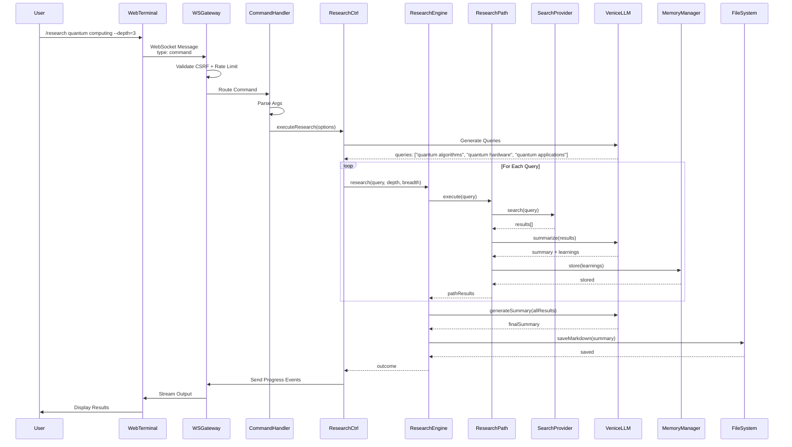
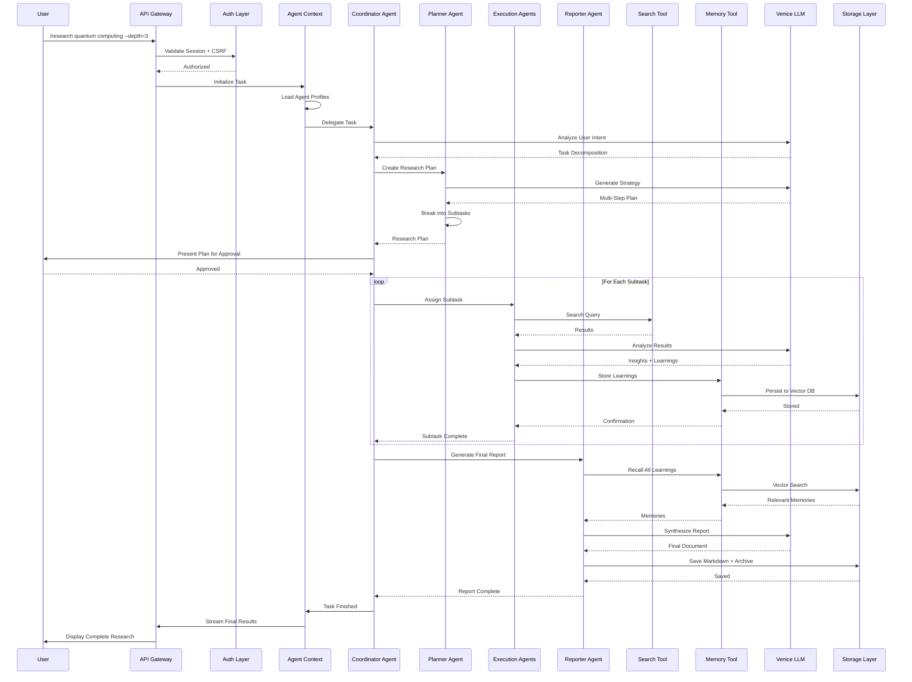
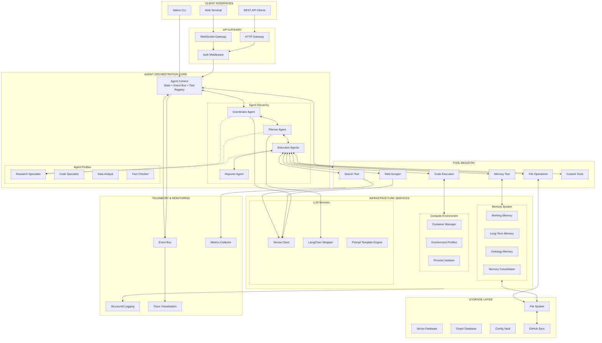

<!--
Why: Preserve the core architecture doctrine and system foundations that shape all delivery.
What: Conceptual foundation, system doctrine, architecture flows, migration path, vendor patterns, and system diagrams.
How: Keep canonical content intact while grouping foundations and architectural signals.
Status: active
Last Updated: 2026-02-02
-->

# Architecture Foundations

## 1) Conceptual Foundation (Ophanim Metaphor)
BITcore is modeled after the Ophanim: self-similar, all-seeing, concentric layers of consciousness.

- **Self-similar consciousness**: agents compose tools → capabilities → primitives without rewrites.
- **All eyes, all directions**: every decision is observable via telemetry/logs across CLI and GUI.
- **Concentric rings**: layered architecture keeps core reasoning decoupled from IO and external systems.
- **Consciousness-as-process**: behavior emerges from composing simple components, not hard-wired flows.

**Why it matters**: scalability, adaptability, transparency, and extensibility.

## 2) Architecture Layers (Concentric Rings)
```
┌─────────────────────────────────────────┐
│ Interface (CLI + Web GUI)               │  ← Commands, Settings, Telemetry
├─────────────────────────────────────────┤
│ Orchestration (Agent Scheduler)         │  ← Mission dispatch, retry logic
├─────────────────────────────────────────┤
│ Agents (Reasoning, Planning)            │  ← Goal pursuit, tool selection
├─────────────────────────────────────────┤
│ Knowledge (Memory + Tools + Search)     │  ← Context retrieval, capability lookup
├─────────────────────────────────────────┤
│ Environment (File System, Shell, I/O)   │  ← Computer system, execution
├─────────────────────────────────────────┤
│ External Systems (LLM, Search, DB)      │  ← Venice, Brave, GitHub, Vector DB
└─────────────────────────────────────────┘
```
Each layer has explicit contracts (inputs/outputs/errors/perf budgets). Outer layers depend inward only.

## 3) System Doctrine

### CLI ↔ GUI Parity Mandate
Every feature, setting, option, and toggle must be accessible from both CLI and Web GUI.

**Implementation pattern**:
1) CLI commands export metadata (`app/commands/*.cli.mjs`).
2) `GET /api/commands` exposes metadata to the GUI.
3) GUI renders forms/controls from metadata.
4) Parity tests assert exact match.

### Single-User Contract (Current)
- One operator identity, default role **admin**.
- No multi-user login or role switching in Nova.
- Multi-user adapters remain planned but inactive.

## 4) Perfected Architecture Additions (Critical Signals)

### Environment Sovereignty & Rebuild Guarantee
- Curated distro catalog: SeedCore, TinyCore, Debian Slim, Kali, Alpine, Arch, custom builds.
- Bootstrap wizard (`bitcore start --bootstrap`) materializes catalogs and rebuild scripts.
- Rebuild guarantee: platform can be reconstructed 1:1 after full wipe using seed artifacts and manifests.

### Isolation-First Filesystem Doctrine
- Strict separation of framework, projects, environments, plugins, and user data.
- Agent access is sandboxed to `/workspace`; framework mounted read-only.
- Sensitive archives are double-nested to reduce accidental deletion.

### Extensible by Default
- Plugins, MCP services, themes, tools, and extensions registered via manifests.
- No hard-coded tool or UI constraints; adapters are hot-swappable.

### Lightweight Compute Defaults
- Lean runtimes are default; heavy stacks remain optional add-ons.

## 7) Vendor Pattern Index (Adapt, Don’t Reinvent)
- **Agent Zero**: tool registry, scheduler, dashboard, instruments.
- **Deerflow**: orchestration, hierarchy, telemetry visualization.
- **Superfile**: parity doctrine, keyboard-first navigation.
- **Chatbot-UI**: sidebar layout, chat UX, HSL tokens.
- **Anything-LLM**: vector DB + ingestion pipeline.
- **Semantic Flow**: retro skin + workflow canvas aesthetics.
- **LibreChat**: provider routing + tool invocation.

**Expanded vendor inventory (canonical list)**
- **OpenAI Swarm**: swarm orchestration patterns and tool routing.
- **Ollama**: local model hosting + low-latency inference.
- **Vector-Admin**: vector store administration UI patterns.
- **ChatGPT-UI**: alternate chat shell and settings ergonomics.

## 8) Architecture Examples (Signal Flow)

**Telemetry “All Eyes”**
Research engine emits `research:*` events → telemetry store → GUI progress ring, token gauge, logs tail.

**Nested Agents (Self-Similarity)**
Base agent loop → specialized agents → tool registry → telemetry emission.

**Concentric Dependency Flow**
Interface → Orchestration → Agents → Knowledge → Environment → External systems.

## 8.1) Data Flow (Current + Target)

### Data Flow: Research Request (Current System)


### Data Flow: Agent-Based Research Request (Target System)


## 8.2) Migration Path (Current → Target)


## 22) System Architecture (Current vs Target)

### Current System Architecture (Operational)
```mermaid
graph TB
	subgraph Client[CLIENT LAYER]
		WebTerminal[Web Terminal<br/>XTerm.js + Command Parser]
		CLI[Native CLI<br/>Readline REPL]
	end

	subgraph Transport[TRANSPORT LAYER]
		WSS[WebSocket Server<br/>/api/research/ws]
		HTTP[HTTP Routes<br/>Express Router]
	end

	subgraph Session[SESSION MANAGEMENT]
		SessionStore[Session Store<br/>ID, User, State, History]
		CSRF[CSRF Token<br/>Validation]
		RateLimit[Rate Limiter<br/>5 req/sec default]
	end

	subgraph MessageRouter[MESSAGE ROUTING]
		ConnectionHandler[Connection Handler<br/>Lifecycle Management]
		CommandHandler[Command Handler<br/>Slash Commands]
		ChatHandler[Chat Handler<br/>Conversational Mode]
		InputHandler[Input Handler<br/>Prompt Responses]
	end

	subgraph Commands[COMMAND REGISTRY]
		ResearchCmd[/research]
		ChatCmd[/chat]
		MemoryCmd[/memory]
		KeysCmd[/keys]
		StatusCmd[/status]
		MissionsCmd[/missions]
	end

	subgraph Features[FEATURE CONTROLLERS]
		ResearchCtrl[Research Controller]
		MemoryCtrl[Memory Controller]
		ChatCtrl[Chat History Controller]
		StatusCtrl[Status Controller]
		MissionsCtrl[Missions Controller]
		PromptsCtrl[Prompts Controller]
	end

	subgraph Infrastructure[INFRASTRUCTURE LAYER]
		direction TB
		subgraph AI[AI Services]
			VeniceLLM[Venice LLM Client]
			LangChainModel[LangChain Wrapper]
			LangGraphJS[LangGraph.js]
			Chains[LangChain Chains]
		end

		subgraph Research[Research Engine]
			ResearchEngine[Research Engine]
			ResearchPath[Research Path]
			OverrideRunner[Override Runner]
		end

		subgraph Search[Search Providers]
			BraveSearch[Brave Search]
			SearchMux[Search Multiplexer]
		end

		subgraph Memory[Memory System]
			MemoryManager[Memory Manager]
			MemoryStore[Memory Store]
			MemoryValidators[Memory Validators]
			GithubMemory[GitHub Integration]
		end
	end

	subgraph Persistence[PERSISTENCE LAYER]
		FileSystem[File System<br/>JSON Archives]
		GithubRepo[GitHub Repository]
		ConfigStore[Encrypted Config]
	end

	WebTerminal --> WSS
	CLI --> Commands

	WSS <--> SessionStore
	HTTP <--> SessionStore
	SessionStore --> CSRF
	SessionStore --> RateLimit

	WSS --> ConnectionHandler
	ConnectionHandler --> CommandHandler
	ConnectionHandler --> ChatHandler
	ConnectionHandler --> InputHandler

	CommandHandler --> Commands
	ChatHandler --> ChatCtrl
	InputHandler <--> SessionStore

	ResearchCmd --> ResearchCtrl
	ChatCmd --> ChatCtrl
	MemoryCmd --> MemoryCtrl
	KeysCmd <--> ConfigStore
	StatusCmd --> StatusCtrl
	MissionsCmd --> MissionsCtrl

	ResearchCtrl --> ResearchEngine
	ResearchCtrl <--> MemoryManager
	MemoryCtrl <--> MemoryManager
	ChatCtrl --> VeniceLLM
	ChatCtrl <--> MemoryManager

	ResearchEngine --> VeniceLLM
	ResearchEngine --> LangChainModel
	ResearchEngine --> Chains
	ResearchEngine --> ResearchPath
	ResearchEngine --> OverrideRunner

	ResearchPath --> SearchMux
	ResearchPath --> VeniceLLM
	SearchMux --> BraveSearch

	MemoryManager <--> MemoryStore
	MemoryManager --> MemoryValidators
	MemoryManager <--> GithubMemory

	MissionsCtrl <--> FileSystem
	MissionsCtrl <--> GithubRepo
	PromptsCtrl <--> GithubRepo
	ConfigStore <--> FileSystem
	MemoryManager <--> FileSystem
	GithubMemory <--> GithubRepo
```

### Target Agent-Based Architecture (Plan)


## 32) Vendor Pattern Summary

Detailed vendor patterns have been extracted to [04b-vendor-patterns.md](04b-vendor-patterns.md).

**Key pattern categories:**
- Multi-agent orchestration (Deerflow, Agent Zero, AIbitat)
- MCP/tooling integration (Agent Zero, LibreChat, AnythingLLM)
- Frontend shell & navigation (Chatbot-UI, Semantic Flow)
- Memory & RAG pipelines (Agent Zero, AnythingLLM, VectorAdmin)
- CLI ↔ GUI parity (Superfile)
- SSE/SSO authentication (Semantic Flow, LibreChat)
- Provider abstraction (Semantic Flow, AnythingLLM)
- Workflow execution (Semantic Flow, Deerflow)

**Adopt/Defer/Discard summary:**
- **Adopt**: capability routing, token budgeting, provider adapters, human-in-loop approval, conversation branching, streaming-by-default.
- **Defer**: multi-user RBAC, workspace sharing, hosted widgets.
- **Discard**: server-side key storage, monolithic prompts, Supabase multi-tenant RLS.

## 14) Decision Points & Trade-offs (Historical)

**Option A: Incremental migration (chosen)**
- Keep legacy visible while Nova builds out (completed; legacy now reference-only).
- Feature flag reserved for rollback during rollout phases.

**Option B: Full rewrite (not chosen)**
- Single codebase, higher risk.

**Option C: Maintain both (not chosen)**
- Double maintenance, user confusion.
