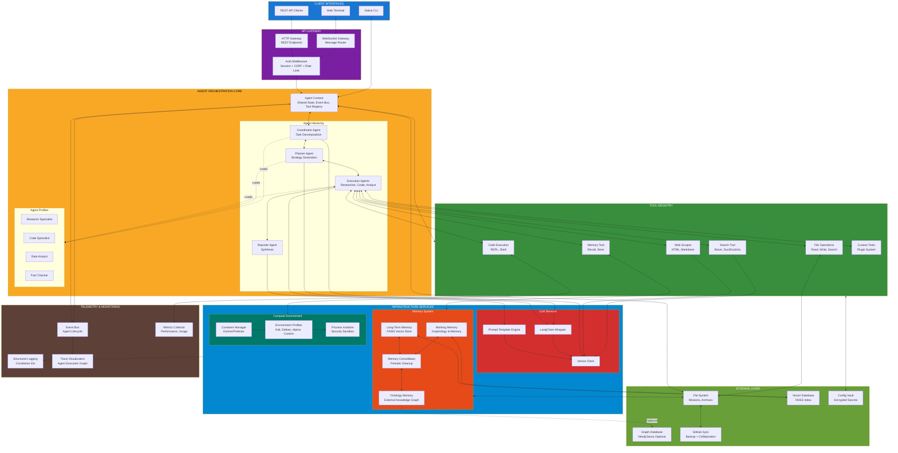
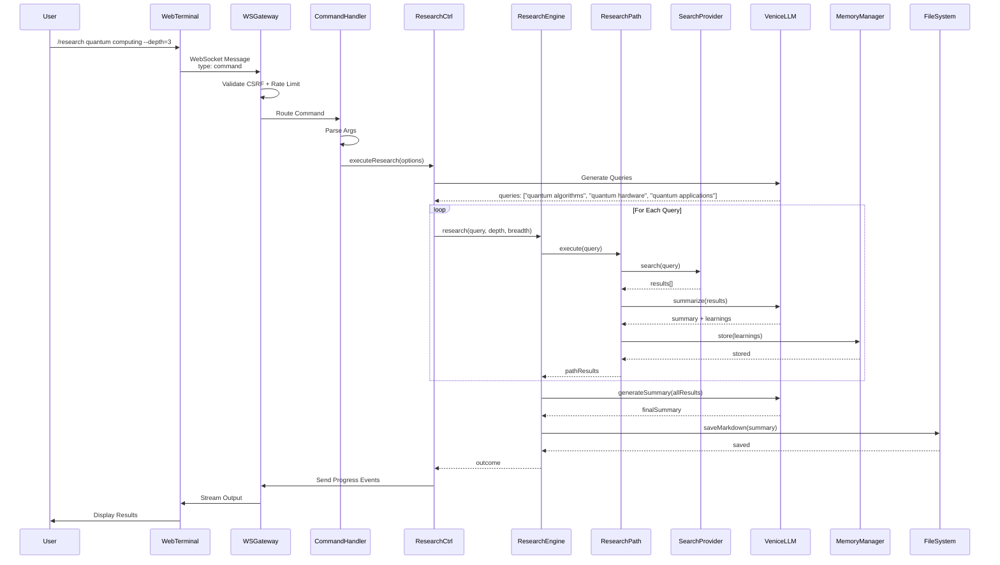
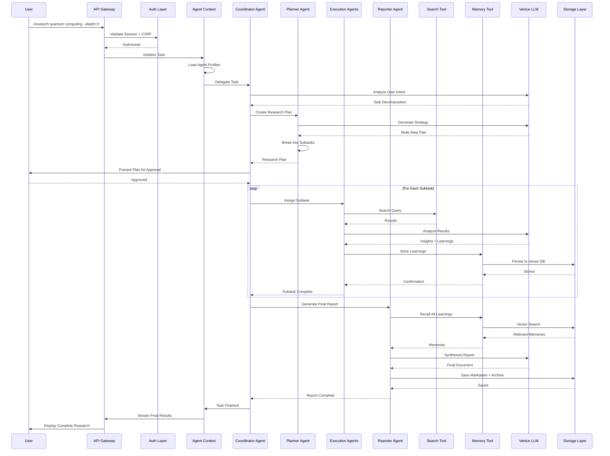

<!--
Why: Present the layered architecture that binds interfaces, agents, environments, and persistence so contributors share a mental model before implementation.
What: Visualizes each layer, the flow of control, and the persistent systems that keep BITcore missions cohesive.
How: Uses Mermaid diagrams to show component boundaries and interaction channels that every module must respect.
-->

# System Architecture

## Current System Architecture

```mermaid
graph TB
    subgraph Client["CLIENT LAYER"]
        WebTerminal["Web Terminal<br/>XTerm.js + Command Parser"]
        CLI["Native CLI<br/>Readline REPL"]
    end

    subgraph Transport["TRANSPORT LAYER"]
        WSS["WebSocket Server<br/>/api/research/ws"]
        HTTP["HTTP Routes<br/>Express Router"]
    end

    subgraph Session["SESSION MANAGEMENT"]
        SessionStore["Session Store<br/>ID, User, State, History"]
        CSRF["CSRF Token<br/>Validation"]
        RateLimit["Rate Limiter<br/>5 req/sec default"]
    end

    subgraph MessageRouter["MESSAGE ROUTING"]
        ConnectionHandler["Connection Handler<br/>Lifecycle Management"]
        CommandHandler["Command Handler<br/>Slash Commands"]
        ChatHandler["Chat Handler<br/>Conversational Mode"]
        InputHandler["Input Handler<br/>Prompt Responses"]
    end

    subgraph Commands["COMMAND REGISTRY"]
        ResearchCmd["/research<br/>Deep Research"]
        ChatCmd["/chat<br/>Toggle Chat Mode"]
        MemoryCmd["/memory<br/>Recall/Store"]
        KeysCmd["/keys<br/>API Key Management"]
        StatusCmd["/status<br/>System Health"]
        MissionsCmd["/missions<br/>Task Scheduler"]
    end

    subgraph Features["FEATURE CONTROLLERS"]
        ResearchCtrl["Research Controller"]
        MemoryCtrl["Memory Controller"]
        ChatCtrl["Chat History Controller"]
        StatusCtrl["Status Controller"]
        MissionsCtrl["Missions Controller"]
        PromptsCtrl["Prompts Controller"]
    end

    subgraph Infrastructure["INFRASTRUCTURE LAYER"]
        direction TB
        
        subgraph AI["AI Services"]
            VeniceLLM["Venice LLM Client<br/>Chat Completions"]
            LangChainModel["LangChain Wrapper<br/>VeniceChatModel"]
            LangGraphJS["LangGraph.js<br/>State Machine + Workflows"]
            Chains["LangChain Chains<br/>QueryGeneration"]
        end
        
        subgraph Research["Research Engine"]
            ResearchEngine["Research Engine<br/>Orchestrator"]
            ResearchPath["Research Path<br/>Query Execution"]
            OverrideRunner["Override Runner<br/>Custom Queries"]
        end
        
        subgraph Search["Search Providers"]
            BraveSearch["Brave Search<br/>Web + News"]
            SearchMux["Search Multiplexer<br/>Provider Abstraction"]
        end
        
        subgraph Memory["Memory System"]
            MemoryManager["Memory Manager<br/>Short/Long Term"]
            MemoryStore["Memory Store<br/>Ephemeral + Validated"]
            MemoryValidators["Memory Validators<br/>Schema Guards"]
            GithubMemory["GitHub Integration<br/>Persistence"]
        end
    end

    subgraph Persistence["PERSISTENCE LAYER"]
        FileSystem["File System<br/>JSON Archives"]
        GithubRepo["GitHub Repository<br/>Missions, Memories, Prompts"]
        ConfigStore["Encrypted Config<br/>API Keys AES-256"]
    end

    WebTerminal -->|"WebSocket<br/>Commands, Chat, Input"| WSS
    CLI -->|"Direct Function Calls"| Commands
    
    WSS <--> SessionStore
    HTTP <--> SessionStore
    
    SessionStore --> CSRF
    SessionStore --> RateLimit
    
    WSS --> ConnectionHandler
    ConnectionHandler --> CommandHandler
    ConnectionHandler --> ChatHandler
    ConnectionHandler --> InputHandler
    
    CommandHandler --> Commands
    ChatHandler --> ChatCtrl
    InputHandler <--> SessionStore
    
    ResearchCmd --> ResearchCtrl
    ChatCmd --> ChatCtrl
    MemoryCmd --> MemoryCtrl
    KeysCmd <--> ConfigStore
    StatusCmd --> StatusCtrl
    MissionsCmd --> MissionsCtrl
    
    ResearchCtrl --> ResearchEngine
    ResearchCtrl <--> MemoryManager
    
    MemoryCtrl <--> MemoryManager
    ChatCtrl --> VeniceLLM
    ChatCtrl <--> MemoryManager
    
    ResearchEngine --> VeniceLLM
    ResearchEngine --> LangChainModel
    ResearchEngine --> Chains
    ResearchEngine --> ResearchPath
    ResearchEngine --> OverrideRunner
    
    ResearchPath --> SearchMux
    ResearchPath --> VeniceLLM
    
    SearchMux --> BraveSearch
    
    VeniceLLM -.->|"HTTP API"| ExternalVenice["Venice API<br/>External"]
    BraveSearch -.->|"HTTP API"| ExternalBrave["Brave API<br/>External"]
    
    MemoryManager <--> MemoryStore
    MemoryManager --> MemoryValidators
    MemoryManager <--> GithubMemory
    
    MissionsCtrl <--> FileSystem
    MissionsCtrl <--> GithubRepo
    PromptsCtrl <--> GithubRepo
    ConfigStore <--> FileSystem
    MemoryManager <--> FileSystem
    
    GithubMemory <--> GithubRepo

    style Client fill:#1976d2,color:#ffffff
    style Transport fill:#7b1fa2,color:#ffffff
    style Session fill:#f57c00,color:#ffffff
    style MessageRouter fill:#c2185b,color:#ffffff
    style Commands fill:#388e3c,color:#ffffff
    style Features fill:#f9a825,color:#000000
    style Infrastructure fill:#0288d1,color:#ffffff
    style Persistence fill:#689f38,color:#ffffff
    style AI fill:#512da8,color:#ffffff
    style Research fill:#d32f2f,color:#ffffff
    style Search fill:#00796b,color:#ffffff
    style Memory fill:#e64a19,color:#ffffff
```

## Target Agent-Based Architecture

## Data Flow: Research Request

## Data Flow: Agent-Based Research Request

## Migration Path: Current → Target

```mermaid
graph LR
    subgraph Phase1["Phase 1: Foundation"]
        P1A["BaseAgent Class"]
        P1B["Agent Context"]
        P1C["Tool Interface"]
    end
    
    subgraph Phase2["Phase 2: Tool Migration"]
        P2A["Search Tool"]
        P2B["Memory Tool"]
        P2C["Code Tool"]
    end
    
    subgraph Phase3["Phase 3: Agent Profiles"]
        P3A["Research Agent"]
        P3B["Planner Agent"]
        P3C["Coordinator Agent"]
    end
    
    subgraph Phase4["Phase 4: Advanced Features"]
        P4A["Computer Environment"]
        P4B["Vector Memory"]
        P4C["Ontology Sync"]
    end
    
    subgraph Phase5["Phase 5: Full Replacement"]
        P5A["Feature Flags Off"]
        P5B["Legacy Code Removal"]
        P5C["Production Rollout"]
    end
    
    Current["Current System<br/>Direct LLM + ResearchEngine"]
    
    Current --> P1A
    P1A --> P1B
    P1B --> P1C
    
    P1C --> P2A
    P2A --> P2B
    P2B --> P2C
    
    P2C --> P3A
    P3A --> P3B
    P3B --> P3C
    
    P3C --> P4A
    P4A --> P4B
    P4B --> P4C
    
    P4C --> P5A
    P5A --> P5B
    P5B --> P5C
    
    P5C --> Target["Target System<br/>Agent-Based Architecture"]
    
    style Current fill:#d32f2f,color:#ffffff
    style Target fill:#388e3c,color:#ffffff
    style Phase1 fill:#f57c00,color:#000000
    style Phase2 fill:#f9a825,color:#000000
    style Phase3 fill:#7b1fa2,color:#ffffff
    style Phase4 fill:#512da8,color:#ffffff
    style Phase5 fill:#0288d1,color:#ffffff
```

