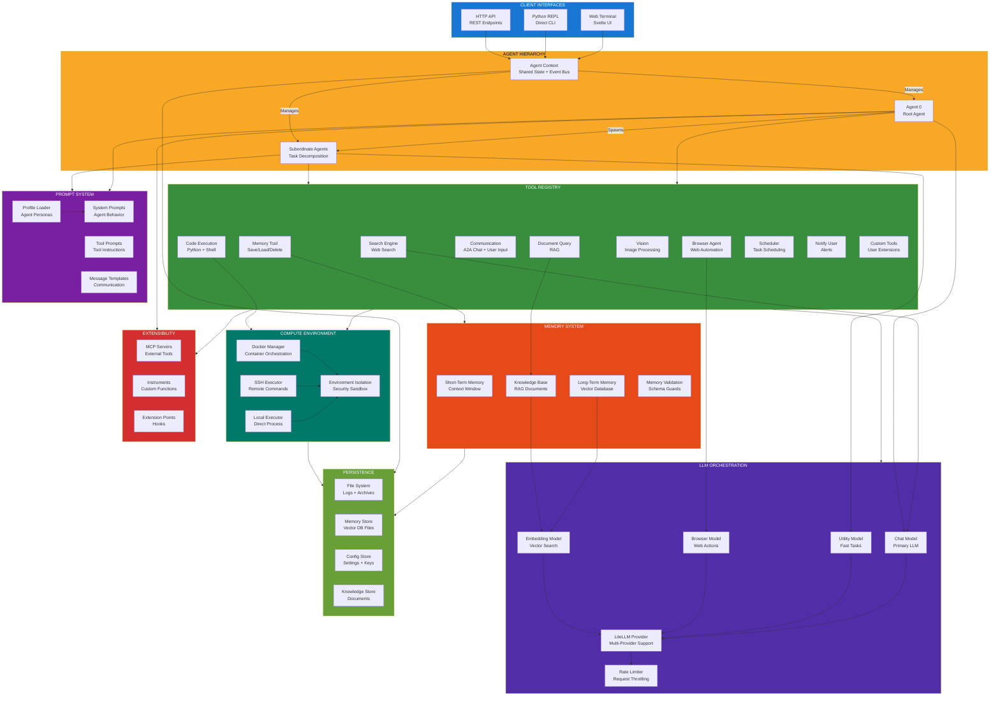
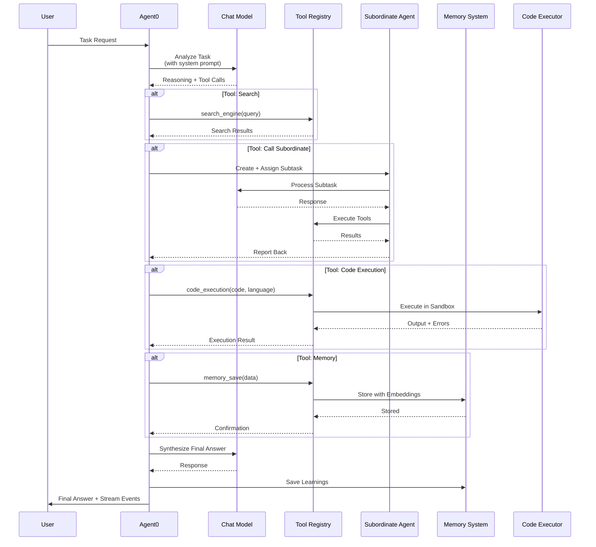
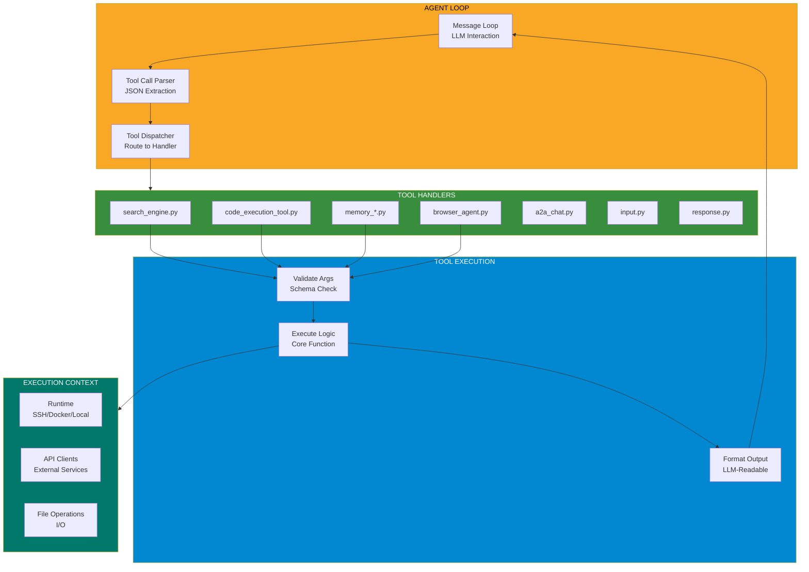
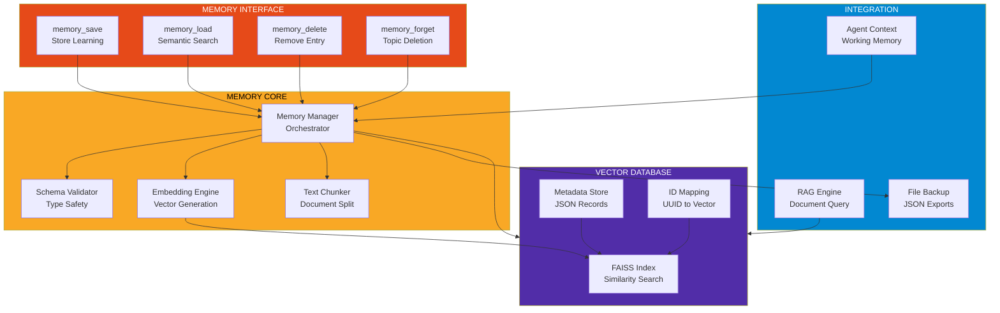
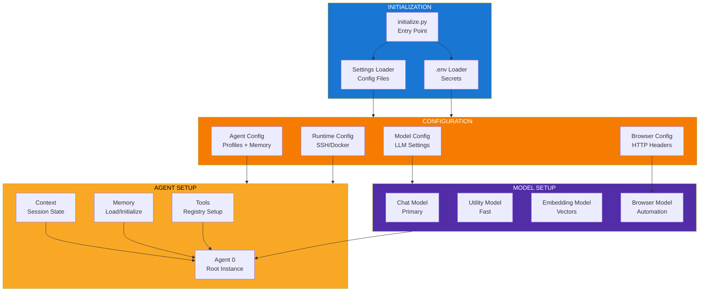
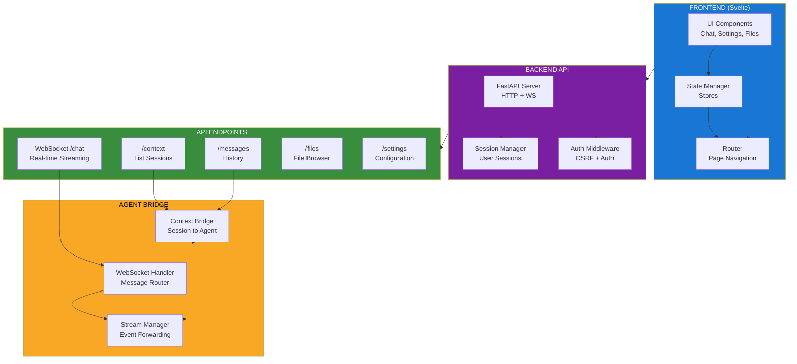
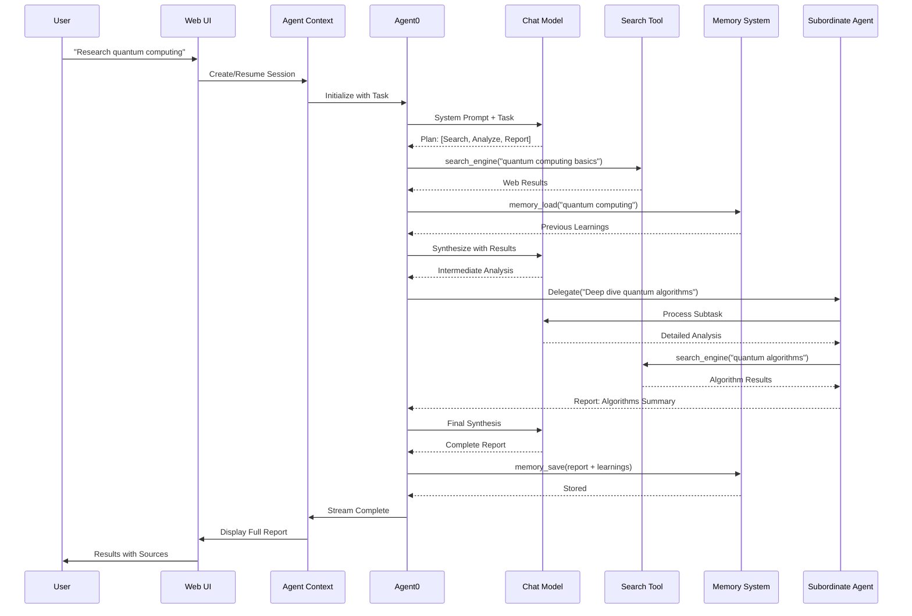

<!--
Why: Document Agent Zero's multi-agent architecture so contributors understand how agents coordinate, use tools, access memory, and interact with LLMs.
What: Visualizes the agent hierarchy, tool registry, memory system, and compute environment that enable dynamic, organic agent growth.
How: Uses Mermaid diagrams to show component boundaries, data flows, and the orchestration patterns that drive Agent Zero's capabilities.
-->

# Agent Zero System Architecture

## Overview

Agent Zero is a dynamic, organic agentic framework designed to grow and learn as it operates. It uses the computer as a tool and features a hierarchical multi-agent system where agents can create subordinate agents to decompose and solve complex tasks.

## Core Architecture



## Agent Communication Flow



## Tool Execution Architecture



## Memory System Architecture



## Configuration & Initialization



## Web UI Architecture



## Data Flow: Research Task



## Extensibility Points

```mermaid
graph TB
    subgraph CoreExtensions["CORE EXTENSIONS"]
        ToolExtension["Tool Extension<br/>python/tools/*.py"]
        InstrumentExtension["Instrument Extension<br/>instruments/*.py"]
        PromptExtension["Prompt Extension<br/>prompts/custom/"]
        ProfileExtension["Profile Extension<br/>Agent Profiles"]
    end

    subgraph ExternalIntegrations["EXTERNAL INTEGRATIONS"]
        MCPProtocol["MCP Protocol<br/>Model Context Protocol"]
        CustomAPIs["Custom APIs<br/>HTTP Integrations"]
        Webhooks["Webhooks<br/>Event Notifications"]
        BrowserUse["Browser-Use<br/>Web Automation"]
    end

    subgraph RuntimeExtensions["RUNTIME EXTENSIONS"]
        DockerImages["Docker Images<br/>Custom Environments"]
        SSHTargets["SSH Targets<br/>Remote Hosts"]
        EnvProfiles["Environment Profiles<br/>Execution Contexts"]
    end

    subgraph DataExtensions["DATA EXTENSIONS"]
        CustomEmbeddings["Custom Embeddings<br/>SentenceTransformers"]
        KnowledgeSources["Knowledge Sources<br/>Document Loaders"]
        MemoryAdapters["Memory Adapters<br/>Storage Backends"]
    end

    CoreExtensions --> ToolExtension
    CoreExtensions --> InstrumentExtension
    
    ExternalIntegrations --> MCPProtocol
    ExternalIntegrations --> BrowserUse
    
    RuntimeExtensions --> DockerImages
    RuntimeExtensions --> SSHTargets
    
    DataExtensions --> CustomEmbeddings
    DataExtensions --> KnowledgeSources

    style CoreExtensions fill:#388e3c,color:#ffffff
    style ExternalIntegrations fill:#d32f2f,color:#ffffff
    style RuntimeExtensions fill:#00796b,color:#ffffff
    style DataExtensions fill:#7b1fa2,color:#ffffff
```



## Key Design Principles

### 1. Organic Growth
- Agents create subordinate agents dynamically based on task complexity
- No pre-programmed task-specific tools; agents build tools as needed
- Persistent memory allows learning and reuse of solutions

### 2. Transparent Operation
- All prompts visible in `prompts/` directory
- Tool implementations in `python/tools/` are readable Python
- Streaming output shows agent reasoning in real-time

### 3. Computer as Tool
- Agents execute arbitrary code in sandboxed environments
- Terminal access for running system commands
- File system operations for tool creation and data management

### 4. Flexible LLM Support
- LiteLLM provides multi-provider abstraction
- Four model roles: Chat, Utility, Browser, Embedding
- Rate limiting and request throttling per model

### 5. Multi-Agent Cooperation
- Superior-subordinate hierarchy for task decomposition
- Agent-to-agent chat for collaboration
- Shared context and memory across agent instances

### 6. Security & Isolation
- Docker/SSH for code execution isolation
- Environment-specific configurations
- Rate limiting and resource controls

## File Organization

```
agent-zero/
├── agent.py                 # Agent class and context management
├── models.py                # LLM models and configurations
├── initialize.py            # Initialization and setup
├── run_ui.py               # Web UI server
├── python/
│   ├── api/                # FastAPI backend
│   ├── extensions/         # Extension system
│   ├── helpers/            # Utilities and helpers
│   └── tools/              # Tool implementations
├── prompts/
│   └── default/            # System prompts and templates
├── webui/                  # Svelte frontend
├── instruments/            # Custom functions
├── knowledge/              # RAG document store
├── memory/                 # Vector database storage
├── conf/                   # Configuration files
└── docker/                 # Docker environments
```

## Technology Stack

- **Core**: Python 3.12+
- **LLM Orchestration**: LiteLLM, LangChain
- **Web Framework**: FastAPI (backend), Svelte (frontend)
- **Vector Database**: FAISS with SentenceTransformers
- **Compute**: Docker, SSH, subprocess
- **Browser Automation**: Playwright via browser-use
- **Tool Integration**: MCP (Model Context Protocol)

---

This architecture enables Agent Zero to operate as a general-purpose assistant that learns, adapts, and grows organically while maintaining transparency and user control.
