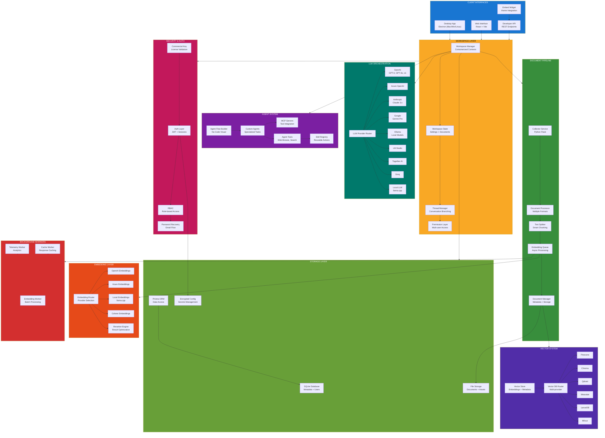
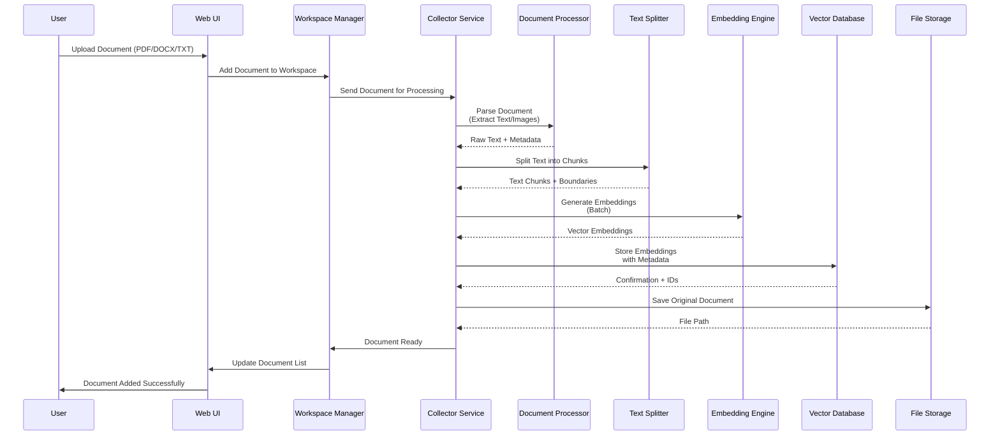
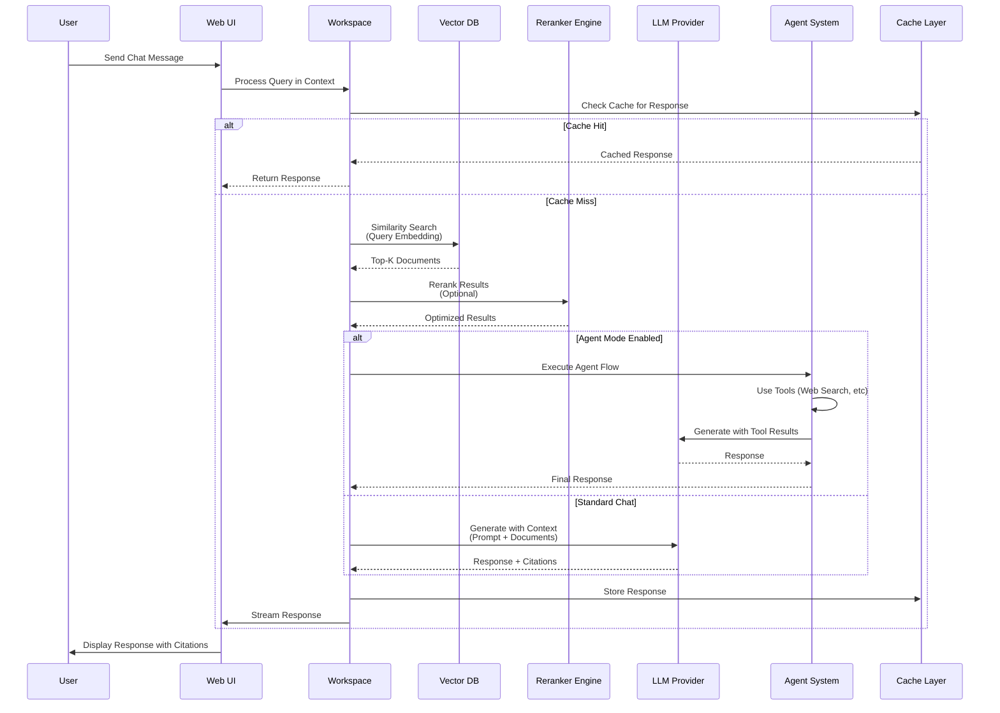
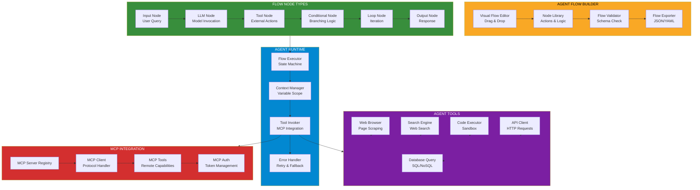
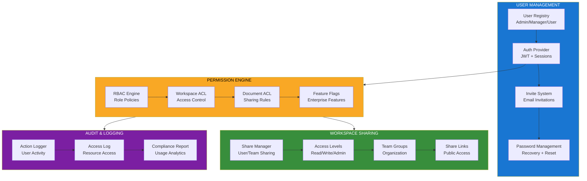
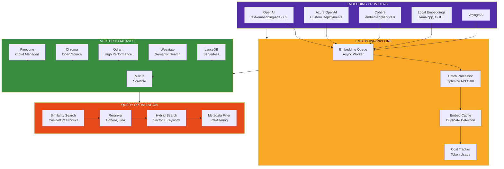
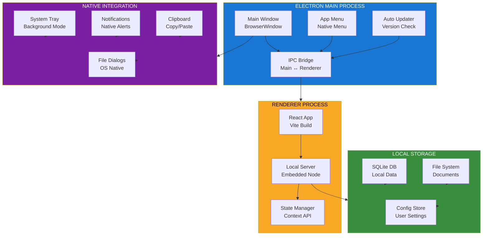
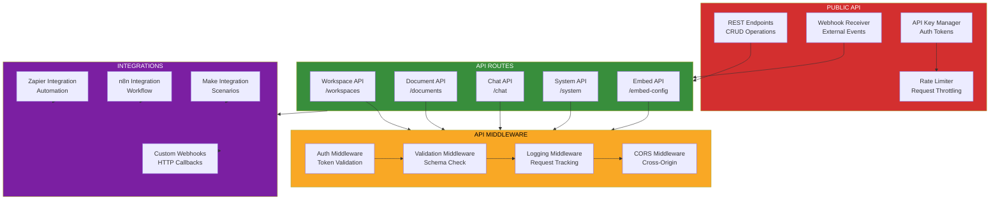

<!--
Why: Document AnythingLLM's all-in-one AI architecture so contributors understand how workspaces, document processing, LLM providers, agents, and multi-user management coordinate.
What: Visualizes the document ingestion pipeline, workspace isolation, agent system, embedding engines, vector databases, and multi-provider LLM integration.
How: Uses Mermaid diagrams to show the full-stack architecture, data flows, and component boundaries that enable private ChatGPT-like experiences with RAG.
-->

# AnythingLLM System Architecture

## Overview

AnythingLLM is an all-in-one AI application that enables users to build private ChatGPT experiences with document context. It supports multiple LLM providers, vector databases, embedding engines, and features workspace isolation, multi-user management, AI agents, and a no-code agent flow builder with full MCP compatibility.

## Core Architecture



## Document Ingestion & Processing Flow



## Workspace Chat & RAG Flow



## Agent Flow System



## Multi-User & Permission System



## Embedding & Vector Database Architecture



## Desktop Application Architecture



## API Architecture



## Key Design Principles

### 1. Workspace Isolation
- Each workspace is a containerized context with its own documents and settings
- Workspaces can share documents but conversations remain isolated
- Clear separation of concerns for multi-tenant environments

### 2. Multi-Provider Support
- Provider-agnostic architecture allows switching between LLMs and vector databases
- Unified interfaces abstract provider-specific implementations
- Cost optimization through provider selection and local model support

### 3. Document Intelligence
- Smart chunking preserves context boundaries
- Deduplication prevents redundant embeddings
- Citation tracking maintains source traceability

### 4. Agent Extensibility
- No-code flow builder for non-technical users
- MCP compatibility enables external tool integration
- Reusable skill registry promotes agent modularity

### 5. Enterprise-Ready
- Multi-user support with granular permissions
- Audit logging for compliance
- Embeddable widget for white-label deployments

### 6. Performance & Cost
- Aggressive caching at multiple layers
- Batch processing for embeddings
- Local model support eliminates API costs

## Technology Stack

- **Frontend**: React 18, Vite, TailwindCSS
- **Backend**: Node.js, Express
- **Desktop**: Electron (Mac, Windows, Linux)
- **Database**: SQLite (local), Prisma ORM
- **Document Processing**: Python Flask, langchain
- **Vector Databases**: Pinecone, Chroma, Qdrant, Weaviate, LanceDB, Milvus
- **LLM Providers**: OpenAI, Anthropic, Google, Azure, Ollama, LM Studio, 20+ others
- **Embedding Providers**: OpenAI, Cohere, Azure, Local (llama.cpp)
- **Agent System**: Custom flow engine, MCP protocol support
- **Background Jobs**: Node.js workers, async queues

## File Organization

```
anything-llm/
├── frontend/              # React web interface
│   ├── src/
│   │   ├── components/    # UI components
│   │   ├── pages/         # Route pages
│   │   ├── hooks/         # Custom hooks
│   │   └── utils/         # Utilities
│   └── vite.config.js
├── server/                # Node.js backend
│   ├── endpoints/         # API routes
│   ├── models/            # Data models
│   ├── utils/             # Core utilities
│   │   ├── agents/        # Agent system
│   │   ├── agentFlows/    # Flow builder
│   │   ├── AiProviders/   # LLM providers
│   │   ├── EmbeddingEngines/ # Embedding providers
│   │   ├── vectorDbProviders/ # Vector DBs
│   │   ├── MCP/           # MCP integration
│   │   └── chats/         # Chat logic
│   ├── prisma/            # Database schema
│   └── index.js
├── collector/             # Python document processor
│   ├── processSingleDocument/ # File parsers
│   ├── scripts/           # Processing scripts
│   └── app.py             # Flask server
├── embed/                 # Embeddable widget
├── browser-extension/     # Browser extension
└── docker/                # Docker deployment
```

## Deployment Options

- **Docker**: Single-command deployment with docker-compose
- **Desktop**: Native apps for Mac, Windows, Linux (Electron)
- **Cloud**: AWS, Azure, GCP, Railway, Render
- **Bare Metal**: Manual installation on Linux/Mac
- **Kubernetes**: Helm charts for cluster deployment

---

This architecture enables AnythingLLM to function as a complete, self-hosted alternative to commercial AI chat platforms, with full control over data, models, and infrastructure while maintaining enterprise-grade features and performance.
