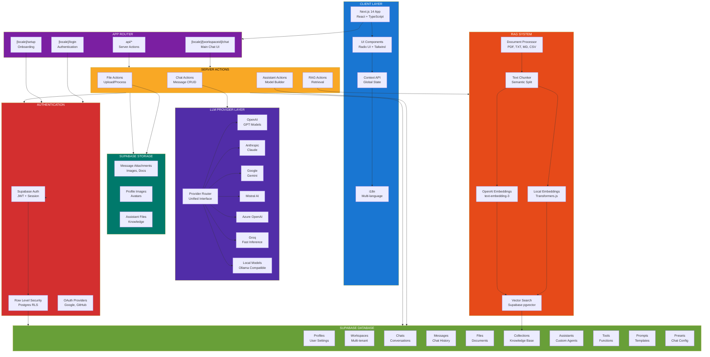
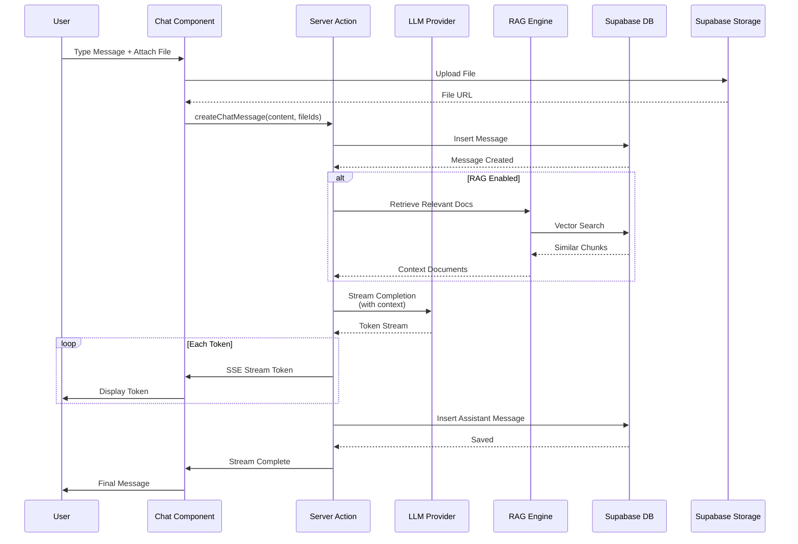
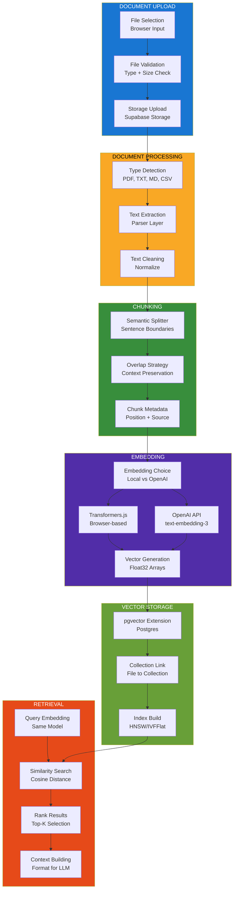
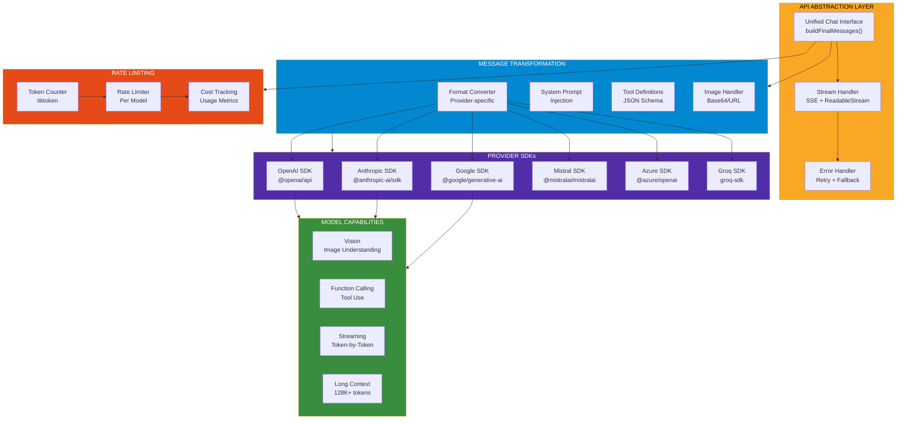
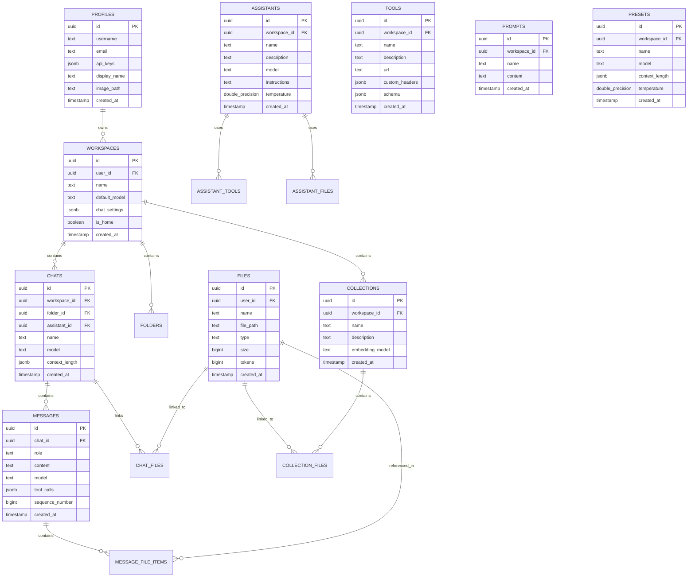
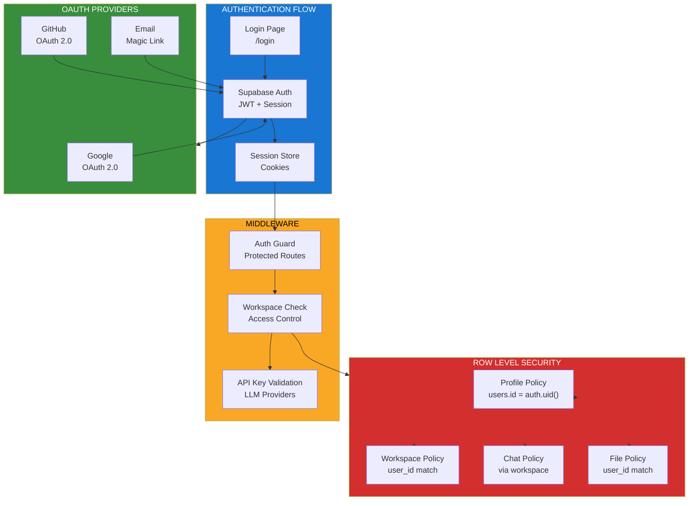
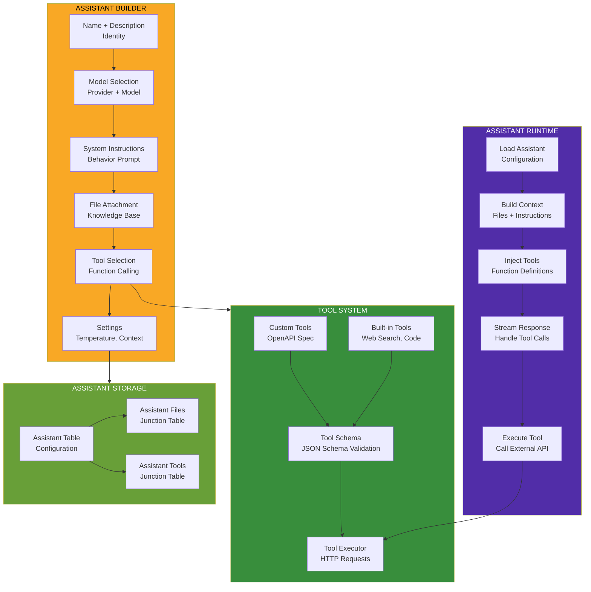
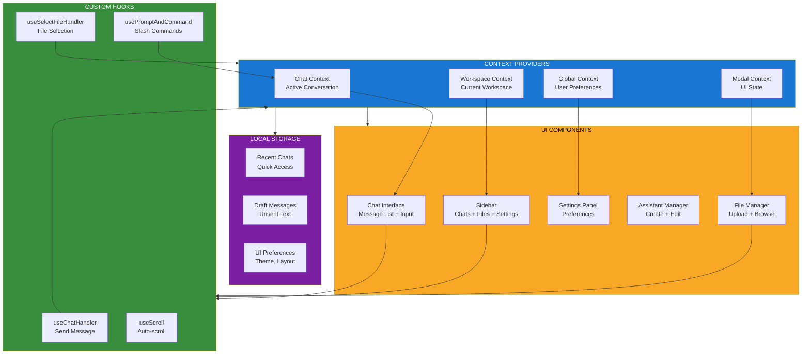

<!--
Why: Document Chatbot UI's Next.js architecture so contributors understand how it integrates Supabase, manages multi-provider LLMs, implements RAG, and orchestrates chat workflows.
What: Visualizes the frontend components, backend API routes, database schema, and LLM provider integrations that power Chatbot UI's feature-rich chat experience.
How: Uses Mermaid diagrams to show component boundaries, data flows, and the patterns that enable multi-model conversations with document retrieval.
-->

# Chatbot UI System Architecture

## Overview

Chatbot UI is an open-source, feature-rich AI chat application built with Next.js 14, supporting multiple LLM providers (OpenAI, Anthropic, Google, Mistral, Azure, Groq) with built-in RAG, model builder, and Supabase persistence.

## Core Architecture



## Chat Flow Architecture



## RAG Document Processing



## Multi-Provider LLM Integration



## Database Schema



## Authentication & Authorization



## Model Builder (Assistants)



## Frontend State Management



## Key Features Implementation

### 1. Multi-Model Conversations
- Chat with multiple models simultaneously
- Compare responses side-by-side
- Model-specific settings per conversation

### 2. RAG Integration
- Browser-based local embeddings (Transformers.js)
- OpenAI embeddings for server-side processing
- Supabase pgvector for similarity search
- Collection-based knowledge organization

### 3. Model Builder
- Custom assistants with instructions
- File attachment for knowledge
- Tool integration via OpenAPI specs
- Reusable across workspaces

### 4. Multi-Workspace Support
- Separate workspaces for different projects
- Workspace-level default models
- Shared files and collections
- Granular access control via RLS

### 5. Progressive Web App
- Offline capability on localhost
- Native app-like experience on mobile
- Service worker for caching
- Push notifications (optional)

## Technology Stack

- **Frontend**: Next.js 14 App Router, React 18, TypeScript
- **UI**: Radix UI, Tailwind CSS, shadcn/ui
- **Backend**: Next.js Server Actions, Supabase Edge Functions
- **Database**: PostgreSQL (Supabase) with pgvector
- **Auth**: Supabase Auth (JWT + OAuth)
- **Storage**: Supabase Storage (S3-compatible)
- **LLM Providers**: OpenAI, Anthropic, Google, Mistral, Azure, Groq
- **Embeddings**: Transformers.js (local), OpenAI (server)
- **Deployment**: Vercel, Docker, Self-hosted

## File Organization

```
chatbot-ui/
├── app/
│   ├── [locale]/
│   │   ├── login/              # Authentication
│   │   ├── setup/              # Onboarding
│   │   ├── [workspaceid]/
│   │   │   └── chat/           # Main chat UI
│   │   └── page.tsx            # Landing
│   └── api/                    # API routes (legacy)
├── components/
│   ├── chat/                   # Chat components
│   ├── sidebar/                # Sidebar components
│   ├── ui/                     # Base UI components
│   └── utility/                # Utility components
├── context/                    # React Context providers
├── db/                         # Supabase queries
├── lib/
│   ├── models/                 # LLM provider integrations
│   ├── retrieval/              # RAG implementation
│   └── server/                 # Server utilities
├── supabase/
│   ├── migrations/             # Database migrations
│   └── types.ts                # Generated types
└── types/                      # TypeScript types
```

---

This architecture enables Chatbot UI to provide a powerful, multi-tenant chat experience with advanced features like RAG, multi-model support, and custom assistants while maintaining data security and user privacy.
