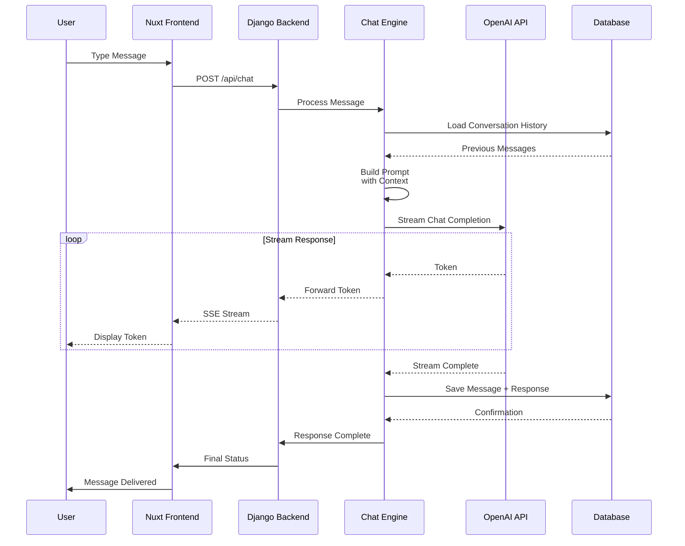
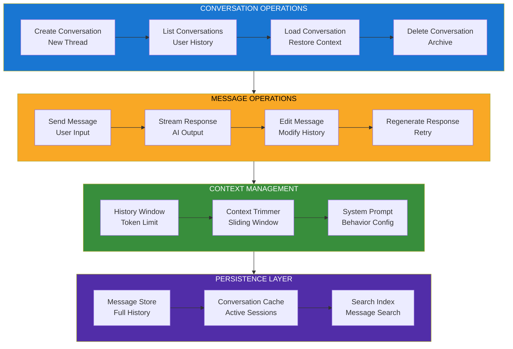
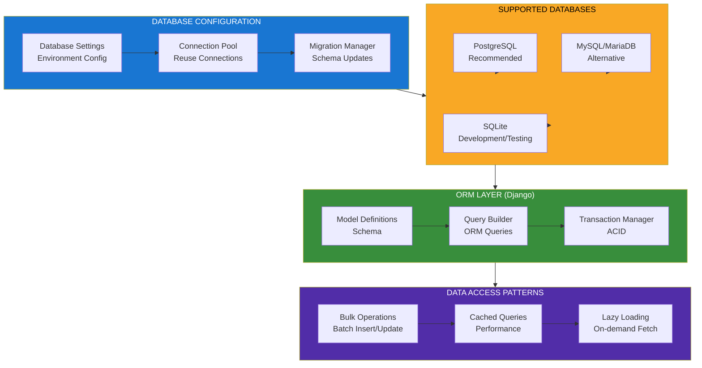
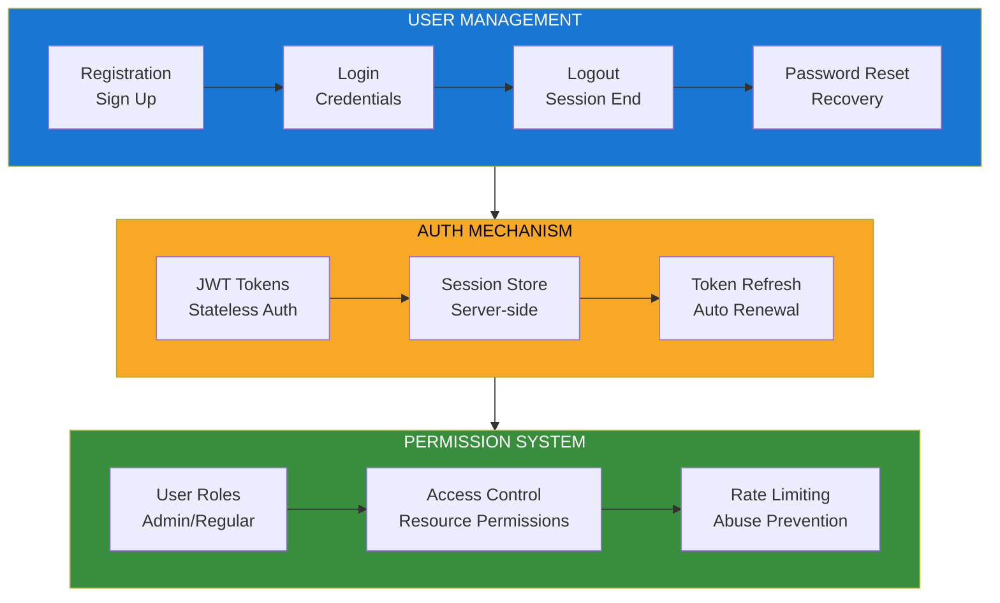
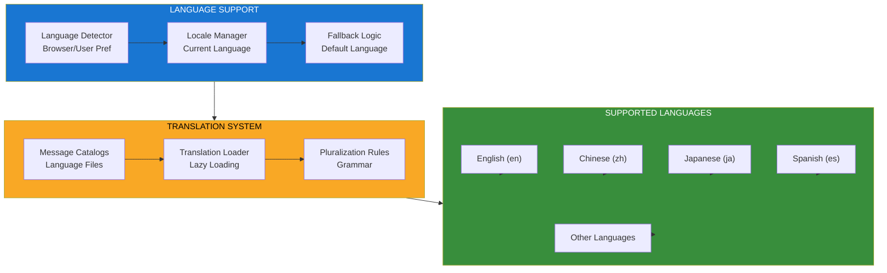

<!--
Why: Document ChatGPT-UI's multi-user web chat architecture so contributors understand how it enables persistent conversations with multiple users, languages, and database connections.
What: Visualizes the Nuxt.js frontend, Django backend, conversation management, and multi-database support.
How: Uses Mermaid diagrams to show the full-stack architecture for a ChatGPT clone with server-side persistence.
-->

# ChatGPT-UI System Architecture

## Overview

ChatGPT-UI is a full-stack ChatGPT web client that supports multiple users, multiple languages (i18n), and multiple database connections for persistent data storage. It consists of a Nuxt.js (Vue 3) frontend and a Django REST backend, providing a polished chat experience with conversation history and user management.

## Core Architecture

```mermaid
graph TB
    subgraph Frontend["FRONTEND (Nuxt.js)"]
        NuxtApp["Nuxt 3 App<br/>Vue 3 + TypeScript"]
        ChatInterface["Chat Interface<br/>Message UI"]
        ConversationList["Conversation List<br/>History Sidebar"]
        UserSettings["User Settings<br/>Preferences"]
    end

    subgraph Backend["BACKEND (Django)"]
        DjangoAPI["Django REST API<br/>Python"]
        ViewHandlers["View Handlers<br/>Request Logic"]
        Serializers["Serializers<br/>Data Formatting"]
        Middleware["Middleware Stack<br/>Auth + CORS"]
    end

    subgraph ChatEngine["CHAT ENGINE"]
        MessageProcessor["Message Processor<br/>Format + Parse"]
        ConversationManager["Conversation Manager<br/>Thread Control"]
        PromptBuilder["Prompt Builder<br/>Context Assembly"]
        ResponseStreamer["Response Streamer<br/>SSE/WebSocket"]
    end

    subgraph OpenAIIntegration["OPENAI INTEGRATION"]
        OpenAIClient["OpenAI Client<br/>Python SDK"]
        ModelRouter["Model Router<br/>GPT Selection"]
        TokenCounter["Token Counter<br/>Usage Tracking"]
        StreamHandler["Stream Handler<br/>Async Response"]
    end

    subgraph DatabaseLayer["DATABASE LAYER"]
        DatabaseRouter["Database Router<br/>Multi-DB Support"]
        PostgreSQL["PostgreSQL<br/>Production"]
        MySQL["MySQL<br/>Alternative"]
        SQLite["SQLite<br/>Development"]
    end

    subgraph DataModels["DATA MODELS"]
        UserModel["User Model<br/>Authentication"]
        ConversationModel["Conversation Model<br/>Thread Storage"]
        MessageModel["Message Model<br/>Chat History"]
        SettingsModel["Settings Model<br/>User Preferences"]
    end

    subgraph Authentication["AUTHENTICATION"]
        AuthSystem["Auth System<br/>JWT + Sessions"]
        UserManager["User Manager<br/>Registration"]
        PermissionCheck["Permission Check<br/>Access Control"]
    end

    subgraph I18N["INTERNATIONALIZATION"]
        LanguageRouter["Language Router<br/>Locale Detection"]
        TranslationStore["Translation Store<br/>Message Catalogs"]
        SupportedLangs["Supported Languages<br/>Multi-language"]
    end

    NuxtApp --> ChatInterface
    ChatInterface --> ConversationList
    ConversationList --> UserSettings
    
    Frontend --> Backend
    DjangoAPI --> ViewHandlers
    ViewHandlers --> Serializers
    Serializers --> Middleware
    
    Backend --> ChatEngine
    MessageProcessor --> ConversationManager
    ConversationManager --> PromptBuilder
    PromptBuilder --> ResponseStreamer
    
    ChatEngine --> OpenAIIntegration
    OpenAIClient --> ModelRouter
    ModelRouter --> TokenCounter
    TokenCounter --> StreamHandler
    
    Backend --> DatabaseLayer
    DatabaseRouter --> PostgreSQL
    DatabaseRouter --> MySQL
    DatabaseRouter --> SQLite
    
    DatabaseLayer --> DataModels
    UserModel --> ConversationModel
    ConversationModel --> MessageModel
    MessageModel --> SettingsModel
    
    Backend --> Authentication
    AuthSystem --> UserManager
    UserManager --> PermissionCheck
    
    Backend --> I18N
    LanguageRouter --> TranslationStore
    TranslationStore --> SupportedLangs

    style Frontend fill:#1976d2,color:#ffffff
    style Backend fill:#f9a825,color:#000000
    style ChatEngine fill:#388e3c,color:#ffffff
    style OpenAIIntegration fill:#512da8,color:#ffffff
    style DatabaseLayer fill:#e64a19,color:#ffffff
    style DataModels fill:#00796b,color:#ffffff
    style Authentication fill:#7b1fa2,color:#ffffff
    style I18N fill:#d32f2f,color:#ffffff
```



## Chat Interaction Flow



## Conversation Management



## Multi-Database Architecture



## User Authentication System



## Internationalization (i18n)



## Key Design Principles

### 1. Full-Stack Persistence
- Server-side conversation storage
- Database-backed message history
- Multi-database support for flexibility

### 2. Multi-User Support
- User authentication and authorization
- Isolated conversation spaces per user
- Shared database with proper access control

### 3. Internationalization
- Multi-language UI support
- Browser-based language detection
- Easy translation management

### 4. Real-time Streaming
- Server-Sent Events (SSE) for response streaming
- Token-by-token display
- Smooth user experience

### 5. Production-Ready
- Database migration support
- Docker deployment
- Environment-based configuration

## Technology Stack

- **Frontend**: Nuxt 3, Vue 3, TypeScript, TailwindCSS
- **Backend**: Django 4.x, Django REST Framework
- **Database**: PostgreSQL (primary), MySQL, SQLite
- **AI**: OpenAI Python SDK
- **Authentication**: JWT, Django Auth
- **I18n**: Nuxt I18n module
- **Deployment**: Docker, Nginx

## File Organization

```
chatgpt-ui/
├── pages/                 # Nuxt pages (routes)
├── components/            # Vue components
├── composables/           # Vue composables
├── server/                # Nuxt server API
│   └── middleware/        # Server middleware
├── lang/                  # Translation files
├── public/                # Static assets
├── layouts/               # Page layouts
└── nuxt.config.ts         # Nuxt configuration

chatgpt-ui-server/         # Separate Django repo
├── api/                   # Django app
│   ├── models.py          # Data models
│   ├── views.py           # API views
│   ├── serializers.py     # DRF serializers
│   └── urls.py            # URL routing
├── config/                # Django settings
└── manage.py              # Django CLI
```

## Deployment Options

- **Docker Compose**: Full-stack deployment
- **Behind Traefik**: Reverse proxy setup
- **Docker Swarm**: Orchestrated deployment
- **Manual**: Separate frontend + backend hosting

## Configuration

Key environment variables:
- `OPENAI_API_KEY`: OpenAI API credentials
- `DATABASE_URL`: Database connection string
- `SECRET_KEY`: Django secret key
- `CORS_ALLOWED_ORIGINS`: Frontend URL
- `DEFAULT_LANGUAGE`: i18n default

---

This architecture provides a complete, production-ready ChatGPT clone with server-side persistence, multi-user support, and internationalization, making it suitable for deployment in multi-tenant scenarios with full conversation history management.
