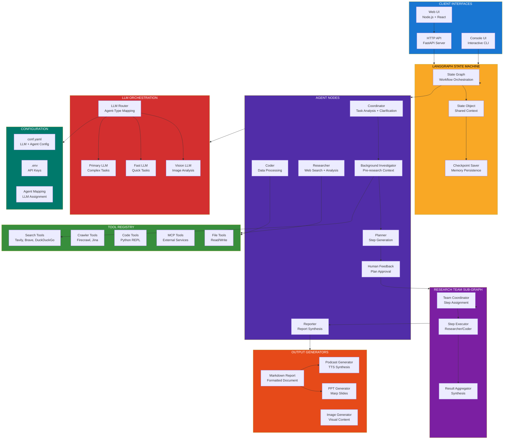
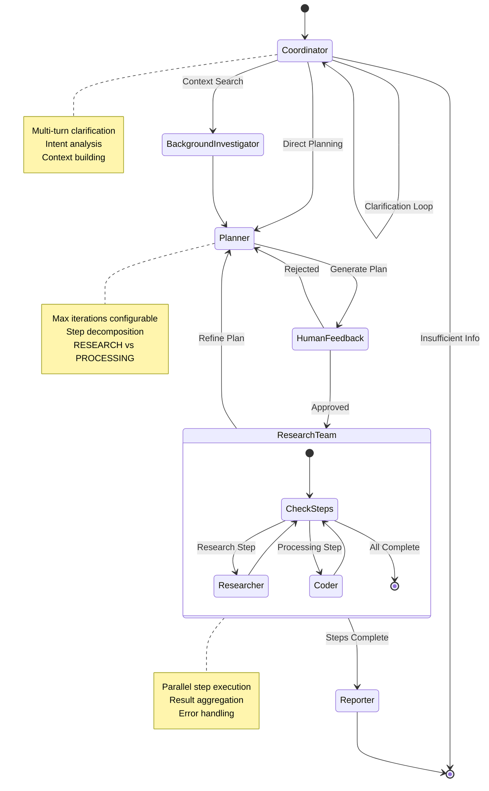
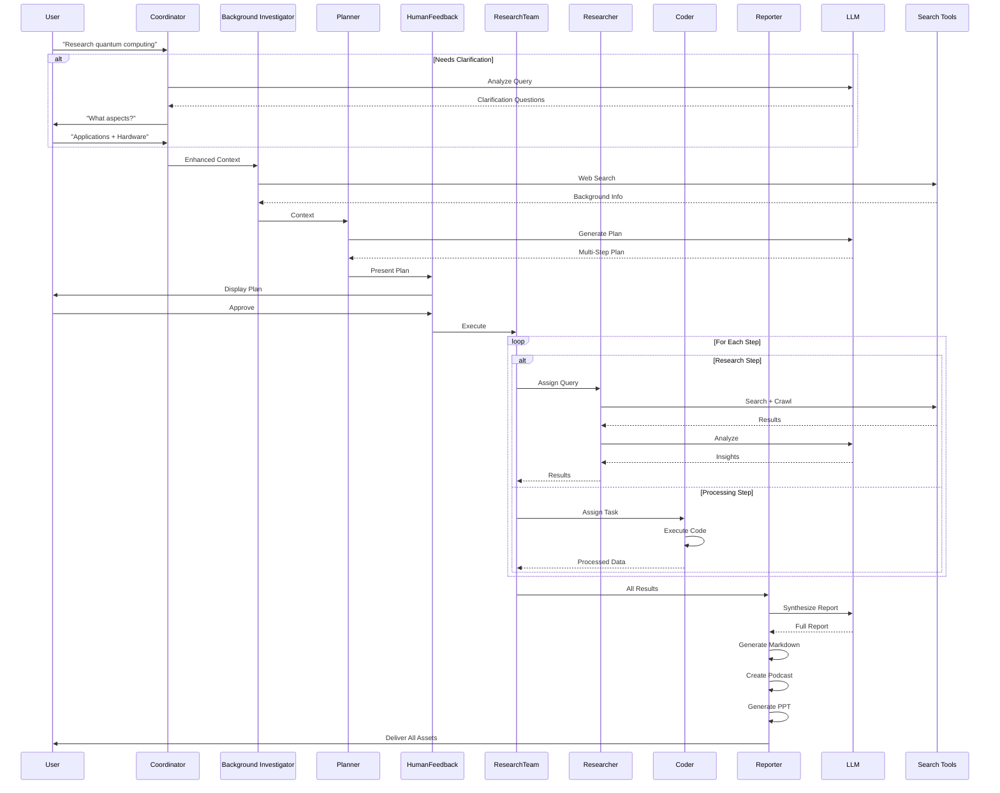
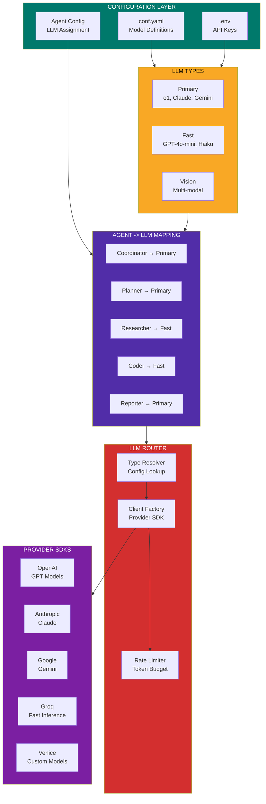
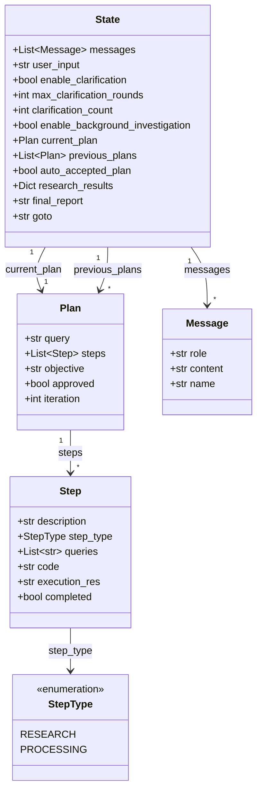
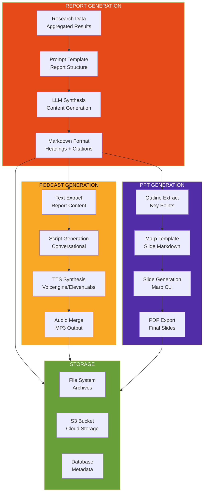
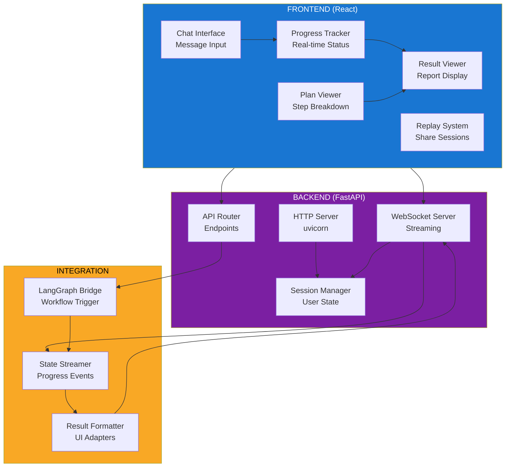

<!--
Why: Document DeerFlow's LangGraph-based deep research architecture so contributors understand how agents coordinate, conduct research, and produce comprehensive reports.
What: Visualizes the state graph, agent hierarchy, tool ecosystem, and workflow orchestration that enable systematic deep research with web search, crawling, and code execution.
How: Uses Mermaid diagrams to show the LangGraph state machine, agent collaboration patterns, and the data flows that produce research reports and podcasts.
-->

# DeerFlow System Architecture

## Overview

DeerFlow (Deep Exploration and Efficient Research Flow) is a LangGraph-based deep research framework that orchestrates multiple specialized agents to conduct systematic research, generate comprehensive reports, and create multimedia content like podcasts and presentations.

## Core Architecture



## LangGraph Workflow State Machine



## Research Workflow Data Flow



## Agent Node Architecture


## Tool Integration Architecture

```mermaid
graph TB
    subgraph SearchTools["SEARCH TOOLS"]
        Tavily["Tavily Search<br/>Web + News"]
        Brave["Brave Search<br/>Web API"]
        DuckDuckGo["DuckDuckGo<br/>Privacy Search"]
        SearchRouter["Search Router<br/>Provider Selection"]
    end

    subgraph CrawlerTools["CRAWLER TOOLS"]
        Firecrawl["Firecrawl<br/>JS Rendering"]
        Jina["Jina Reader<br/>Clean Markdown"]
        Playwright["Playwright<br/>Browser Automation"]
        CrawlerRouter["Crawler Router<br/>Best Provider"]
    end

    subgraph CodeExecution["CODE EXECUTION"]
        PythonREPL["Python REPL<br/>Sandboxed"]
        EnvManager["Environment Manager<br/>Dependencies"]
        OutputCapture["Output Capture<br/>Streams"]
    end

    subgraph MCPIntegration["MCP INTEGRATION"]
        MCPServer["MCP Server<br/>Protocol Handler"]
        GitHubTrending["GitHub Trending<br/>MCP Tool"]
        CustomMCP["Custom MCP<br/>User Tools"]
        ToolRegistry["Tool Registry<br/>Dynamic Load"]
    end

    subgraph FileSystem["FILE SYSTEM"]
        FileRead["File Read<br/>Documents"]
        FileWrite["File Write<br/>Reports"]
        ArchiveManager["Archive Manager<br/>Storage"]
    end

    SearchRouter --> Tavily
    SearchRouter --> Brave
    SearchRouter --> DuckDuckGo
    
    CrawlerRouter --> Firecrawl
    CrawlerRouter --> Jina
    CrawlerRouter --> Playwright
    
    PythonREPL --> EnvManager
    EnvManager --> OutputCapture
    
    MCPServer --> GitHubTrending
    MCPServer --> CustomMCP
    MCPServer --> ToolRegistry
    
    FileRead --> ArchiveManager
    FileWrite --> ArchiveManager

    style SearchTools fill:#388e3c,color:#ffffff
    style CrawlerTools fill:#00796b,color:#ffffff
    style CodeExecution fill:#512da8,color:#ffffff
    style MCPIntegration fill:#d32f2f,color:#ffffff
    style FileSystem fill:#7b1fa2,color:#ffffff
```



## LLM Configuration & Routing



## State Object Structure



## Output Generation Pipeline



## Web UI Architecture



## Key Design Principles

### 1. LangGraph State Machine
- Declarative workflow definition
- Conditional edges for dynamic routing
- Checkpoint-based memory persistence
- Human-in-the-loop approval gates

### 2. Multi-Agent Collaboration
- Specialized agents for distinct tasks
- Coordinator orchestrates workflow
- Research team for parallel execution
- Reporter synthesizes all outputs

### 3. Flexible Tool Ecosystem
- Multiple search providers (Tavily, Brave, DuckDuckGo)
- Web crawling with Firecrawl/Jina
- Python REPL for data processing
- MCP protocol for external tools

### 4. LLM Configuration
- Agent-specific LLM assignment
- Primary (complex) vs Fast (simple) models
- Configurable via YAML + environment
- Rate limiting and cost control

### 5. Output Diversity
- Markdown reports with citations
- TTS-generated podcasts
- Marp-based presentations
- Shareable replay links

### 6. Human-in-the-Loop
- Plan approval before execution
- Clarification rounds for ambiguous queries
- Progress visibility with streaming
- Interruptible workflows

## Technology Stack

- **Core**: Python 3.12+
- **Workflow**: LangGraph, LangChain
- **LLM Providers**: OpenAI, Anthropic, Google, Groq, Venice
- **Search**: Tavily, Brave, DuckDuckGo
- **Crawling**: Firecrawl, Jina Reader
- **Backend**: FastAPI, uvicorn
- **Frontend**: React (Vite), WebSocket
- **TTS**: Volcengine TTS, ElevenLabs
- **Slides**: Marp CLI
- **Code Execution**: Python REPL (sandboxed)

## File Organization

```
deerflow/
├── main.py                 # CLI entry point
├── server.py               # FastAPI server
├── conf.yaml.example       # Configuration template
├── src/
│   ├── graph/
│   │   ├── builder.py      # LangGraph construction
│   │   ├── nodes.py        # Agent node implementations
│   │   └── types.py        # State type definitions
│   ├── agents/
│   │   └── agents.py       # Agent factory
│   ├── prompts/
│   │   └── *.py            # Prompt templates
│   ├── tools/
│   │   ├── search/         # Search tools
│   │   ├── crawler/        # Web crawlers
│   │   └── code/           # Code execution
│   ├── llms/
│   │   └── llm.py          # LLM client factory
│   ├── podcast/
│   │   └── generator.py    # TTS generation
│   ├── ppt/
│   │   └── generator.py    # Marp slides
│   └── server/
│       └── api.py          # FastAPI routes
└── web/
    └── src/                # React frontend
```

---

This architecture enables DeerFlow to conduct systematic, multi-step research with human oversight, producing comprehensive reports enriched with multimedia assets like podcasts and presentations.
