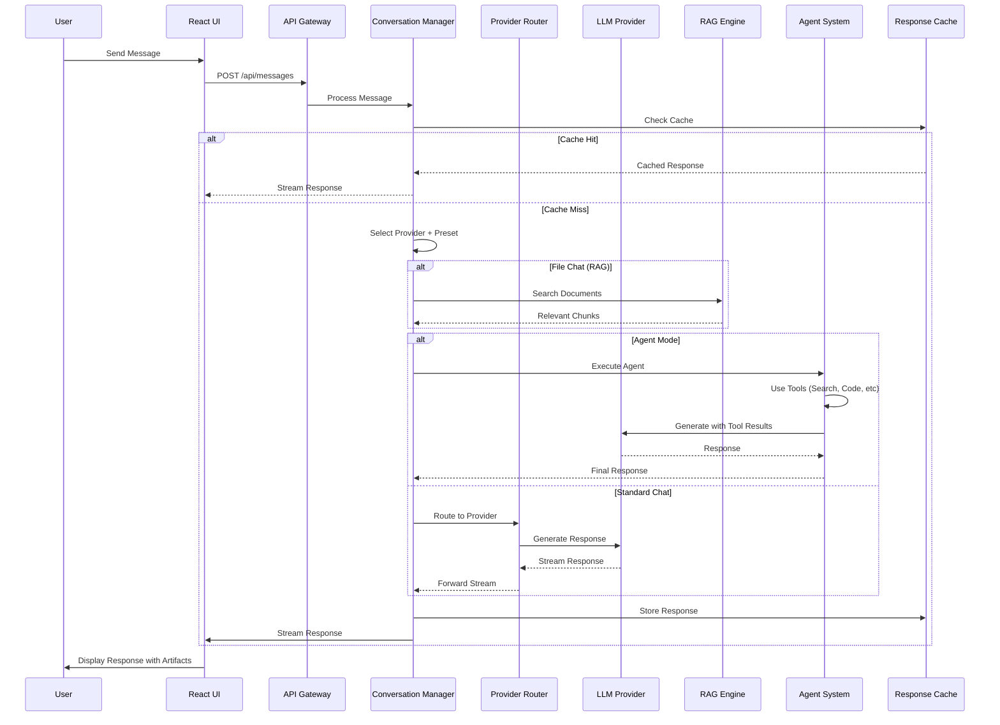
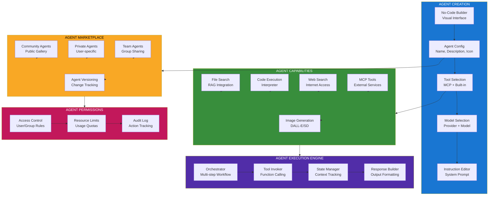
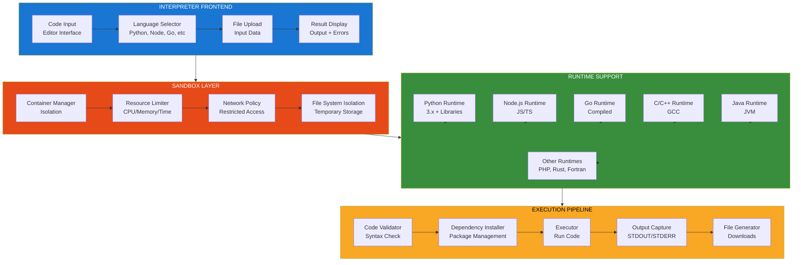
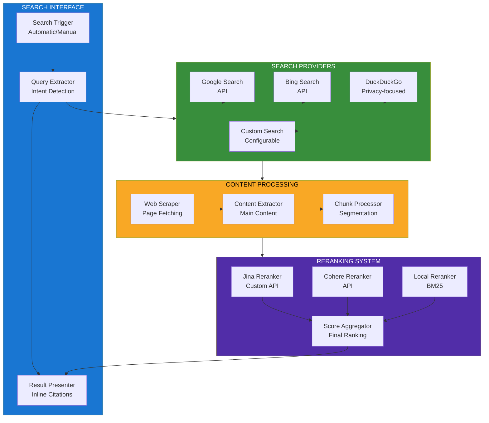
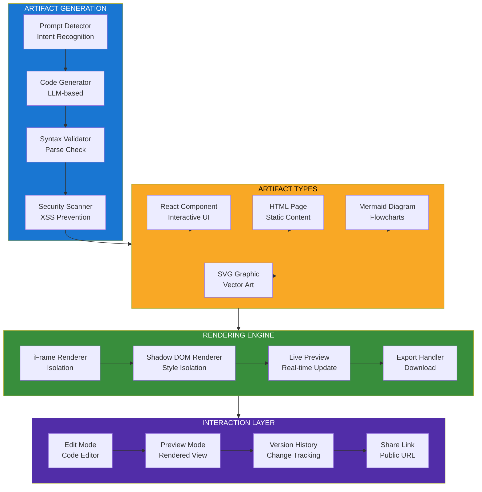
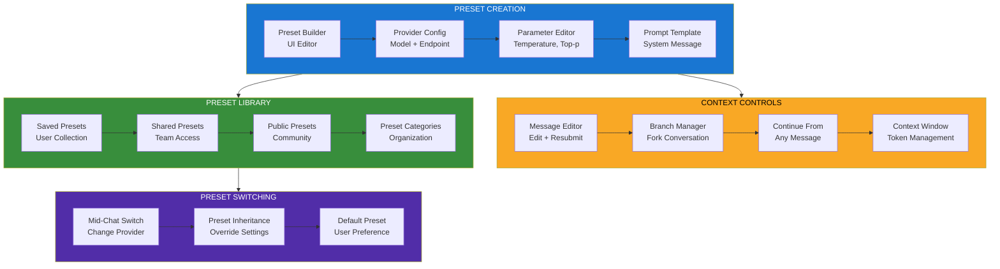

<!--
Why: Document LibreChat's comprehensive multi-provider chat architecture so contributors understand how it enables unified access to multiple AI services with advanced features like agents, RAG, code interpreter, and generative UI.
What: Visualizes the provider routing system, conversation management, file handling, plugin architecture, preset system, and multi-user access control.
How: Uses Mermaid diagrams to show the full-stack architecture that enables ChatGPT-like experiences with provider flexibility and enterprise features.
-->

# LibreChat System Architecture

## Overview

LibreChat is an enhanced ChatGPT clone that provides a unified interface for multiple AI providers (OpenAI, Anthropic, Google, Azure, AWS Bedrock, custom endpoints). It features multi-modal support, agents, RAG (file chat), code interpreter, generative UI with code artifacts, web search, image generation, conversation branching, and multi-user management.

## Core Architecture

```mermaid
graph TB
    subgraph Client["CLIENT LAYER"]
        ReactUI["React Frontend<br/>Next.js App"]
        StateManager["State Management<br/>Recoil + React Query"]
        WebSocket["WebSocket Client<br/>Real-time Streaming"]
        FileUploader["File Uploader<br/>Multi-modal Support"]
    end

    subgraph APIGateway["API GATEWAY"]
        ExpressServer["Express Server<br/>REST + WS"]
        RouteController["Route Controller<br/>Endpoint Routing"]
        Middleware["Middleware Stack<br/>Auth + Validation"]
        RateLimiter["Rate Limiter<br/>Request Throttling"]
    end

    subgraph ProviderSystem["PROVIDER SYSTEM"]
        ProviderRouter["Provider Router<br/>Unified Interface"]
        OpenAI["OpenAI<br/>GPT-4o, o1, DALL-E"]
        Anthropic["Anthropic<br/>Claude 3.x"]
        Google["Google<br/>Gemini Pro/Flash"]
        Azure["Azure OpenAI<br/>Custom Deployments"]
        AWSBedrock["AWS Bedrock<br/>Claude, Titan"]
        VertexAI["Vertex AI<br/>Gemini"]
        CustomEndpoint["Custom Endpoints<br/>OpenAI-compatible"]
    end

    subgraph ConversationEngine["CONVERSATION ENGINE"]
        ConvManager["Conversation Manager<br/>Thread Orchestration"]
        MessageProcessor["Message Processor<br/>Format + Parse"]
        BranchManager["Branch Manager<br/>Fork & Continue"]
        ContextBuilder["Context Builder<br/>History Assembly"]
    end

    subgraph AgentSystem["AGENT SYSTEM (LibreChat Agents)"]
        AgentBuilder["Agent Builder<br/>No-Code Creation"]
        AgentMarketplace["Agent Marketplace<br/>Community Agents"]
        AgentSharing["Agent Sharing<br/>User/Group Permissions"]
        MCPIntegration["MCP Integration<br/>Tool Protocols"]
        AgentExecution["Agent Execution<br/>Multi-step Workflows"]
    end

    subgraph FileSystem["FILE & RAG SYSTEM"]
        FileHandler["File Handler<br/>Upload + Processing"]
        VectorStore["Vector Store<br/>Embeddings"]
        RAGEngine["RAG Engine<br/>Document Chat"]
        FileSearch["File Search<br/>Semantic Query"]
        ImageProcessor["Image Processor<br/>Vision Models"]
    end

    subgraph CodeInterpreter["CODE INTERPRETER"]
        SandboxManager["Sandbox Manager<br/>Isolated Execution"]
        RuntimeEnvironment["Runtime Environment<br/>Python, Node, Go, etc"]
        FileIO["File I/O<br/>Upload/Download"]
        SecurityLayer["Security Layer<br/>Resource Limits"]
    end

    subgraph WebSearch["WEB SEARCH SYSTEM"]
        SearchProvider["Search Provider<br/>Configurable Engine"]
        ContentScraper["Content Scraper<br/>Page Fetching"]
        Reranker["Reranker<br/>Jina/Custom"]
        ResultAggregator["Result Aggregator<br/>Multi-source"]
    end

    subgraph ImageGen["IMAGE GENERATION"]
        ImageRouter["Image Router<br/>Provider Selection"]
        DALLE["DALL-E 2/3<br/>OpenAI"]
        GPTImage["GPT-Image-1<br/>Text-to-Image"]
        StableDiffusion["Stable Diffusion<br/>Local/Remote"]
        Flux["Flux<br/>Advanced Models"]
    end

    subgraph GenerativeUI["GENERATIVE UI (Code Artifacts)"]
        ArtifactEngine["Artifact Engine<br/>Code Generation"]
        ReactRenderer["React Renderer<br/>Live Preview"]
        HTMLRenderer["HTML Renderer<br/>Static Pages"]
        MermaidRenderer["Mermaid Renderer<br/>Diagrams"]
    end

    subgraph PresetSystem["PRESET & PROMPT SYSTEM"]
        PresetManager["Preset Manager<br/>Create + Save"]
        PromptLibrary["Prompt Library<br/>Reusable Templates"]
        SharingEngine["Sharing Engine<br/>User/Group Access"]
    end

    subgraph Database["DATABASE LAYER"]
        MongoDB["MongoDB<br/>Conversations + Users"]
        PostgreSQL["PostgreSQL<br/>Alternative DB"]
        ModelCache["Model Cache<br/>Response Caching"]
        SessionStore["Session Store<br/>Active Sessions"]
    end

    subgraph Authentication["AUTH & SECURITY"]
        AuthProvider["Auth Provider<br/>Local + OAuth"]
        JWTManager["JWT Manager<br/>Token Handling"]
        PermissionEngine["Permission Engine<br/>RBAC"]
        OAuth["OAuth Providers<br/>Google, GitHub"]
    end

    ReactUI --> StateManager
    StateManager --> WebSocket
    WebSocket --> FileUploader
    
    Client --> APIGateway
    ExpressServer --> RouteController
    RouteController --> Middleware
    Middleware --> RateLimiter
    
    APIGateway --> ProviderSystem
    ProviderRouter --> OpenAI
    ProviderRouter --> Anthropic
    ProviderRouter --> Google
    ProviderRouter --> Azure
    ProviderRouter --> AWSBedrock
    ProviderRouter --> VertexAI
    ProviderRouter --> CustomEndpoint
    
    APIGateway --> ConversationEngine
    ConvManager --> MessageProcessor
    MessageProcessor --> BranchManager
    BranchManager --> ContextBuilder
    
    ConversationEngine --> AgentSystem
    AgentBuilder --> AgentMarketplace
    AgentMarketplace --> AgentSharing
    AgentSharing --> MCPIntegration
    MCPIntegration --> AgentExecution
    
    ConversationEngine --> FileSystem
    FileHandler --> VectorStore
    VectorStore --> RAGEngine
    RAGEngine --> FileSearch
    FileSearch --> ImageProcessor
    
    AgentExecution --> CodeInterpreter
    SandboxManager --> RuntimeEnvironment
    RuntimeEnvironment --> FileIO
    FileIO --> SecurityLayer
    
    AgentExecution --> WebSearch
    SearchProvider --> ContentScraper
    ContentScraper --> Reranker
    Reranker --> ResultAggregator
    
    ConversationEngine --> ImageGen
    ImageRouter --> DALLE
    ImageRouter --> GPTImage
    ImageRouter --> StableDiffusion
    ImageRouter --> Flux
    
    ConversationEngine --> GenerativeUI
    ArtifactEngine --> ReactRenderer
    ArtifactEngine --> HTMLRenderer
    ArtifactEngine --> MermaidRenderer
    
    ConversationEngine --> PresetSystem
    PresetManager --> PromptLibrary
    PromptLibrary --> SharingEngine
    
    APIGateway --> Database
    MongoDB --> ModelCache
    PostgreSQL --> ModelCache
    ModelCache --> SessionStore
    
    APIGateway --> Authentication
    AuthProvider --> JWTManager
    JWTManager --> PermissionEngine
    PermissionEngine --> OAuth

    style Client fill:#1976d2,color:#ffffff
    style APIGateway fill:#f9a825,color:#000000
    style ProviderSystem fill:#388e3c,color:#ffffff
    style ConversationEngine fill:#512da8,color:#ffffff
    style AgentSystem fill:#e64a19,color:#ffffff
    style FileSystem fill:#00796b,color:#ffffff
    style CodeInterpreter fill:#7b1fa2,color:#ffffff
    style WebSearch fill:#689f38,color:#ffffff
    style ImageGen fill:#d32f2f,color:#ffffff
    style GenerativeUI fill:#0288d1,color:#ffffff
    style PresetSystem fill:#f57c00,color:#ffffff
    style Database fill:#455a64,color:#ffffff
    style Authentication fill:#c2185b,color:#ffffff
```



## Conversation Flow with Provider Routing



## LibreChat Agent Architecture



## Code Interpreter System



## Web Search Architecture



## Generative UI (Code Artifacts)



## Preset & Context Management



## Key Design Principles

### 1. Provider Agnostic
- Unified interface for all AI providers
- Easy switching between providers mid-conversation
- Custom endpoint support for any OpenAI-compatible API

### 2. Advanced Context Control
- Conversation branching at any message
- Edit and resubmit with context preservation
- Token management and optimization

### 3. Agent Marketplace
- No-code agent creation for non-technical users
- Community sharing with permission controls
- MCP protocol for extensible tool integration

### 4. Secure Execution
- Sandboxed code interpreter with resource limits
- Multiple language runtime support
- File I/O with security scanning

### 5. Multi-modal Intelligence
- Vision support for image understanding
- File chat with RAG for document Q&A
- Image generation with multiple providers

### 6. Generative UI
- React, HTML, and Mermaid artifact generation
- Live preview with isolation
- Export and share capabilities

## Technology Stack

- **Frontend**: React 18, Next.js, TypeScript, TailwindCSS
- **Backend**: Node.js, Express.js
- **Database**: MongoDB (primary), PostgreSQL (alternative)
- **State Management**: Recoil, React Query
- **Authentication**: Passport.js, JWT, OAuth2
- **AI Providers**: OpenAI, Anthropic, Google, Azure, AWS Bedrock, Vertex AI
- **Vector Database**: MongoDB Atlas Search, Pinecone
- **Code Execution**: Docker containers, isolated runtimes
- **Web Search**: Google, Bing, DuckDuckGo with Jina reranking
- **Image Generation**: DALL-E, Stable Diffusion, Flux, GPT-Image
- **MCP**: Model Context Protocol client integration

## File Organization

```
LibreChat/
├── client/                # React frontend
│   ├── src/
│   │   ├── components/    # UI components
│   │   ├── hooks/         # Custom hooks
│   │   ├── store/         # Recoil state
│   │   └── utils/         # Client utilities
├── api/                   # Backend services
│   ├── server/            # Express server
│   │   ├── routes/        # API routes
│   │   ├── controllers/   # Business logic
│   │   ├── services/      # Core services
│   │   └── middleware/    # Middleware stack
│   ├── app/               # Application core
│   │   └── clients/       # Provider clients
│   ├── models/            # Database models
│   └── lib/               # Shared libraries
├── packages/              # Monorepo packages
│   ├── data-provider/     # Data access layer
│   └── ui/                # Shared UI components
├── config/                # Configuration files
├── utils/                 # Build utilities
└── librechat.yaml         # Main config file
```

## Deployment Options

- **Docker**: docker-compose for full stack deployment
- **Railway**: One-click deployment template
- **Zeabur**: Automated deployment platform
- **Sealos**: Cloud-native deployment
- **Kubernetes**: Helm charts for cluster deployment
- **Bare Metal**: Manual installation on Linux/Mac

---

This architecture enables LibreChat to function as a comprehensive, ChatGPT-enhanced alternative with multi-provider support, advanced agent capabilities, secure code execution, and enterprise-grade features while maintaining full user control over data and infrastructure.
