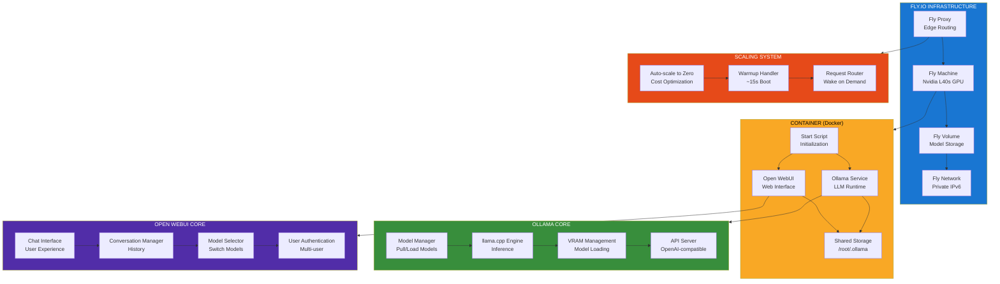
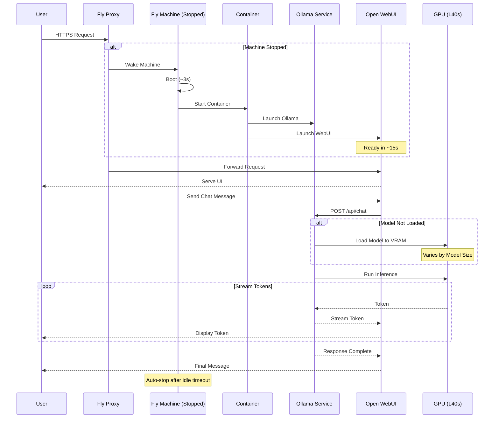
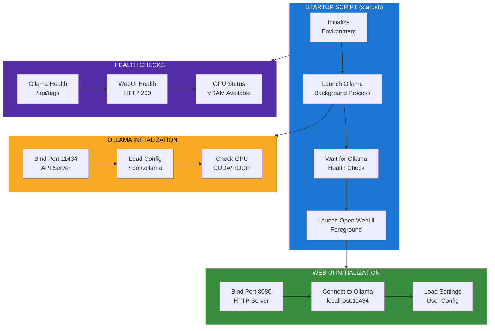
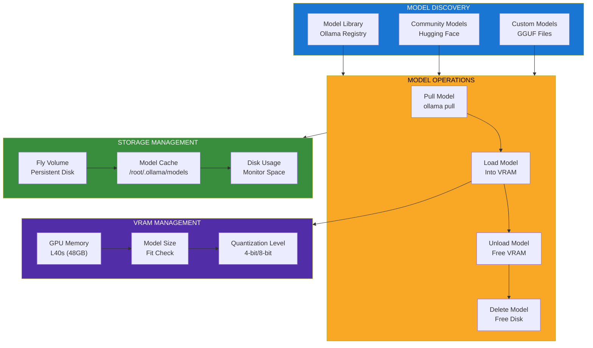
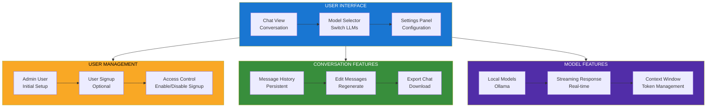

<!--
Why: Document the Ollama + Open WebUI deployment architecture on Fly.io so contributors understand how to run local LLMs with a web interface on GPU infrastructure.
What: Visualizes the containerized deployment, resource management, auto-scaling, and the integration between Ollama (LLM runtime) and Open WebUI (chat interface).
How: Uses Mermaid diagrams to show the Fly.io deployment pattern for running Ollama and Open WebUI together on the same GPU-equipped machine.
-->

# Ollama + Open WebUI on Fly.io Architecture

## Overview

This is a deployment template for running Ollama (local LLM runtime powered by llama.cpp) and Open WebUI (web chat interface) together on the same Fly.io Machine with GPU support. It enables private, self-hosted AI chat with models running on Nvidia L40s GPUs, featuring auto-scaling to zero for cost optimization.

## Core Architecture



## Request Flow with Auto-scaling



## Container Startup Sequence



## Model Management



## Open WebUI Features



## Fly.io Configuration

```mermaid
graph TB
    subgraph FlyConfig["FLY.TOML CONFIGURATION"]
        AppName["App Name<br/>Unique Identifier"]
        VMSettings["VM Settings<br/>l40s GPU"]
        EnvVariables["Environment Variables<br/>ENABLE_SIGNUP"]
        ServiceConfig["Service Config<br/>Port 8080"]
    end

    subgraph ResourceAllocation["RESOURCE ALLOCATION"]
        GPUType["GPU Type<br/>Nvidia L40s"]
        CPUCores["CPU Cores<br/>Shared/Dedicated"]
        RAMAllocation["RAM Allocation<br/>Memory"]
        DiskSize["Disk Size<br/>Volume"]
    end

    subgraph NetworkConfig["NETWORK CONFIGURATION"]
        HTTPService["HTTP Service<br/>Port 8080"]
        InternalIP["Internal IP<br/>fly-local-6pn"]
        PublicIP["Public IP<br/>Fly Edge"]
    end

    subgraph ScalingConfig["SCALING CONFIGURATION"]
        AutoStopDelay["Auto-stop Delay<br/>Idle Timeout"]
        MinMachines["Min Machines<br/>0 (Scale to Zero)"]
        MaxMachines["Max Machines<br/>1 (Cost Control)"]
    end

    AppName --> VMSettings
    VMSettings --> EnvVariables
    EnvVariables --> ServiceConfig
    
    FlyConfig --> ResourceAllocation
    GPUType --> CPUCores
    CPUCores --> RAMAllocation
    RAMAllocation --> DiskSize
    
    FlyConfig --> NetworkConfig
    HTTPService --> InternalIP
    InternalIP --> PublicIP
    
    FlyConfig --> ScalingConfig
    AutoStopDelay --> MinMachines
    MinMachines --> MaxMachines

    style FlyConfig fill:#1976d2,color:#ffffff
    style ResourceAllocation fill:#f9a825,color:#000000
    style NetworkConfig fill:#388e3c,color:#ffffff
    style ScalingConfig fill:#512da8,color:#ffffff
```



## Key Design Principles

### 1. Unified Deployment
- Single Docker container runs both services
- Shared storage for models and data
- Simplified management

### 2. Cost Optimization
- Auto-scale to zero when idle
- GPU resources released automatically
- Pay only for active usage

### 3. GPU Performance
- Nvidia L40s for high performance
- llama.cpp leverages GPU acceleration
- Fast inference for most models

### 4. Quick Startup
- Machine boots in ~3 seconds
- Services ready in ~15 seconds
- Model loading time varies by size

### 5. Privacy-First
- Self-hosted with full control
- No external API dependencies
- Data stays on your infrastructure

## Technology Stack

- **LLM Runtime**: Ollama (llama.cpp)
- **Web Interface**: Open WebUI
- **Container**: Docker
- **Infrastructure**: Fly.io (GPU Machines)
- **GPU**: Nvidia L40s (48GB VRAM)
- **Storage**: Fly Volumes (persistent)
- **Networking**: Fly Proxy (edge routing)

## File Organization

```
ollama-open-webui/
├── Dockerfile             # Container definition
├── start.sh               # Startup script
├── fly.toml               # Fly.io configuration
└── README.md              # Documentation
```

## Deployment

```bash
# Clone and deploy
fly launch --from https://github.com/fly-apps/ollama-open-webui

# Access at https://[app].fly.dev

# First user becomes admin
# Optionally disable signup:
# Set ENABLE_SIGNUP=false in fly.toml
```

## Configuration Options

### VM Types
- Default: `l40s` (Nvidia L40s GPU)
- Alternative: Standard Fly Machines (CPU-only, slower)

### Environment Variables
- `ENABLE_SIGNUP`: Allow/prevent new user registration
- `OLLAMA_HOST`: Ollama API endpoint (default: localhost:11434)

### Volume Settings
- Size: Configurable (models can be large)
- Persistence: Survives machine restarts

## Performance Characteristics

### Startup Times
- Machine boot: ~3 seconds
- Container start: ~10 seconds
- Services ready: ~15 seconds total
- Model loading: Varies by model size (7B ~5s, 70B ~30s)

### Inference Performance
- Depends on model size and quantization
- L40s provides excellent performance
- llama.cpp optimizations for CUDA

### Cost Optimization
- Scales to zero automatically
- Only charged for active usage
- GPU time is premium but efficient

## Limitations & Considerations

- **Model Size**: Ensure model fits in VRAM (L40s = 48GB)
- **Cold Starts**: ~15s latency on first request after idle
- **CPU Performance**: Reduced without GPU, but functional
- **Network**: Private IPv6 within Fly network

---

This architecture provides a simple, cost-effective way to run private AI chat with local models on GPU infrastructure, combining the power of Ollama's LLM runtime with Open WebUI's polished interface, all automatically scaled on Fly.io.
