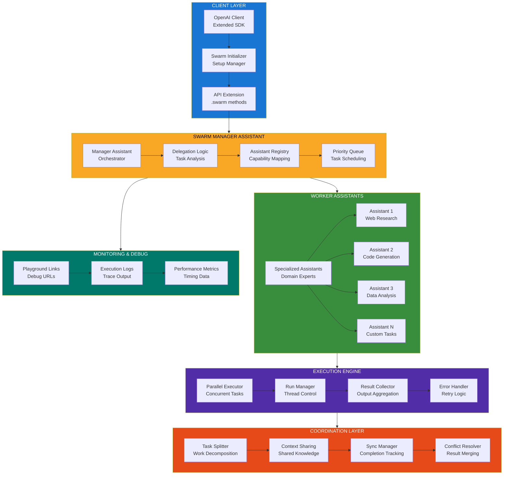
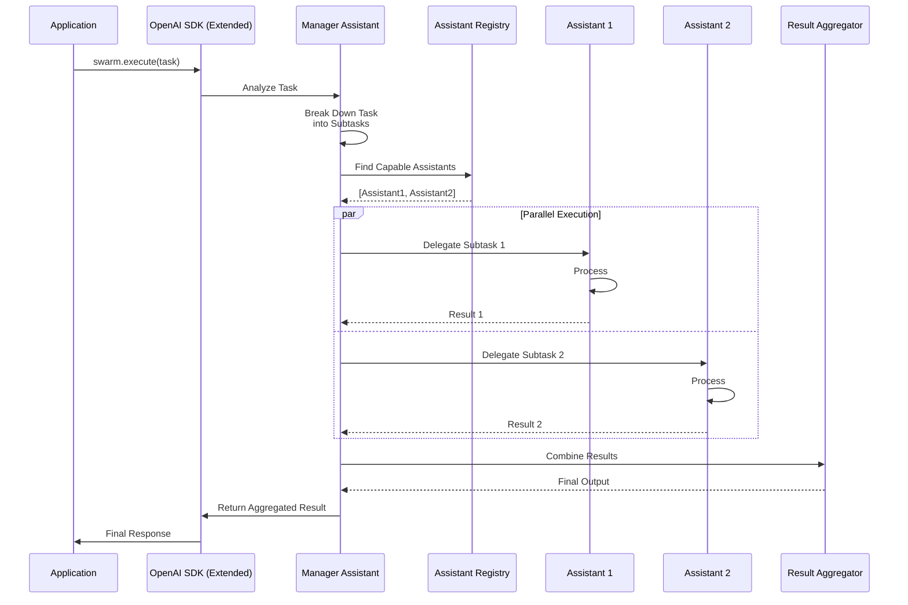
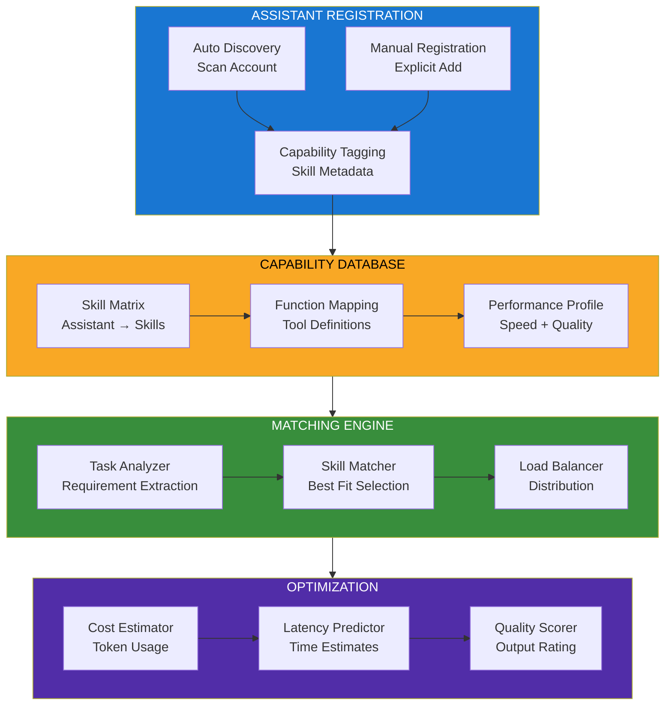
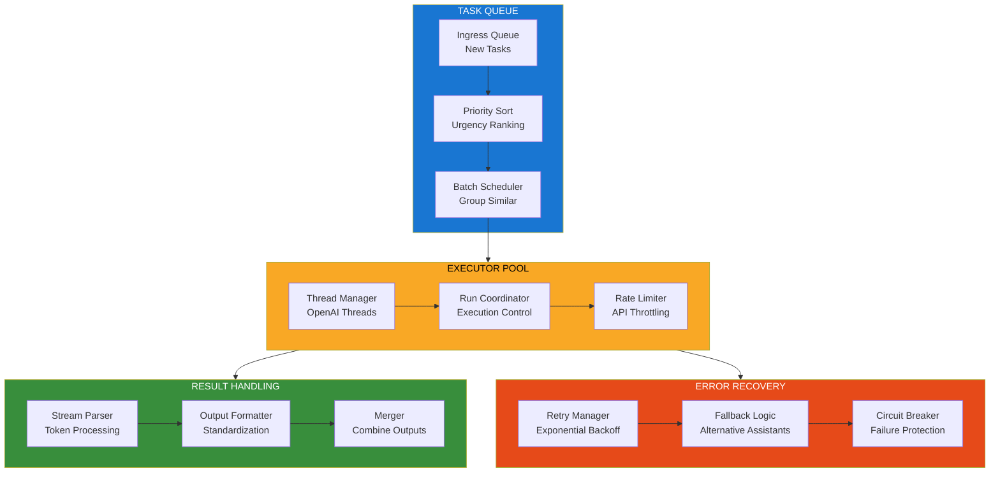
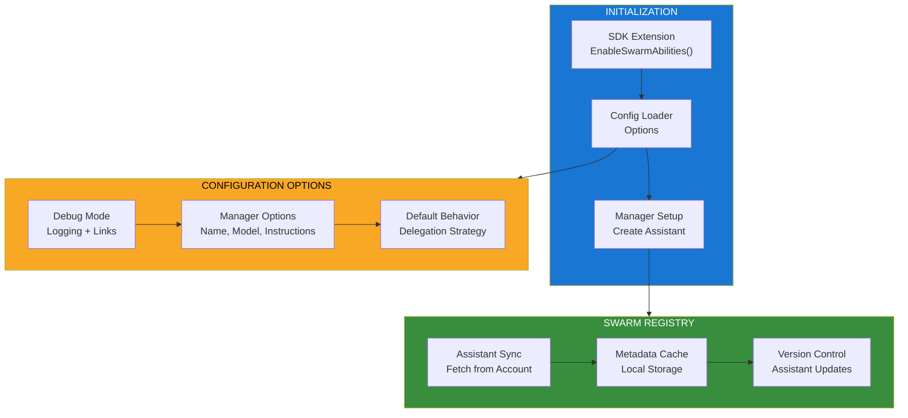

<!--
Why: Document the OpenAI Assistant Swarm Manager so contributors understand how it orchestrates multiple OpenAI assistants to delegate complex tasks intelligently.
What: Visualizes the swarm coordination system, assistant registry, delegation logic, and parallel execution patterns.
How: Uses Mermaid diagrams to show how one manager assistant can coordinate an army of specialized assistants through a unified API.
-->

# OpenAI Assistant Swarm Manager Architecture

## Overview

OpenAI Assistant Swarm Manager is a Node.js library that extends the OpenAI SDK to enable intelligent coordination between multiple OpenAI assistants. It allows a single "manager" assistant to delegate work to specialized assistants in parallel, handling complex multi-step tasks through automatic orchestration.

## Core Architecture



## Swarm Delegation Flow



## Assistant Registry & Capability System



## Parallel Execution Architecture



## Configuration & Setup



## Key Design Principles

### 1. Transparent Delegation
- Manager assistant automatically analyzes and delegates tasks
- No manual orchestration required
- Mental overhead of coordination handled by the library

### 2. Parallel Execution
- Multiple assistants work simultaneously on subtasks
- Optimal resource utilization
- Significant speed improvements for complex workflows

### 3. Capability-Based Routing
- Assistants tagged with skills and capabilities
- Automatic matching to appropriate tasks
- Load balancing across available workers

### 4. Resilient Orchestration
- Retry logic for failed delegations
- Fallback to alternative assistants
- Circuit breakers prevent cascade failures

### 5. Developer-Friendly
- Simple API extension to OpenAI SDK
- Debug mode with playground links
- Minimal configuration required

## Technology Stack

- **Runtime**: Node.js (ES6+)
- **SDK**: OpenAI Node SDK
- **Language**: TypeScript
- **Build**: tsup
- **Package Manager**: yarn/npm

## File Organization

```
openai-assistant-swarm/
├── src/
│   ├── index.ts              # Main entry point
│   ├── swarm-manager.ts      # Manager logic
│   ├── assistant-registry.ts # Capability system
│   ├── executor.ts           # Parallel execution
│   └── utils.ts              # Helpers
├── examples/
│   ├── basic-delegation.js   # Simple example
│   ├── parallel-tasks.js     # Multi-assistant
│   └── advanced.js           # Complex workflows
└── package.json
```

## Usage Pattern

```javascript
import OpenAI from 'openai';
import { EnableSwarmAbilities } from '@mintplex-labs/openai-assistant-swarm';

// Extend OpenAI client
const client = new OpenAI({ apiKey: process.env.OPEN_AI_KEY });
EnableSwarmAbilities(client, {
  debug: true,
  managerAssistantOptions: {
    name: "Task Orchestrator",
    model: "gpt-4",
    instructions: "Delegate tasks efficiently"
  }
});

// Initialize swarm
await client.beta.assistants.swarm.init();

// Execute with automatic delegation
const result = await client.beta.assistants.swarm.execute({
  task: "Research AI trends and write a summary",
  assistants: ['researcher', 'writer'],
  parallelExecution: true
});
```

## Key Benefits

1. **Reduced Complexity**: No manual assistant coordination code
2. **Performance**: Parallel execution reduces total time
3. **Scalability**: Easy to add new specialized assistants
4. **Cost Optimization**: Efficient use of API calls
5. **Debugging**: Playground links for each step

---

This architecture enables developers to build complex multi-assistant workflows without the mental overhead of manual orchestration, making it easy to create powerful AI systems that leverage specialized capabilities across multiple assistants.
