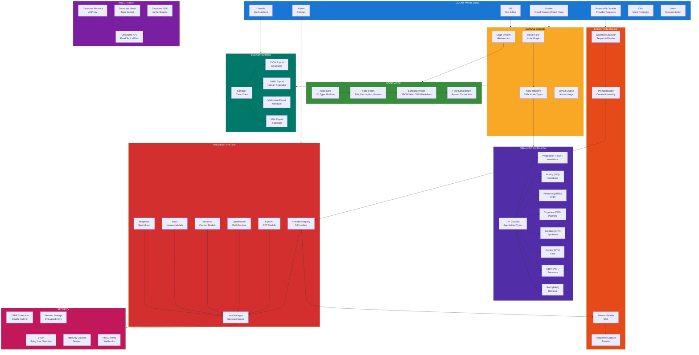
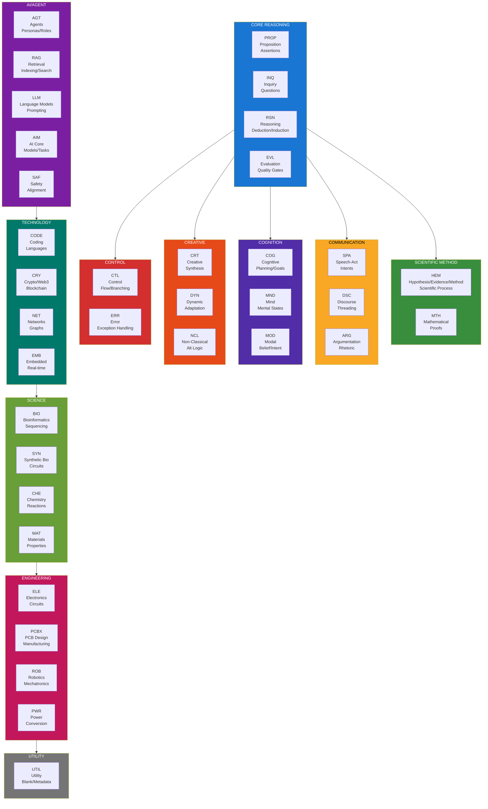
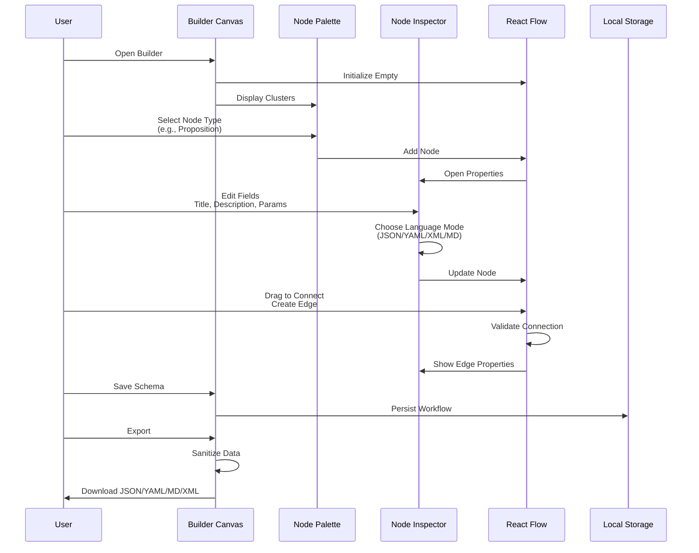
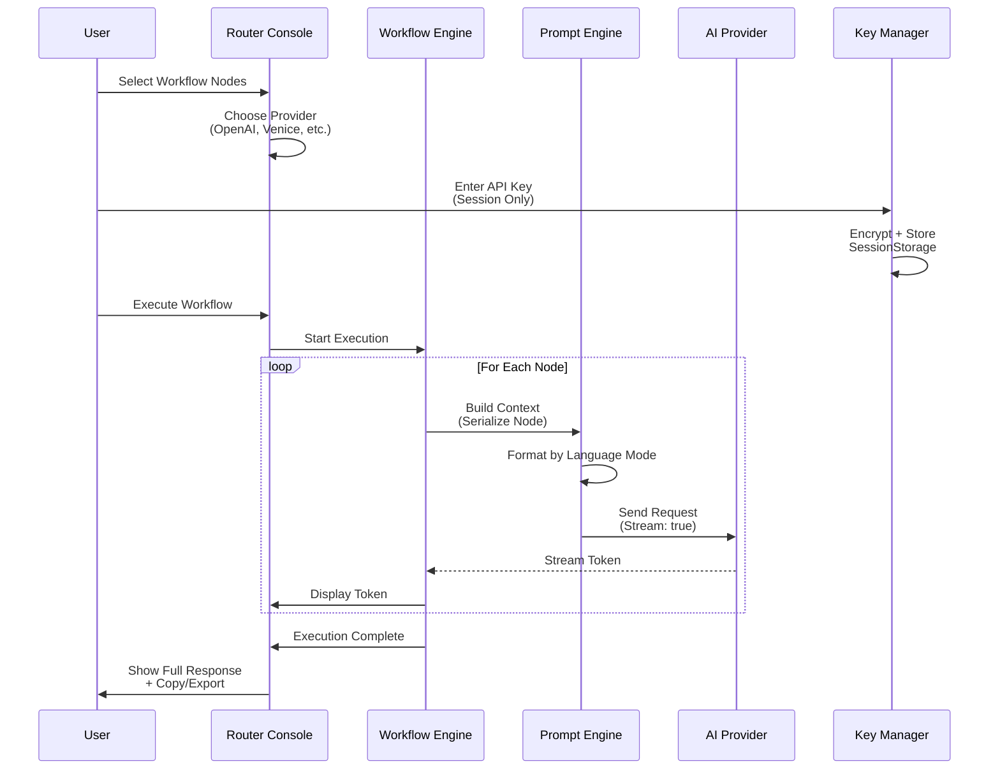
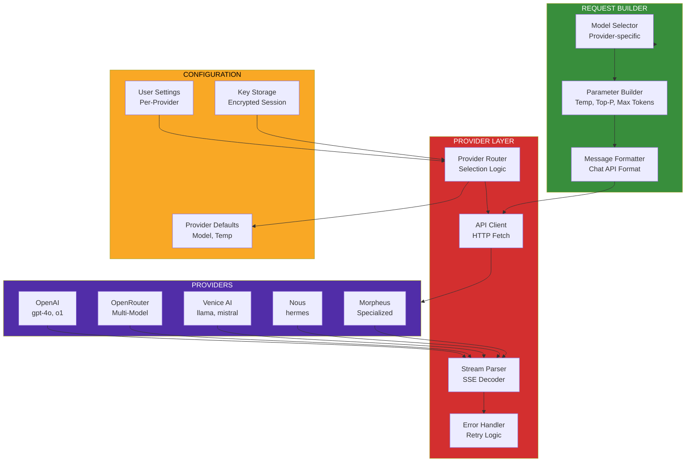
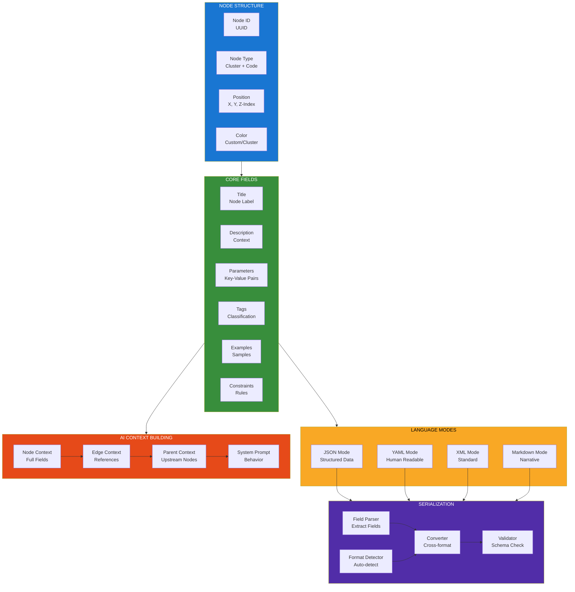
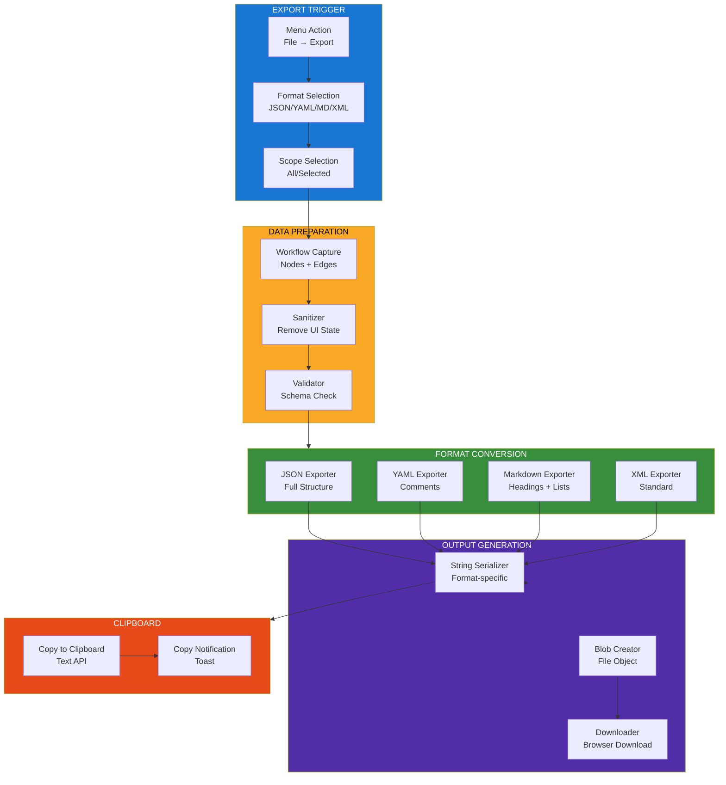
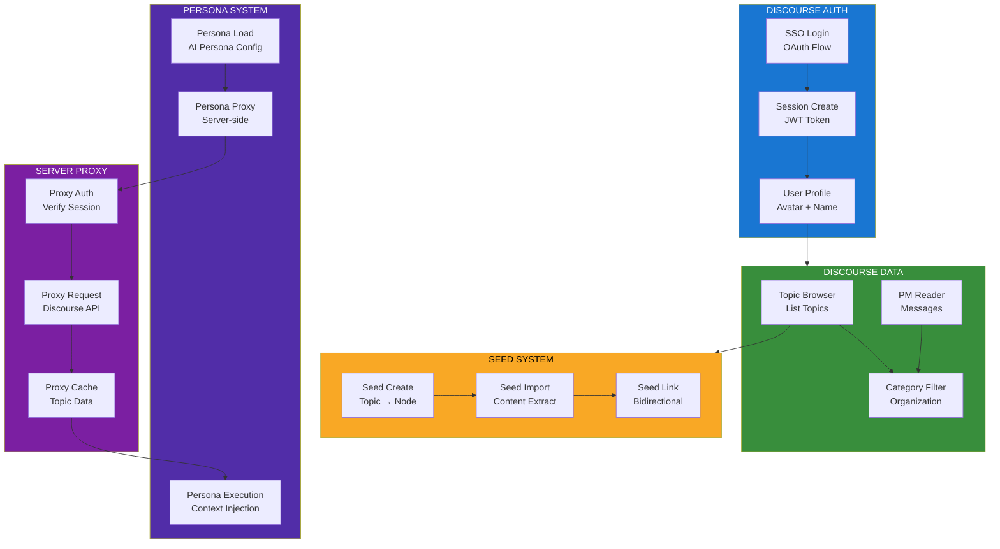
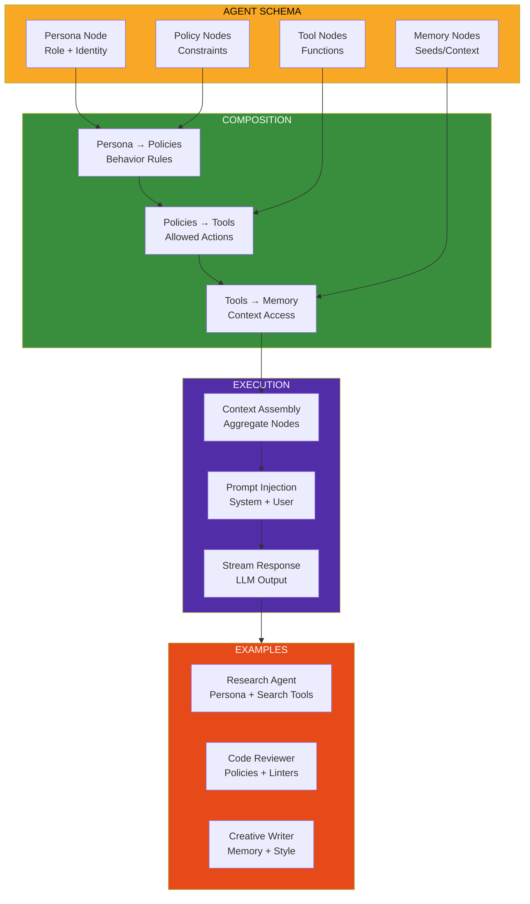

<!--
Why: Document Semantic Flow's context engineering canvas so contributors understand how it enables composable structured context design with explicit semantic nodes and multi-format support.
What: Visualizes the node ontology, canvas architecture, AI provider routing, and export system that make Semantic Flow a visual workspace for precision AI context composition.
How: Uses Mermaid diagrams to show the Win95-style UI, node types, provider integrations, and the patterns that enable deliberate context design with portable exports.
-->

# Semantic Flow System Architecture

## Overview

Semantic Flow is an open-source Context Engineering Canvas—a visual workspace for composing precise, interlinked semantic nodes with explicit fields and formats. You design the context; the model consumes a clean, inspectable structure you can export or execute. Nothing sensitive is persisted server-side (BYOK).

## Core Architecture



## Node Ontology (Semantic Clusters)



## Builder Canvas Workflow



## Router/API Console Flow



## Provider Integration Architecture



## Node Field System



## Export System



## Discourse Integration



## Security Model

```mermaid
graph TB
    subgraph BYOK["BRING YOUR OWN KEY"]
        KeyInput["Key Input<br/>User Prompt"]
        KeyEncrypt["Key Encrypt<br/>CryptoJS AES"]
        SessionStore["Session Store<br/>sessionStorage"]
    end

    subgraph SessionSecurity["SESSION SECURITY"]
        HttpOnlyCookie["HttpOnly Cookie<br/>CSRF Token"]
        DoubleSubmit["Double Submit<br/>CSRF Validation"]
        SessionExpiry["Session Expiry<br/>Timeout"]
    end

    subgraph WebhookSecurity["WEBHOOK SECURITY"]
        HMACSignature["HMAC Signature<br/>SHA256"]
        SignatureVerify["Signature Verify<br/>Request Auth"]
        PayloadValidate["Payload Validate<br/>Schema Check"]
    end

    subgraph DataMinimization["DATA MINIMIZATION"]
        LocalWorkflow["Local Workflow<br/>Browser Storage"]
        NoServerPersist["No Server Persist<br/>Keys/Secrets"]
        ExportOnly["Export Only<br/>User Control"]
    end

    subgraph DiscourseIntegration["DISCOURSE INTEGRATION"]
        SSLRequired["SSL Required<br/>HTTPS Only"]
        OAuthSecure["OAuth Secure<br/>Token Exchange"]
        ProxyIsolation["Proxy Isolation<br/>Server-side"]
    end

    KeyInput --> KeyEncrypt
    KeyEncrypt --> SessionStore
    
    HttpOnlyCookie --> DoubleSubmit
    DoubleSubmit --> SessionExpiry
    
    HMACSignature --> SignatureVerify
    SignatureVerify --> PayloadValidate
    
    LocalWorkflow --> NoServerPersist
    NoServerPersist --> ExportOnly
    
    SSLRequired --> OAuthSecure
    OAuthSecure --> ProxyIsolation

    style BYOK fill:#d32f2f,color:#ffffff
    style SessionSecurity fill:#f9a825,color:#000000
    style WebhookSecurity fill:#388e3c,color:#ffffff
    style DataMinimization fill:#512da8,color:#ffffff
    style DiscourseIntegration fill:#7b1fa2,color:#ffffff
```



## Agentic Construct Pattern



## Key Design Principles

### 1. Context Engineering First
- Design context deliberately before execution
- Visual canvas for inspecting structure
- Edges express reference, not execution order

### 2. Multi-Format Nodes
- JSON for structured data
- YAML for human-readable config
- XML for standard interchange
- Markdown for narrative

### 3. Semantic Ontology
- 17+ clusters with 100+ node types
- Covers reasoning, cognition, communication, science, engineering, AI
- Extensible and composable

### 4. BYOK Philosophy
- Keys only in sessionStorage (encrypted)
- No server-side persistence of secrets
- User controls all sensitive data

### 5. Portable by Design
- Export to JSON, YAML, Markdown, XML
- Import/export round-trips
- Interoperable with other tools

### 6. Win95 Suite
- Builder, IDE, Router, Console, Chat, Admin, Learn
- Unified retro-modern aesthetic
- Context design as visual reasoning

## Technology Stack

- **Frontend**: React 18, Vite, TypeScript
- **Canvas**: React Flow (node graph)
- **UI**: Win95 CSS theme, custom components
- **State**: React Context + Local Storage
- **Security**: CryptoJS (AES), HttpOnly cookies, CSRF
- **Providers**: OpenAI, OpenRouter, Venice, Nous, Morpheus
- **Server**: Node.js (optional proxy for Discourse)
- **Discourse**: SSO (OAuth), API (topics/PMs)
- **Export**: js-yaml, fast-xml-parser

## File Organization

```
semantic_flow/
├── src/
│   ├── App.jsx                 # Main app shell
│   ├── main.jsx                # Entry point
│   ├── nav-items.jsx           # Navigation
│   ├── components/
│   │   └── ui/                 # UI components
│   ├── pages/
│   │   ├── Builder.jsx         # Canvas page
│   │   ├── IDE.jsx             # Text editor
│   │   ├── Router.jsx          # API console
│   │   ├── Console.jsx         # Quick actions
│   │   ├── Admin.jsx           # Settings
│   │   ├── Chat.jsx            # Mock chat
│   │   └── Learn.jsx           # Docs
│   ├── lib/
│   │   ├── ontology.js         # Node types
│   │   ├── graphSchema.js      # Schema logic
│   │   ├── nodeModel.js        # Node model
│   │   ├── exportUtils.js      # Export logic
│   │   ├── formatUtils.js      # Format conversion
│   │   ├── promptingEngine.js  # Execution engine
│   │   ├── aiRouter.js         # Provider router
│   │   ├── security.js         # Key management
│   │   └── auth.js             # Discourse SSO
│   └── utils/
│       └── debugNav.js         # Navigation helpers
├── server/
│   ├── app.js                  # Express server
│   └── index.js                # Server entry
├── public/
└── deployment.md               # Deployment guide
```

---

This architecture enables Semantic Flow to function as a visual reasoning engine for context design, where users compose explicit, typed semantic nodes that can be exported, shared, or executed against AI providers with full transparency and control.
