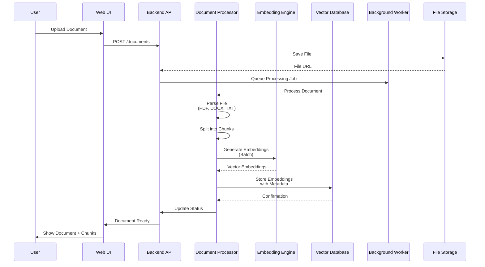
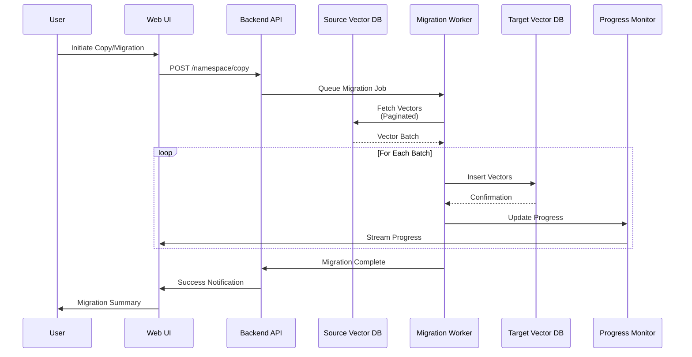
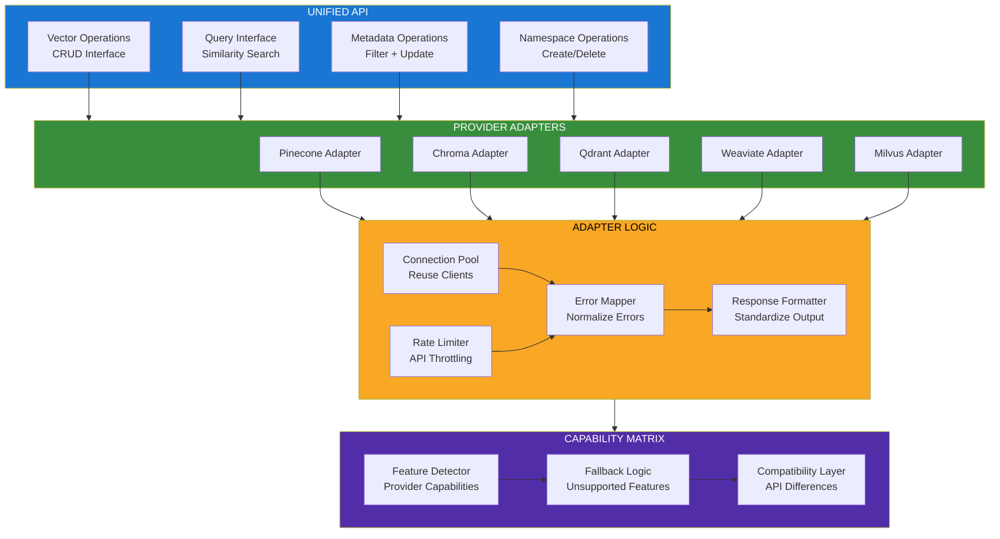
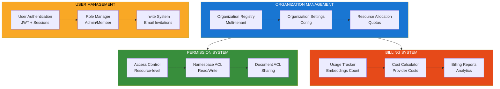
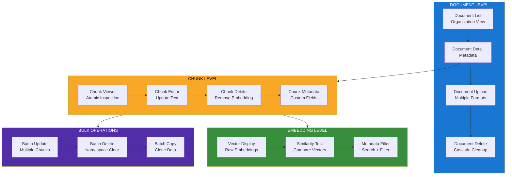
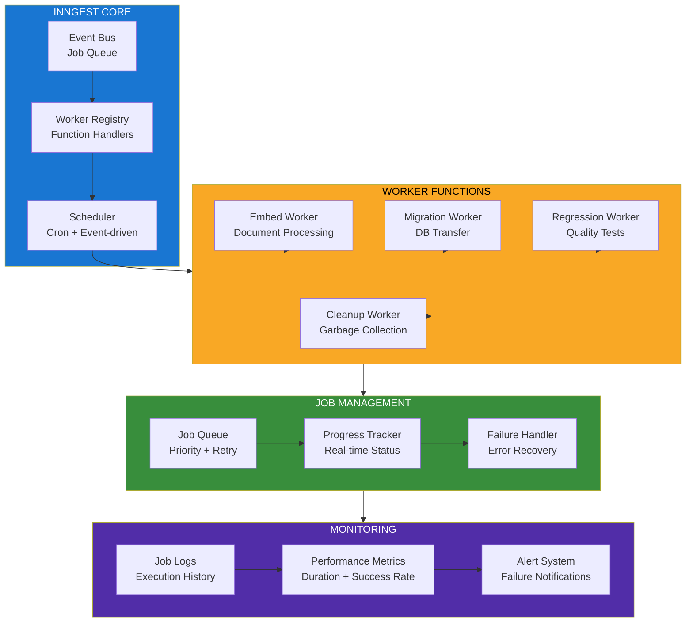

<!--
Why: Document VectorAdmin's universal vector database management architecture so contributors understand how it provides a unified interface for managing embeddings across multiple vector database providers.
What: Visualizes the multi-provider abstraction layer, document ingestion pipeline, organization management, and the suite of tools for vector data management.
How: Uses Mermaid diagrams to show how VectorAdmin enables visual management of vector data without API complexity.
-->

# VectorAdmin System Architecture

## Overview

VectorAdmin is a full-stack universal GUI and tool suite for managing vector databases at scale. It provides a unified interface for Pinecone, Chroma, Qdrant, Weaviate, and other vector databases, enabling visual management of embeddings, documents, namespaces, and organizations with multi-user support.

## Core Architecture

```mermaid
graph TB
    subgraph Frontend["FRONTEND (React)"]
        WebUI["Web Interface<br/>Vite + React"]
        OrgDashboard["Organization Dashboard<br/>Multi-tenant"]
        DocumentManager["Document Manager<br/>Visual Interface"]
        EmbeddingViewer["Embedding Viewer<br/>Vector Inspection"]
    end

    subgraph Backend["BACKEND (Node.js)"]
        ExpressAPI["Express API<br/>REST Endpoints"]
        RouteHandlers["Route Handlers<br/>Business Logic"]
        AuthMiddleware["Auth Middleware<br/>JWT + Sessions"]
    end

    subgraph VectorDBAbstraction["VECTOR DB ABSTRACTION"]
        UnifiedInterface["Unified Interface<br/>Provider Agnostic"]
        PineconeAdapter["Pinecone Adapter<br/>Cloud"]
        ChromaAdapter["Chroma Adapter<br/>Open Source"]
        QdrantAdapter["Qdrant Adapter<br/>High Performance"]
        WeaviateAdapter["Weaviate Adapter<br/>Semantic Search"]
    end

    subgraph DocumentProcessor["DOCUMENT PROCESSOR (Python)"]
        FlaskServer["Flask Server<br/>Processing API"]
        FileParser["File Parser<br/>Multiple Formats"]
        TextSplitter["Text Splitter<br/>Chunking"]
        EmbeddingEngine["Embedding Engine<br/>OpenAI, Cohere"]
    end

    subgraph OrganizationLayer["ORGANIZATION LAYER"]
        OrgManager["Organization Manager<br/>Multi-tenant"]
        UserRoles["User Roles<br/>Admin/Member"]
        ResourceQuotas["Resource Quotas<br/>Usage Limits"]
        BillingTracker["Billing Tracker<br/>Cost Management"]
    end

    subgraph DocumentManagement["DOCUMENT MANAGEMENT"]
        DocumentStore["Document Store<br/>Metadata"]
        ChunkViewer["Chunk Viewer<br/>Atomic Level"]
        VersionControl["Version Control<br/>Change Tracking"]
        DuplicateDetection["Duplicate Detection<br/>Deduplication"]
    end

    subgraph NamespaceTools["NAMESPACE TOOLS"]
        NamespaceManager["Namespace Manager<br/>Logical Grouping"]
        CopyUtility["Copy Utility<br/>Clone Embeddings"]
        MigrateUtility["Migrate Utility<br/>Cross-DB Transfer"]
        BulkOperations["Bulk Operations<br/>Batch Actions"]
    end

    subgraph BackgroundWorkers["BACKGROUND WORKERS (Inngest)"]
        EmbedWorker["Embedding Worker<br/>Async Processing"]
        MigrationWorker["Migration Worker<br/>Long-running Tasks"]
        RegressionTester["Regression Tester<br/>Quality Assurance"]
    end

    subgraph Storage["STORAGE LAYER"]
        PostgreSQL["PostgreSQL<br/>Metadata + Users"]
        S3Storage["S3 Storage<br/>Document Files"]
        Redis["Redis<br/>Cache + Sessions"]
    end

    WebUI --> OrgDashboard
    OrgDashboard --> DocumentManager
    DocumentManager --> EmbeddingViewer
    
    Frontend --> Backend
    ExpressAPI --> RouteHandlers
    RouteHandlers --> AuthMiddleware
    
    Backend --> VectorDBAbstraction
    UnifiedInterface --> PineconeAdapter
    UnifiedInterface --> ChromaAdapter
    UnifiedInterface --> QdrantAdapter
    UnifiedInterface --> WeaviateAdapter
    
    Backend --> DocumentProcessor
    FlaskServer --> FileParser
    FileParser --> TextSplitter
    TextSplitter --> EmbeddingEngine
    
    Backend --> OrganizationLayer
    OrgManager --> UserRoles
    UserRoles --> ResourceQuotas
    ResourceQuotas --> BillingTracker
    
    Backend --> DocumentManagement
    DocumentStore --> ChunkViewer
    ChunkViewer --> VersionControl
    VersionControl --> DuplicateDetection
    
    Backend --> NamespaceTools
    NamespaceManager --> CopyUtility
    CopyUtility --> MigrateUtility
    MigrateUtility --> BulkOperations
    
    Backend --> BackgroundWorkers
    EmbedWorker --> MigrationWorker
    MigrationWorker --> RegressionTester
    
    Backend --> Storage
    PostgreSQL --> S3Storage
    S3Storage --> Redis

    style Frontend fill:#1976d2,color:#ffffff
    style Backend fill:#f9a825,color:#000000
    style VectorDBAbstraction fill:#388e3c,color:#ffffff
    style DocumentProcessor fill:#512da8,color:#ffffff
    style OrganizationLayer fill:#e64a19,color:#ffffff
    style DocumentManagement fill:#00796b,color:#ffffff
    style NamespaceTools fill:#7b1fa2,color:#ffffff
    style BackgroundWorkers fill:#d32f2f,color:#ffffff
    style Storage fill:#455a64,color:#ffffff
```



## Document Upload & Embedding Flow



## Namespace Copy & Migration Flow



## Vector Database Abstraction Layer



## Organization & User Management



## Document & Chunk Management



## Background Worker System (Inngest)



## Key Design Principles

### 1. Provider Agnostic
- Unified API abstracts provider differences
- Easy switching between vector databases
- Consistent experience across providers

### 2. Visual Management
- Atomic-level chunk inspection and editing
- No API calls required for common operations
- Clear visualization of vector data structure

### 3. Cost Optimization
- Copy embeddings without re-embedding
- Duplicate detection prevents waste
- Usage tracking for billing transparency

### 4. Multi-tenant Architecture
- Organization-level isolation
- Role-based access control
- Resource quotas per organization

### 5. Long-running Tasks
- Background workers for async operations
- Progress tracking for migrations
- Retry logic for resilience

## Technology Stack

- **Frontend**: React, Vite, TailwindCSS
- **Backend**: Node.js, Express
- **Document Processing**: Python Flask
- **Database**: PostgreSQL
- **Cache**: Redis
- **Storage**: AWS S3 (or compatible)
- **Background Jobs**: Inngest
- **Vector Databases**: Pinecone, Chroma, Qdrant, Weaviate, Milvus
- **Embedding**: OpenAI, Cohere

## File Organization

```
vector-admin/
├── frontend/              # React web interface
│   ├── src/
│   │   ├── components/    # UI components
│   │   ├── pages/         # Route pages
│   │   └── utils/         # Utilities
├── backend/               # Node.js backend
│   ├── endpoints/         # API routes
│   ├── models/            # Database models
│   ├── utils/             # Core logic
│   └── index.js
├── document-processor/    # Python Flask
│   ├── processSingleDocument/
│   ├── scripts/
│   └── app.py
├── workers/               # Inngest workers
│   ├── functions/         # Worker functions
│   └── index.js
└── docker/                # Docker deployment
```

## Deployment Options

- **Docker**: docker-compose for full stack
- **Cloud**: AWS, GCP, Azure
- **Kubernetes**: Scalable cluster deployment

## Current Status

⚠️ **Note**: This project is no longer actively maintained by Mintplex Labs. The application remains functional but may not support breaking changes from vector database providers. The team's focus has shifted to AnythingLLM.

---

This architecture enabled VectorAdmin to provide a comprehensive, visual interface for managing vector databases at scale, abstracting away provider complexity and offering enterprise-grade multi-tenant management capabilities.
