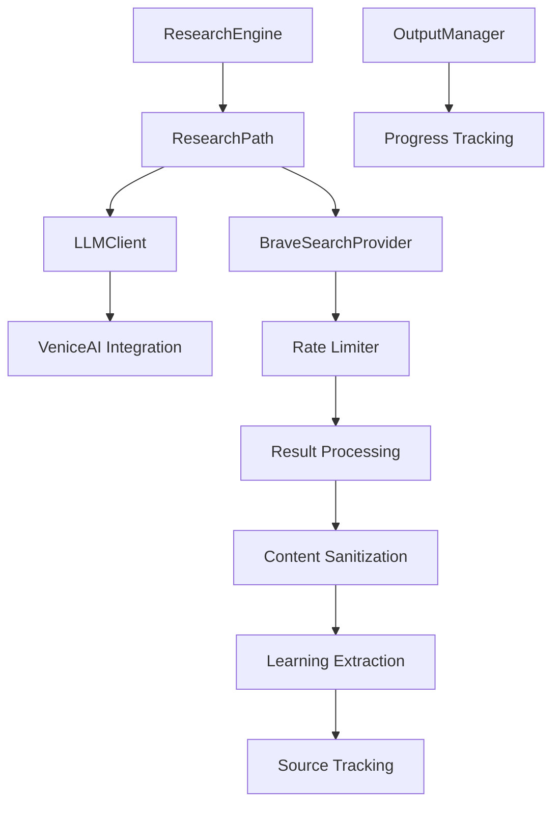
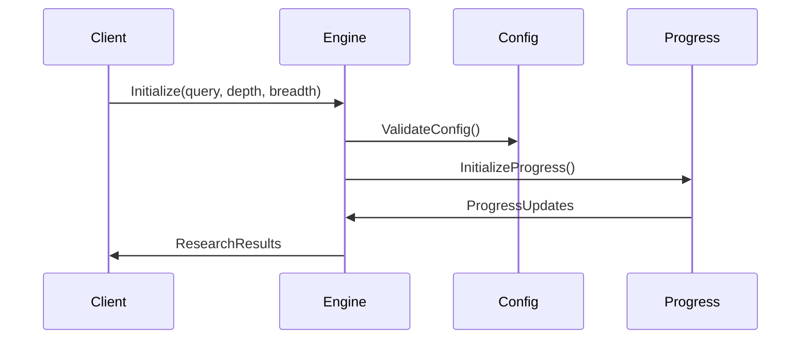
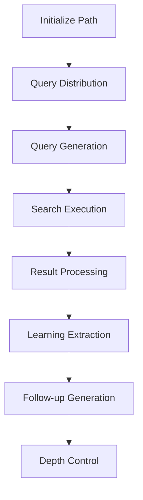
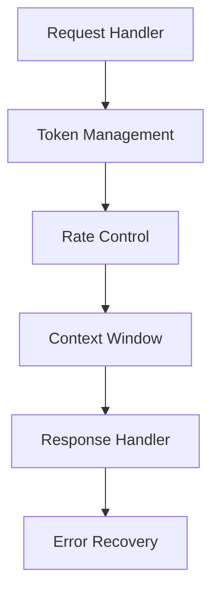
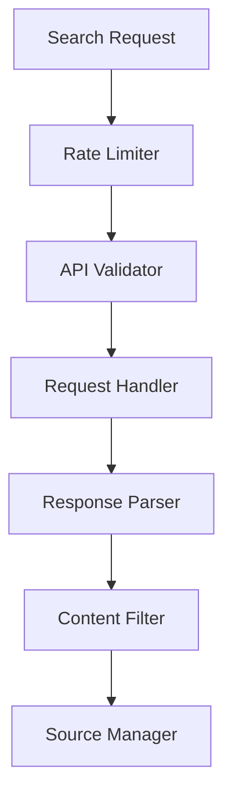
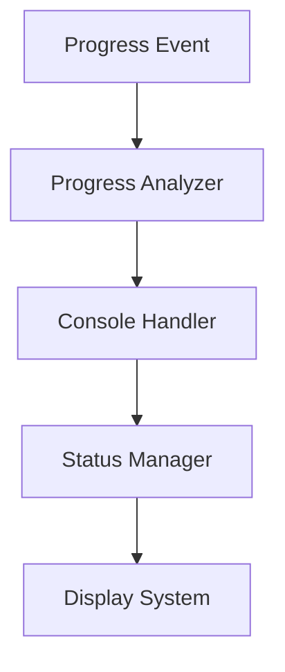
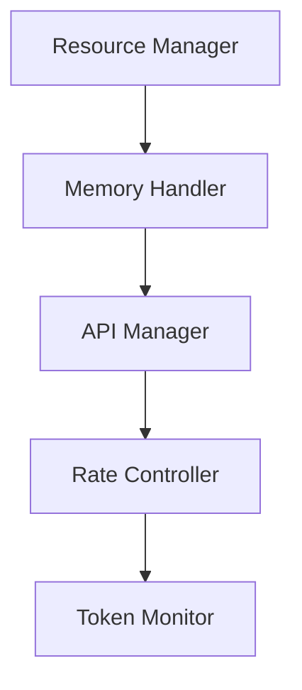
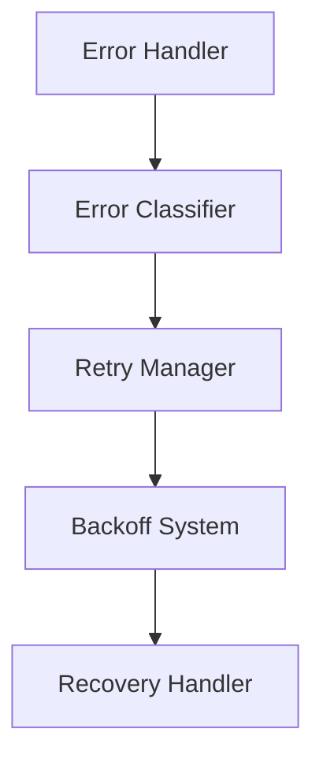
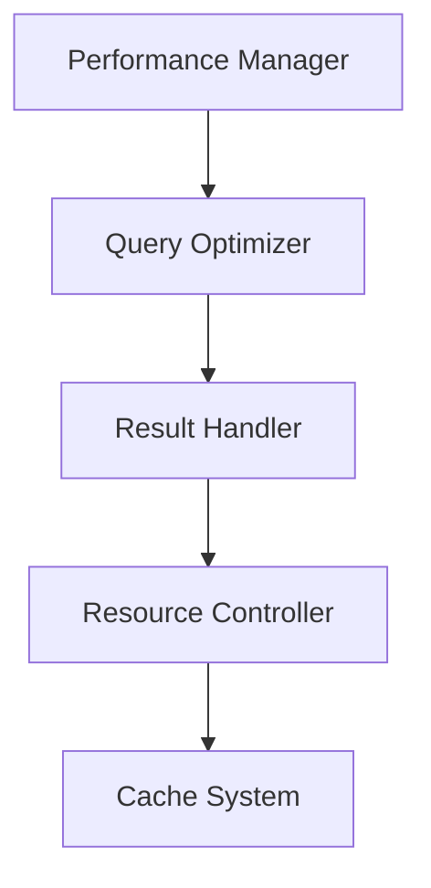
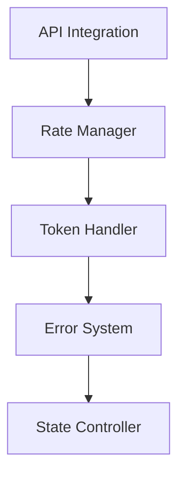

# Deep Research: Technical Documentation for Old App but still applies to New app

Key differences for the new app is the token classifiers, users, and similar.

## System Architecture Overview

The Deep Research system implements a privacy-focused research pipeline combining AI analysis with privacy-centric search capabilities. The architecture follows a modular design with strict separation of concerns.

### Core System Components and Data Flow

## Detailed Component Architecture

### 1. Research Engine Core (ResearchEngine)

The ResearchEngine orchestrates the research process with:

Core Components:
- ResearchConfig interface:
  - query: Research topic initialization
  - breadth: Parallel path configuration
  - depth: Path depth control
  - onProgress: Progress monitoring
- ResearchProgress tracking:
  - Real-time depth/breadth monitoring
  - Query completion status
  - Progress event handling

### 2. Research Path Implementation (ResearchPath)

Research execution flow:

Core Processing Steps:
1. Query Generation and Management
   - Intelligent query generation with LLM
   - Dynamic query reduction
   - Token optimization system
   - Context window management
   - Automatic query refinement

2. Search Execution System
   - Exponential backoff retry mechanism
   - Intelligent request throttling
   - API state management
   - Dynamic rate limiting
   - Error recovery protocols

3. Result Processing Pipeline
   - Content sanitization
   - Source validation
   - Learning synthesis
   - Token optimization
   - Cross-reference verification

### 3. LLM Integration Architecture (LLMClient)

Venice.ai integration system:

Key Features:
- Adaptive token management
- Model selection optimization
- Smart retry mechanisms
- State preservation
- Response validation

### 4. Search Provider Architecture (BraveSearchProvider)

Privacy-focused search implementation:

Implementation:
- Request rate optimization
- Error classification system
- Intelligent retry logic
- Content validation pipeline
- Source verification

### 5. Progress Tracking System (OutputManager)

Real-time monitoring system:

Features:
- Real-time progress computation
- Dynamic visualization system
- State management
- Query tracking optimization

### 6. Resource Management

System resource optimization:

Core Features:
- Memory optimization system
- Batch processing controller
- Buffer management system
- Resource allocation optimization

### 7. Error Handling Architecture

Robust error recovery system:

Implementation:
- Smart backoff system
- State preservation mechanism
- Error classification engine
- Recovery strategy optimization

## Performance Optimization

Performance architecture:

Key Areas:
1. Query Optimization
   - Dynamic query refinement
   - Context-aware generation
   - Redundancy elimination
   - Pattern recognition

2. Result Processing
   - Parallel processing system
   - Incremental aggregation
   - Memory-efficient handling
   - Result validation

3. Resource Utilization
   - Dynamic rate management
   - Adaptive batch processing
   - Smart resource allocation
   - Cache optimization

## Technical Integration Points

Integration architecture:

Implementation:
- Secure API management
- Rate control optimization
- Token usage monitoring
- State management system
- Recovery mechanisms
